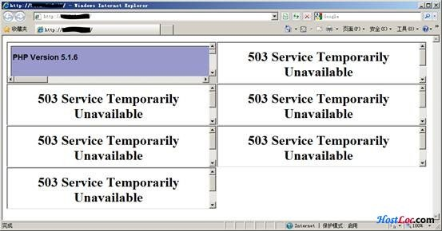

Nginx简单防御CC攻击

[Nginx](https://www.centos.bz/category/web-server/nginx/)是一款轻量级的Web服务器，由俄罗斯的程序设计师Igor Sysoev所开发，最初供俄国大型的入口网站及搜寻引Rambler使用。 其特点是占有内存少，并发能力强，事实上[Nginx](https://www.centos.bz/tag/nginx-2/)的并发能力确实在同类型的网站服务器中表现较好。

Nginx虽然可以比[Apache](https://www.centos.bz/category/web-server/apache/)处理更大的连接数，但是HTTP GET FLOOD针对的不仅仅是WEB服务器，还有数据库服务器。大量HTTP请求产生了大量的数据库查询，可以在几秒之内使数据库停止响应，系统负载升高，最终导致服务器当机。

本文主要介绍[Centos](https://www.centos.bz/tag/centos/)+Nginx下如何快速有效得防御CC攻击。至于如何安装Nginx就不详细介绍了，有兴趣的读者可以在Nginx官方网站（http://www.nginx.org/）下载源代码进行编译。如果你使用的是Centos5，也可以使用rpm包进行安装（http://centos.alt.ru/repository/centos/5/i386/nginx-stable-0.7.65-1.el5.i386.rpm）。

# 1.主动抑制

为了让Nginx支持更多的并发连接数，根据实际情况对工作线程数和每个工作线程支持的最大连接数进行调整。例如设置“worker_processes 10”和“worker_connections 1024”，那这台服务器支持的最大连接数就是10×1024=10240。

```
worker_processes 10;
events {
use epoll;
worker_connections 10240;
}
```


Nginx 0.7开始提供了2个限制用户连接的模块：NginxHttpLimitZoneModule和NginxHttpLimitReqModule。
NginxHttpLimitZoneModule可以根据条件进行并发连接数控制。
例如可以定义以下代码：


```
http {
limit_zone   my_zone  $binary_remote_addr  10m;
server {
location /somedir/ {
limit_conn   my_zone  1;
		}
	}
}
```

其中“limit_zone my_zone $binary_remote_addr 10m”的意思是定义一个名称为my_zone的存储区域、my_zone中的内容为远程IP地址、my_zone的大小为10M；“location /somedir/”的意思是针对somedir目录应用规则；“limit_conn my_zone 1”的意思是针对上面定义的my_zone记录区记录的IP地址在指定的目录中只能建立一个连接。

NginxHttpLimitReqModule可以根据条件进行请求频率的控制。
例如可以定义以下代码：

```
http {
limit_req_zone  $binary_remote_addr  zone=my_req_zone:10m   rate=1r/s;
...
server {
...
location /somedir/ {
limit_req_zone   zone= my_req_zone  burst=2;
}
```

其中“limit_req_zone $binary_remote_addr zone=my_req_zone:10m rate=1r/s”的意思是定义一个名称为my_req_zone的存储区域，my_req_zone内容为远程IP地址，my_req_zone大小为10M，my_req_zone中的平均请求速率只能为1个每秒；“location /somedir/”的意思是针对somedir目录应用规则；“limit_req_zone zone= my_req_zone burst=2”的意思是针对上面定义的my_req_zone记录区记录的IP地址在请求指定的目录中的内容时最高2个每秒的突发请求速率。

当有连接触发上诉规则时，Nginx会报“503 Service Temporarily Unavailable”的错误，停止用户请求。返回一个503，对服务器来说影响不大，只占用一个nginx的线程而已，相对来说还是很划算的。

为了测试效果，我将以上代码放入Nginx的配置文件，并编写了一个php文件显示phpinfo；另外还写了一个html文件，其中嵌入了多个iframe调用php文件。当我打开这个html文件了，可以看到只有一个iframe中的php文件正常显示了，其他的iframe都显示503错误。



**应用举例（Discuz！）**
Discuz!是使用比较多的一个php论坛程序。以Discuz!7.0为例，程序目录下有比较多的可以直接访问的php文件，但其中最容易受到攻击的一般有index.php（首页）、forumdisplay.php（板块显示）、viewthread.php（帖子显示）。攻击者一般会对这些页面发起大量的请求，导致HTTP服务器连接数耗尽、[mysql](https://www.centos.bz/category/mysql/)数据库停止响应，最终导致服务器崩溃。
为了防止上述页面被攻击，我们可以设定以下的规则进行防御：

```
http {
limit_zone   myzone_bbs  $binary_remote_addr  10m;
limit_req_zone $binary_remote_addr zone=bbs:10m rate=1r/s;
...
server {
...
location ~ ^/bbs/(index|forumdisplay|viewthread).php$ {
limit_conn   myzone_bbs  3;
limit_req zone=bbs burst=2 nodelay;
root           html;
fastcgi_pass   unix:/dev/shm/php-cgi.sock;
fastcgi_index  index.php;
fastcgi_param  SCRIPT_FILENAME  /usr/share/nginx/html$fastcgi_script_name;
include        fastcgi_params;
		}
	}
}
```

应用这条规则后，bbs目录下的index.php、forumdisplay.php和viewthread.php这些页面同一个IP只许建立3个连接，并且每秒只能有1个请求（突发请求可以达到2个）。

虽然这样的规则一般来说对正常的用户不会产生影响（极少有人在1秒内打开3个页面），但是为了防止影响那些手快的用户访问，可以在nginx中自定义503页面，503页面对用户进行提示，然后自动刷新。

在Nginx中自定义503页面：

```
error_page   503   /errpage/503.html;
```

503页面的源代码：

```
<html>
&lt; head>
&lt; title>页面即将载入....</title>
&lt; meta http-equiv=content-type c>
&lt; META NAME="ROBOTS" C>
&lt; /head>
&lt; body bgcolor="#FFFFFF">
&lt; table cellpadding="0" cellspacing="0" border="0" width="700" align="center" height="85%">
<tr align="center" valign="middle">
<td>
 
<table cellpadding="10" cellspacing="0" border="0" width="80%" align="center" style="font-family:
Verdana, Tahoma; color: #666666; font-size: 11px">
<tr>
<td valign="middle" align="center" bgcolor="#EBEBEB">
<br /><b style="font-size: 16px">页面即将载入</b>
<br /><br />你刷新页面的速度过快。请少安毋躁，页面即将载入...
<br /><br />[<a href="javascript:window.location.reload();"><font color=#666666>立即重新载入</font></a>]
<br /><br />
</td>
</tr>
</table>
 
</td>
</tr>
&lt; /table>
&lt; /body>
&lt; /html>
 
&lt; SCRIPT language=javascript>
function update()
{
window.location.reload();
}
setTimeout("update()",2000);
&lt; /script>
```

# 2.被动防御

虽然主动防御已经抵挡了大多数HTTP GET FLOOD攻击，但是道高一尺魔高一丈，攻击者会总会找到你薄弱的环节进行攻击。所以我们在这里也要介绍一下被动防御的一些方法。
## 1)封IP地址
访问者通过浏览器正常访问网站，与服务器建立的连接一般不会超过20个，我们可以通过脚本禁止连接数过大的IP访问。
以下脚本通过netstat命令列举所有连接，将连接数最高的一个IP如果连接数超过150，则通过 iptables阻止访问：

```
#!/bin/sh
status=<code>netstat -na|awk '$5 ~ /[0-9]+:[0-9]+/ {print $5}' |awk -F ":" -- '{print $1}' |sort -n|uniq -c |sort -n|tail -n 1</code>
NUM=<code>echo $status|awk '{print $1}'</code>
IP=<code>echo $status|awk '{print $2}'</code>
result=<code>echo "$NUM &gt; 150" | bc</code>
if [ $result = 1 ]
then
echo IP:$IP is over $NUM, BAN IT!
/sbin/iptables -I INPUT -s $IP -j DROP
fi
```

运行crontab -e，将上述脚本添加到crontab每分钟自动运行：

```
* * * * * /root/xxxx.sh
```

通过apache自带的ab工具进行服务器压力测试：
```
ab -n 1000 -c 100 http://www.xxx.com/bbs/index.php
```
测试完成后，我们就可以看到系统中有IP被封的提示：
```
[root@xxxxxx ~]#tail /var/spool/mail/root
Content-Type: text/plain; charset=ANSI_X3.4-1968
Auto-Submitted: auto-generated
X-Cron-Env: &lt;SHELL=/bin/sh>
X-Cron-Env: &lt;HOME=/root>
X-Cron-Env: &lt;;PATH=/usr/bin:/bin>
X-Cron-Env: &lt;LOGNAME=root>
X-Cron-Env: &lt;USER=root>
 
IP:58.246.xx.xx is over 1047, BAN IT!
```
至此，又一次HTTP GET FLOOD防御成功。

## 2)根据特征码屏蔽请求（对CC攻击效果较好）
一般同一种CC攻击工具发起的攻击请求包总是相同的，而且和正常请求有所差异。
当服务器遭遇CC攻击时，我们可以快速查看日志，分析其请求的特征，比如User-agent。下面的是某一次CC攻击时的User-agent
```
Mozilla/4.0 (compatible; MSIE 5.01; Windows NT 5.0; MyIE 3.01)Cache-Control: no-store, must-revalidate
```
几乎没有正常的浏览器会在User-agent中带上“must-revalidate”这样的关键字。所以我们可以以这个为特征进行过滤，将User-agent中带有“must-revalidate”的请求全部拒绝访问：
```
if ($http_user_agent ~ must-revalidate) {
return 403;
}
```
本文主要介绍了nginx下的HTTP GET FLOOD防御，如果有不对的地方，希望大家可以向我提出。同时，也希望大家能够举一反三，把这种思路应用到apache、lighttpd等常见的web服务器中。