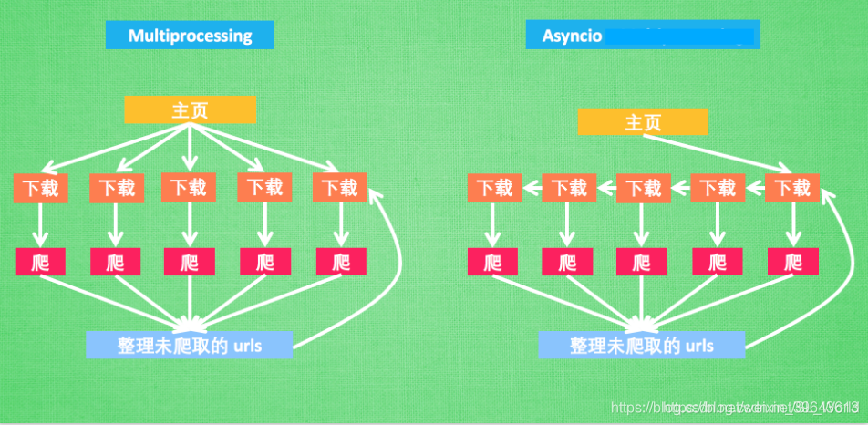
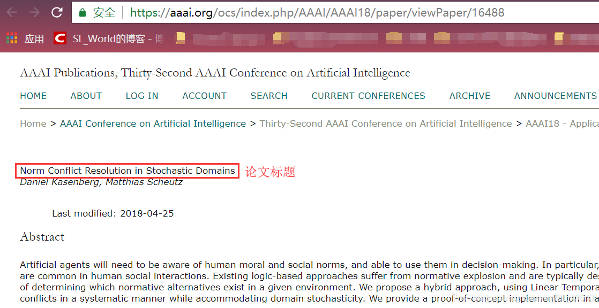
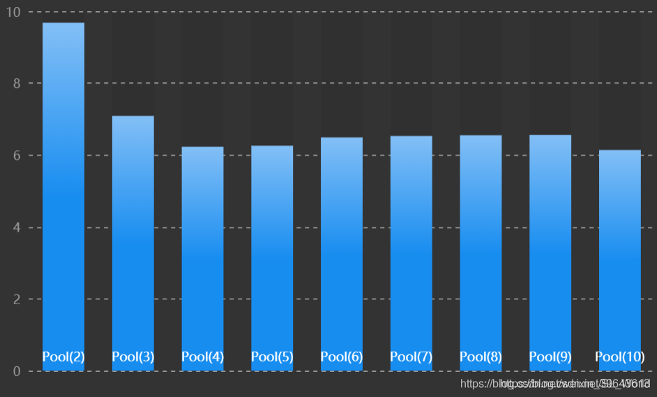

# Python实战异步爬虫(协程)+分布式爬虫(多进程)

src:https://blog.csdn.net/SL_World/article/details/86633611


>引言：我们在写爬虫时常会遇到这样的问题，当需要爬取多个URL时，写一个普通的基于requests库的爬虫程序爬取时间会很长。因为是顺序请求网页的，而网页请求和获得响应过程比较耗费时间，程序不得不等待获得当前网页响应后才能进行下一个URL的爬取，使得总耗时较多。对于这样的多任务，可以使用基于多进程(multiprocessing)和基于Asyncio库的异步(协程)爬虫增强并发性，加速爬虫。

# 前言
**Talk is cheap,show me the picture!**
在讲解之前，我们先来通过一幅图看清多进程和协程的爬虫之间的原理及其区别。(图片来源于网络)


这里，**异步爬虫**不同于多进程爬虫，它使用**单线程**(即仅创建一个事件循环，然后把所有任务添加到事件循环中)就能**并发处理多任务**。在**轮询**到某个任务后，当**遇到耗时操作**(如请求URL)时，**挂起**该任务并进行下一个任务，当之前被挂起的任务**更新了状态**(如获得了网页响应)，则**被唤醒**，程序继续**从上次挂起的地方运行**下去。极大的减少了中间不必要的等待时间。

1. 对于协程(Asyncio库)的原理及实现请见：[《Python异步IO之协程(详解)》](https://blog.csdn.net/SL_World/article/details/86597738)
2. 对于多进程的知识讲解及实现请见：[《廖雪峰-Python多进程》](https://www.liaoxuefeng.com/wiki/1016959663602400/1017628290184064)

在有了`Asyncio`异步IO库实现**协程**后，我们还需要实现异步网页请求。因此，`aiohttp`库应运而生。

# 使用aiohttp库实现异步网页请求
在我们写普通的爬虫程序时，经常会用到`requests`库用以请求网页并获得服务器响应。而在协程中，由于`requests`库提供的相关方法不是**可等待对象(awaitable)**,使得无法放在`await`后面，因此无法使用`requests`库在协程程序中实现请求。

在此，官方专门提供了一个`aiohttp`库，用来实现异步网页请求等功能，简直就是异步版的`requests`库，当然需要我们手动安装该库(如下所示)。

```
 pip3 install aiohttp
```
【基础实现】：在[官方文档](https://docs.aiohttp.org/en/stable/client_quickstart.html)中，推荐使用`ClientSession()`函数来调用网页请求等相关方法。
首先，我们需要引入`aiohttp`模块。

```python
import aiohttp
```

然后，我们**在协程中**使用`ClientSession()`的`get()`或`request()`方法来请求网页。(其中`async with`是[异步上下文管理器](https://blog.csdn.net/SL_World/article/details/86608702)，其封装了异步实现等功能)

```python
async with aiohttp.ClientSession() as session:
    async with session.get('http://httpbin.org/get') as resp:
        print(resp.status)
        print(await resp.text())
```
`ClientSession()`除了有请求网页的方法，官方API还提供了其他HTTP常见方法。

```python
session.request(method='GET', url='http://httpbin.org/request')
session.post('http://httpbin.org/post', data=b'data')
session.put('http://httpbin.org/put', data=b'data')
session.delete('http://httpbin.org/delete')
session.head('http://httpbin.org/get')
session.options('http://httpbin.org/get')
session.patch('http://httpbin.org/patch', data=b'data')

```

如欲看完整的`aiohttp`使用方法，请见[官方文档](https://docs.aiohttp.org/en/stable/client_quickstart.html)。

# 【案例】
## 【任务】爬取2018年AAAI顶会中10篇论文的标题


【已知】：10个论文页面URL。如欲提前看所有代码请见：[GitHub](https://github.com/SparksFly8/Learning_Python/tree/master/spider)

```python
urls = [
    'https://aaai.org/ocs/index.php/AAAI/AAAI18/paper/viewPaper/16488',
    'https://aaai.org/ocs/index.php/AAAI/AAAI18/paper/viewPaper/16583',
    'https://aaai.org/ocs/index.php/AAAI/AAAI18/paper/viewPaper/16380',
    'https://aaai.org/ocs/index.php/AAAI/AAAI18/paper/viewPaper/16911',
    'https://aaai.org/ocs/index.php/AAAI/AAAI18/paper/viewPaper/16581',
    'https://aaai.org/ocs/index.php/AAAI/AAAI18/paper/viewPaper/16674',
    'https://aaai.org/ocs/index.php/AAAI/AAAI18/paper/viewPaper/16112',
    'https://aaai.org/ocs/index.php/AAAI/AAAI18/paper/viewPaper/17343',
    'https://aaai.org/ocs/index.php/AAAI/AAAI18/paper/viewPaper/16659',
    'https://aaai.org/ocs/index.php/AAAI/AAAI18/paper/viewPaper/16449',
]

```

## 一、测试普通爬虫程序
下面是一个普通的同步代码，实现顺序爬取10个URL的title。

```python
import time
from lxml import etree
import requests
urls = [
    'https://aaai.org/ocs/index.php/AAAI/AAAI18/paper/viewPaper/16488',
    'https://aaai.org/ocs/index.php/AAAI/AAAI18/paper/viewPaper/16583',
    # 省略后面8个url...
]
'''
提交请求获取AAAI网页,并解析HTML获取title
'''
def get_title(url,cnt):
    response = requests.get(url)  # 提交请求,获取响应内容
    html = response.content       # 获取网页内容(content返回的是bytes型数据,text()获取的是Unicode型数据)
    title = etree.HTML(html).xpath('//*[@id="title"]/text()') # 由xpath解析HTML
    print('第%d个title:%s' % (cnt,''.join(title)))
    
if __name__ == '__main__':
    start1 = time.time()
    i = 0
    for url in urls:
        i = i + 1
        start = time.time()
        get_title(url,i)
        print('第%d个title爬取耗时:%.5f秒' % (i,float(time.time() - start)))
    print('爬取总耗时:%.5f秒' % float(time.time()-start1))

```
执行结果如下：

```python
第1个title:Norm Conflict Resolution in Stochastic Domains
第1个title爬取耗时:1.41810秒
第2个title:Algorithms for Trip-Vehicle Assignment in Ride-Sharing
第2个title爬取耗时:1.31734秒
第3个title:Tensorized Projection for High-Dimensional Binary Embedding
第3个title爬取耗时:1.31826秒
第4个title:Synthesis of Programs from Multimodal Datasets
第4个title爬取耗时:1.28625秒
第5个title:Video Summarization via Semantic Attended Networks
第5个title爬取耗时:1.33226秒
第6个title:TIMERS: Error-Bounded SVD Restart on Dynamic Networks
第6个title爬取耗时:1.52718秒
第7个title:Memory Management With Explicit Time in Resource-Bounded Agents
第7个title爬取耗时:1.35522秒
第8个title:Mitigating Overexposure in Viral Marketing
第8个title爬取耗时:1.35722秒
第9个title:Neural Link Prediction over Aligned Networks
第9个title爬取耗时:1.51317秒
第10个title:Dual Deep Neural Networks Cross-Modal Hashing
第10个title爬取耗时:1.30624秒
爬取总耗时:13.73324秒

```
可见，平均每请求完一个URL并解析该HTML耗时1.4秒左右。本次程序运行总耗时13.7秒。

## 二、测试基于协程的异步爬虫程序
下面，是使用了协程的异步爬虫程序。`etree`模块用于解析HTML，`aiohttp`是一个利用asyncio的库，它的API看起来很像请求的API，可以暂时看成协程版的`requests`。

```python
import time
from lxml import etree
import aiohttp
import asyncio
urls = [
    'https://aaai.org/ocs/index.php/AAAI/AAAI18/paper/viewPaper/16488',
    'https://aaai.org/ocs/index.php/AAAI/AAAI18/paper/viewPaper/16583',
    # 省略后面8个url...
]
titles = []
sem = asyncio.Semaphore(10) # 信号量，控制协程数，防止爬的过快
'''
提交请求获取AAAI网页,并解析HTML获取title
'''
async def get_title(url):
    with(await sem):
        # async with是异步上下文管理器
        async with aiohttp.ClientSession() as session:  # 获取session
            async with session.request('GET', url) as resp:  # 提出请求
                # html_unicode = await resp.text() 
                # html = bytes(bytearray(html_unicode, encoding='utf-8'))
                html = await resp.read() # 可直接获取bytes 
                title = etree.HTML(html).xpath('//*[@id="title"]/text()')
                print(''.join(title))
'''
调用方
'''
def main():
    loop = asyncio.get_event_loop()           # 获取事件循环
    tasks = [get_title(url) for url in urls]  # 把所有任务放到一个列表中
    loop.run_until_complete(asyncio.wait(tasks)) # 激活协程
    loop.close()  # 关闭事件循环

if __name__ == '__main__':
    start = time.time()
    main()  # 调用方
    print('总耗时：%.5f秒' % float(time.time()-start))

```
执行结果如下：

```
Memory Management With Explicit Time in Resource-Bounded Agents
Norm Conflict Resolution in Stochastic Domains
Video Summarization via Semantic Attended Networks
Tensorized Projection for High-Dimensional Binary Embedding
Algorithms for Trip-Vehicle Assignment in Ride-Sharing
Dual Deep Neural Networks Cross-Modal Hashing
Neural Link Prediction over Aligned Networks
Mitigating Overexposure in Viral Marketing
TIMERS: Error-Bounded SVD Restart on Dynamic Networks
Synthesis of Programs from Multimodal Datasets
总耗时：2.43371秒

```

可见，本次我们使用协程爬取10个URL只耗费了2.4秒，效率是普通同步程序的8~12倍。
**【解释】：**

1. `request`获取的`text()`返回的是网页的**Unicode型数据**，`content`和`read()`返回的是**bytes型数据**。而`etree.HTML(html)`接收的参数需是bytes类型，所以**①可以通过resp.read()直接获取bytes；** ②若使用`text()`则需要通过先把Unicode类型数据转换成**比特数组对象**，再转换成**比特对象**， 即`bytes(bytearray(html_unicode, encoding='utf-8'))`。
2. 发起请求除了可以用上述`session.request('GET', url)`也可以用`session.get(url)`，功能相同。
3. 如果同时做太多的请求，链接有可能会断掉。所以需要使用`sem = asyncio.Semaphore(10)` ，`Semaphore`是**限制**同时工作的协同程序数量的同步工具。
4. `async with`是异步上下文管理器，[不解的请看Python中的async with用法](https://blog.csdn.net/SL_World/article/details/86608702)。

## 三、测试基于多进程的分布式爬虫程序
下面，我们测试多进程爬虫程序，由于我的电脑CPU是4核，所以这里进程池我就设的4。

```python
import multiprocessing
from multiprocessing import Pool
import time
import requests
from lxml import etree
urls = [
    'https://aaai.org/ocs/index.php/AAAI/AAAI18/paper/viewPaper/16488',
    'https://aaai.org/ocs/index.php/AAAI/AAAI18/paper/viewPaper/16583',
    # 省略后面8个url...
]
'''
提交请求获取AAAI网页,并解析HTML获取title
'''
def get_title(url,cnt):
    response = requests.get(url)  # 提交请求
    html = response.content       # 获取网页内容
    title = etree.HTML(html).xpath('//*[@id="title"]/text()') # 由xpath解析HTML
    print('第%d个title:%s' % (cnt,''.join(title)))
'''
调用方
'''
def main():
    print('当前环境CPU核数是：%d核' % multiprocessing.cpu_count())
    p = Pool(4)  # 进程池
    i = 0
    for url in urls:
        i += 1
        p.apply_async(get_title, args=(url, i))
    p.close()
    p.join()   # 运行完所有子进程才能顺序运行后续程序
    
if __name__ == '__main__':
    start = time.time()
    main()  # 调用方
    print('总耗时：%.5f秒' % float(time.time()-start))

```

执行结果：

```
当前环境CPU核数是：4核
第2个title:Algorithms for Trip-Vehicle Assignment in Ride-Sharing
第1个title:Norm Conflict Resolution in Stochastic Domains
第4个title:Synthesis of Programs from Multimodal Datasets
第3个title:Tensorized Projection for High-Dimensional Binary Embedding
第5个title:Video Summarization via Semantic Attended Networks
第6个title:TIMERS: Error-Bounded SVD Restart on Dynamic Networks
第7个title:Memory Management With Explicit Time in Resource-Bounded Agents
第8个title:Mitigating Overexposure in Viral Marketing
第9个title:Neural Link Prediction over Aligned Networks
第10个title:Dual Deep Neural Networks Cross-Modal Hashing
总耗时：5.01228秒
```
可见，多进程分布式爬虫也比普通同步程序要快很多，本次运行时间5秒。但比协程略慢。

**【时间对比】：**
对于上例中10个URL的爬取时间，下面整理成了表格。

| CPU核数\实现方式 | 普通同步爬虫 | 多进程爬虫 | 异步爬虫 |      |
| ---------------- | ------------ | ---------- | -------- | ---- |
| 4核              | 13.7秒       | 5.0秒      | 2.4秒    |      |

其中增加多进程中进程池Pool(n)的n可加速爬虫，下图显示了消耗的时间(单位.秒)和Pool()参数的关系。


如果你以为到这里就结束了，那你就要错过最精彩的东西了：)

## 四、测试-异步结合多进程-爬虫程序
由于解析·HTML·也需要消耗一定的时间，而·aiohttp·和·asyncio·均未提供相关解析方法。所以可以在请求网页的时使用异步程序，在解析·HTML·使用多进程，两者配合使用，效率更高哦～！
**【请求网页】：使用协程。**
**【解析HTML】：使用多进程。**

```python
from multiprocessing import Pool
import time
from lxml import etree
import aiohttp
import asyncio
urls = [
    'https://aaai.org/ocs/index.php/AAAI/AAAI18/paper/viewPaper/16488',
    'https://aaai.org/ocs/index.php/AAAI/AAAI18/paper/viewPaper/16583',
    # 省略后面8个url...
]
htmls = []
titles = []
sem = asyncio.Semaphore(10) # 信号量，控制协程数，防止爬的过快
'''
提交请求获取AAAI网页html
'''
async def get_html(url):
    with(await sem):
        # async with是异步上下文管理器
        async with aiohttp.ClientSession() as session:  # 获取session
            async with session.request('GET', url) as resp:  # 提出请求
                html = await resp.read() # 直接获取到bytes
                htmls.append(html)
                print('异步获取%s下的html.' % url)

'''
协程调用方，请求网页
'''
def main_get_html():
    loop = asyncio.get_event_loop()           # 获取事件循环
    tasks = [get_html(url) for url in urls]  # 把所有任务放到一个列表中
    loop.run_until_complete(asyncio.wait(tasks)) # 激活协程
    loop.close()  # 关闭事件循环
'''
使用多进程解析html
'''
def multi_parse_html(html,cnt):
    title = etree.HTML(html).xpath('//*[@id="title"]/text()')
    titles.append(''.join(title))
    print('第%d个html完成解析－title:%s' % (cnt,''.join(title)))
'''
多进程调用总函数，解析html
'''
def main_parse_html():
    p = Pool(4)
    i = 0
    for html in htmls:
        i += 1
        p.apply_async(multi_parse_html,args=(html,i))
    p.close()
    p.join()


if __name__ == '__main__':
    start = time.time()
    main_get_html()   # 调用方
    main_parse_html() # 解析html
    print('总耗时：%.5f秒' % float(time.time()-start))

```
执行结果如下：

```
异步获取https://aaai.org/ocs/index.php/AAAI/AAAI18/paper/viewPaper/16380下的html.
异步获取https://aaai.org/ocs/index.php/AAAI/AAAI18/paper/viewPaper/16674下的html.
异步获取https://aaai.org/ocs/index.php/AAAI/AAAI18/paper/viewPaper/16583下的html.
异步获取https://aaai.org/ocs/index.php/AAAI/AAAI18/paper/viewPaper/16911下的html.
异步获取https://aaai.org/ocs/index.php/AAAI/AAAI18/paper/viewPaper/17343下的html.
异步获取https://aaai.org/ocs/index.php/AAAI/AAAI18/paper/viewPaper/16449下的html.
异步获取https://aaai.org/ocs/index.php/AAAI/AAAI18/paper/viewPaper/16488下的html.
异步获取https://aaai.org/ocs/index.php/AAAI/AAAI18/paper/viewPaper/16659下的html.
异步获取https://aaai.org/ocs/index.php/AAAI/AAAI18/paper/viewPaper/16581下的html.
异步获取https://aaai.org/ocs/index.php/AAAI/AAAI18/paper/viewPaper/16112下的html.
第3个html完成解析－title:Algorithms for Trip-Vehicle Assignment in Ride-Sharing
第1个html完成解析－title:Tensorized Projection for High-Dimensional Binary Embedding
第2个html完成解析－title:TIMERS: Error-Bounded SVD Restart on Dynamic Networks
第4个html完成解析－title:Synthesis of Programs from Multimodal Datasets
第6个html完成解析－title:Dual Deep Neural Networks Cross-Modal Hashing
第7个html完成解析－title:Norm Conflict Resolution in Stochastic Domains
第8个html完成解析－title:Neural Link Prediction over Aligned Networks
第5个html完成解析－title:Mitigating Overexposure in Viral Marketing
第9个html完成解析－title:Video Summarization via Semantic Attended Networks
第10个html完成解析－title:Memory Management With Explicit Time in Resource-Bounded Agents

```
# 【参考文献】
[[1] aiohttp官方API文档](https://docs.aiohttp.org/en/stable/client_quickstart.html)
[[2] 加速爬虫: 异步加载 Asyncio](https://morvanzhou.github.io/tutorials/data-manipulation/scraping/4-02-asyncio/)
[[3] python:利用asyncio进行快速抓取](https://www.bbsmax.com/A/Ae5RXrL3zQ/)
[[4] 使用 aiohttp 和 asyncio 进行异步请求](https://blog.csdn.net/getcomputerstyle/article/details/78438246)
[[5] requests的content与text导致lxml的解析问题](https://www.kingname.info/2015/04/29/lxmloldbug/)