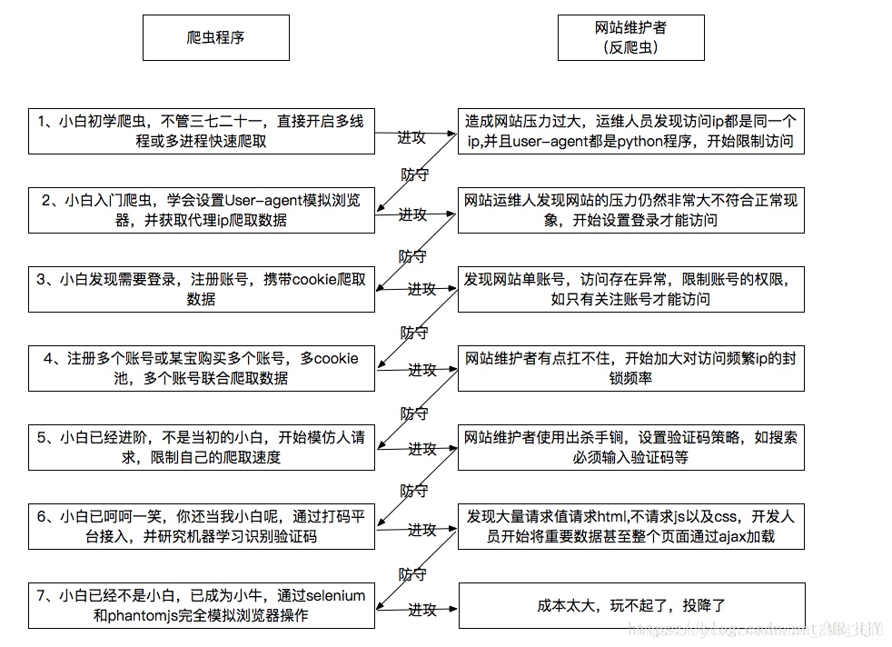
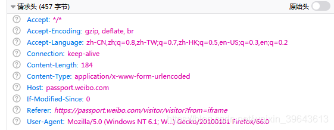
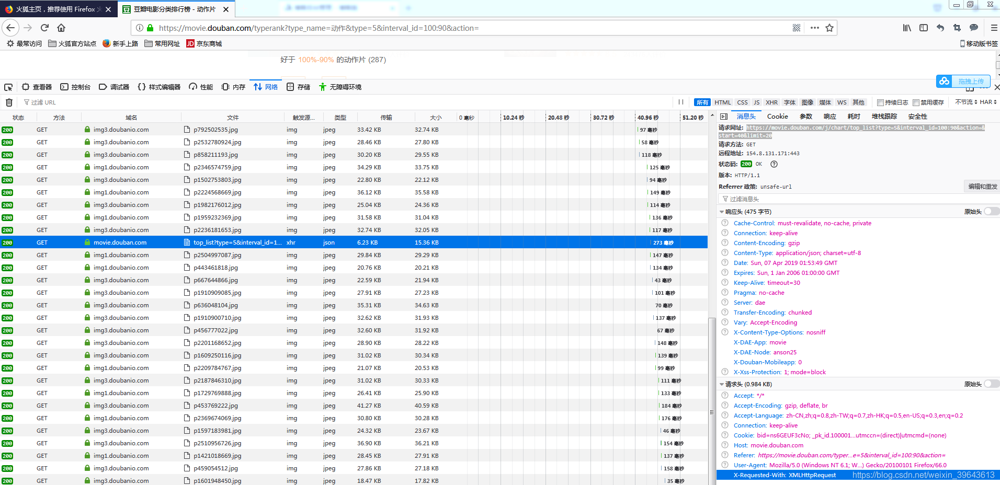

# 反爬与反反爬

src:https://www.cnblogs.com/yanshw/p/10664274.html





# 1. 前言
很多网站都有反爬机制，自从有了爬虫，反爬与反反爬的斗争就没停过，而且都在不断升级。

下面介绍一些常见的反爬与反反爬机制。

# 2. 基于headers的反爬
基于用户请求的headers反爬是最常见的反爬机制。


在请求头headers中，包含很多键值对，服务器会根据这些键值对进行反爬。

## 2.1. User-Agent

请求使用的终端，正常为浏览器，如果使用爬虫，就会显示如python

 **反反爬策略：伪装浏览器**

即在爬虫中添加headers，并在headers中添加浏览器

并且可通过频繁更换user-agent实现反爬

```python
header={'User-Agent': 'Mozilla/5.0 (Windows NT 6.1; WOW64; Trident/7.0; rv:11.0) like Gecko'}
```

## 2.2. referer：防盗链

盗链：其他站点通过超链接等连接到我们的站点窃取我们的资源的行为称为盗链

referer请求头：代表当前访问是从哪个网页过来的

如我们的网站上有一个很好的图片，别人可以通过查看我们的链接直接用到他的网站上，此时我们如果设置referer，他就无法直接使用

具体解释请自行百度。

**反反爬策略：在headers中添加防盗链，通过抓包查看具体值**

```python
request.add_header('Referer', 'http://www.abwuliu.com/login.html')
```

# 3. 基于用户行为的反爬

检测用户的行为是否正常，如访问频率

## 3.1. 拉黑IP
检测同一IP的访问频率，如果访问过快，就封IP

**反反爬策略：**

1. 减缓访问频率

2. 使用代理访问，正向代理，我会在其他博客详细介绍

3. 使用特殊IP，如学习的公网IP，但有些不行的

4. 利用服务器的反向代理进行爬取，前提是知道web服务器的反向代理

## 3.2. 拉黑账号
如果同一账号短时间内多次执行某操作，就封账户

**反反爬策略：**

1. 减缓访问频率

2. 执行几次操作后，退出，重新登录

3. 建立 cookie 池，切换登录

# 4. 基于动态页面的反爬

 使用动态网页，动态生成数据，或者动态加载，无法从源码直接查看数据。

如`ajax`在后台与服务器交换数据，在不更新整个页面的情况下，实现页面局部更新，是一种异步加载的方法，用js和xml实现。

```html
xmlhttp.open("GET","test1.txt",true);
xmlhttp.send();
```
反反爬策略：

1. 通过抓包观察ajax的请求方式，模拟该请求方式进行网页爬取。如豆瓣电影排行榜，初始页面有一些电影，当下滑到底部时，页面会自动加载更多的电影。

分析：右下角 XMLHttpRequest 请求，说明是ajax。左上角是请求url：https://movie.douban.com/j/chart/top_list？type=5&interval_id=100:90&action=&start=40&limit=20，通过start和limit两个参数访问页面，这种情况是比较简单的，但通常会有更高级的异步加载，如数据加密。
2.模拟浏览器：selenium，模拟人来直接操纵浏览器。
通常还可以用phantomJS作为辅助工具，phantomJS其实是个没有界面的浏览器。
这个工具可以设置环境变量，在程序里直接调用，具体请百度。

# 5. 基于验证码的反爬

**反反爬策略：**

1. 半自动识别：爬取验证码图片，在本地查看，并输入，其他同普通爬虫，无法解决大规模爬虫问题

2. 通过第三方平台识别验证码：如云打码http://www.yundama.com/demo.html

3. 图像识别

# 6. 基于加密的反爬

大多是通过js来对数据进行加密

**反反爬策略：**

1. 找到对应的js代码，自己实现其加密算法

2. 用PyV8，execjs等库执行js代码

3. selenimu模拟浏览器

 还有一些经常遇到的爬虫的挑战。


# 7. 基于post的爬虫

需要提交一些参数给服务器

```python
data={'x':'aaa','y':'123','code':'','error_num':0}
dataEncode=urllib.urlencode(data)
request=urllib2.Request(url,dataEncode,header)
```


# 8. 基于登录的爬虫

1. 提交用户名密码，同post，但是很多网站在登录时会隐形的添加一些参数，如除了用户名密码外，还提交一个随机数，或者隐形的变换你提交的参数，如你提交的是123，自动转换成a123，等等诸多手段，需要通过抓包来查看真实提交的参数

2. 利用cookie进行登录，我会在其他博客详细介绍
```python
cj=cookielib.CookieJar()
pro=urllib2.HTTPCookieProcessor(cj)
opener=urllib2.build_opener(pro)
urllib2.install_opener(opener)
request=urllib2.Request(url,dataEncode,header)
```

3. 跳转url，登录url和接收数据的url不是同一个url，而且还有多个url跳转，post-get跳转，需要借助抓包仔细观察。

```python
login_url = "http://passport.jd.com/uc/login"
post_url = "http://passport.jd.com/uc/loginService"
```

4. 经常变换登录方式


# 9. 总结

道高一尺，魔高一丈，反爬技术在不断升级，但总有对应的反反爬机制，然而万变不离其宗，基础道理与方法都一致，解决具体问题时稍加研究即可。

# 参考资料：

[通过referer请求头实现防盗链
](https://blog.csdn.net/dreamli1314/article/details/78848356)
<https://www.csdn.net/gather_28/MtjaQg4sMDc5LWJsb2cO0O0O.html>