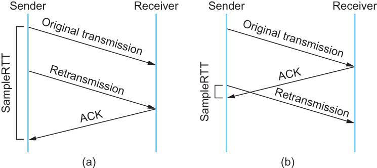

# TCP 的那些事儿（上）

src:https://coolshell.cn/articles/11564.html

## 前言

TCP是一个巨复杂的协议，因为他要解决很多问题，而这些问题又带出了很多子问题和阴暗面。所以学习TCP本身是个比较痛苦的过程，但对于学习的过程却能让人有很多收获。关于TCP这个协议的细节，我还是推荐你去看[W.Richard Stevens](http://www.kohala.com/start/)的《[TCP/IP 详解 卷1：协议](http://book.douban.com/subject/1088054/)》（当然，你也可以去读一下[RFC793](http://tools.ietf.org/html/rfc793)以及后面N多的RFC）。另外，本文我会使用英文术语，这样方便你通过这些英文关键词来查找相关的技术文档。

之所以想写这篇文章，目的有三个，

- 一个是想锻炼一下自己是否可以用简单的篇幅把这么复杂的TCP协议描清楚的能力。
- 另一个是觉得现在的好多程序员基本上不会认认真真地读本书，喜欢快餐文化，所以，希望这篇快餐文章可以让你对TCP这个古典技术有所了解，并能体会到软件设计中的种种难处。并且你可以从中有一些软件设计上的收获。
- 最重要的希望这些基础知识可以让你搞清很多以前一些似是而非的东西，并且你能意识到基础的重要。

所以，本文不会面面俱到，只是对TCP协议、算法和原理的科普。


我本来只想写一个篇幅的文章的，但是TCP真TMD的复杂，比C++复杂多了，这30多年来，各种优化变种争论和修改。所以，写着写着就发现只有砍成两篇。

- 上篇中，主要向你介绍TCP协议的定义和丢包时的重传机制。
- 下篇中，重点介绍TCP的流迭、拥塞处理。

废话少说，首先，我们需要知道TCP在网络OSI的七层模型中的第四层——Transport层，IP在第三层——Network层，ARP在第二层——Data Link层，在第二层上的数据，我们叫Frame，在第三层上的数据叫Packet，第四层的数据叫Segment。

首先，我们需要知道，我们程序的数据首先会打到TCP的Segment中，然后TCP的Segment会打到IP的Packet中，然后再打到以太网Ethernet的Frame中，传到对端后，各个层解析自己的协议，然后把数据交给更高层的协议处理。

## 1.TCP头格式

接下来，我们来看一下TCP头的格式


你需要注意这么几点：

- TCP的包是没有IP地址的，那是IP层上的事。但是有源端口和目标端口。
- 一个TCP连接需要四个元组来表示是同一个连接（src_ip, src_port, dst_ip, dst_port）准确说是五元组，还有一个是协议。但因为这里只是说TCP协议，所以，这里我只说四元组。
- 注意上图中的四个非常重要的东西：
  - **Sequence Number**是包的序号，**用来解决网络包乱序（reordering）问题。**
  - **Acknowledgement Number**就是ACK——用于确认收到，**用来解决不丢包的问题**。
  - **Window又叫Advertised-Window**，也就是著名的滑动窗口（Sliding Window），**用于解决流控的**。
  - **TCP Flag** ，也就是包的类型，**主要是用于操控TCP的状态机的**。

关于其它的东西，可以参看下面的图示


## 2. TCP的状态机

其实，**网络上的传输是没有连接的，包括TCP也是一样的**。而TCP所谓的“连接”，其实只不过是在通讯的双方维护一个“连接状态”，让它看上去好像有连接一样。所以，TCP的状态变换是非常重要的。

下面是：“**TCP协议的状态机**”（[图片来源](http://www.tcpipguide.com/free/t_TCPOperationalOverviewandtheTCPFiniteStateMachineF-2.htm)） 和 “**TCP建链接**”、“**TCP断链接**”、“**传数据**” 的对照图，我把两个图并排放在一起，这样方便在你对照着看。另外，下面这两个图非常非常的重要，你一定要记牢。（吐个槽：看到这样复杂的状态机，就知道这个协议有多复杂，复杂的东西总是有很多坑爹的事情，所以TCP协议其实也挺坑爹的）


很多人会问，为什么建链接要3次握手，断链接需要4次挥手？

- **对于建链接的3次握手，**主要是要初始化Sequence Number 的初始值。通信的双方要互相通知对方自己的初始化的Sequence Number（缩写为ISN：Inital Sequence Number）——所以叫SYN，全称Synchronize Sequence Numbers。也就上图中的 x 和 y。这个号要作为以后的数据通信的序号，以保证应用层接收到的数据不会因为网络上的传输的问题而乱序（TCP会用这个序号来拼接数据）。

- **对于4次挥手，**其实你仔细看是2次，因为TCP是全双工的，所以，发送方和接收方都需要Fin和Ack。只不过，有一方是被动的，所以看上去就成了所谓的4次挥手。如果两边同时断连接，那就会就进入到CLOSING状态，然后到达TIME_WAIT状态。下图是双方同时断连接的示意图（你同样可以对照着TCP状态机看）：


另外，有几个事情需要注意一下：

- **关于建连接时SYN超时**。试想一下，如果server端接到了clien发的SYN后回了SYN-ACK后client掉线了，server端没有收到client回来的ACK，那么，这个连接处于一个中间状态，即没成功，也没失败。于是，server端如果在一定时间内没有收到的TCP会重发SYN-ACK。在Linux下，默认重试次数为5次，重试的间隔时间从1s开始每次都翻售，5次的重试时间间隔为1s, 2s, 4s, 8s, 16s，总共31s，第5次发出后还要等32s都知道第5次也超时了，所以，总共需要 1s + 2s + 4s+ 8s+ 16s + 32s = 2^6 -1 = 63s，TCP才会把断开这个连接。

- **关于SYN Flood攻击**。一些恶意的人就为此制造了SYN Flood攻击——给服务器发了一个SYN后，就下线了，于是服务器需要默认等63s才会断开连接，这样，攻击者就可以把服务器的syn连接的队列耗尽，让正常的连接请求不能处理。于是，Linux下给了一个叫**tcp_syncookies**的参数来应对这个事——当SYN队列满了后，TCP会通过源地址端口、目标地址端口和时间戳打造出一个特别的Sequence Number发回去（又叫cookie），如果是攻击者则不会有响应，如果是正常连接，则会把这个 SYN Cookie发回来，然后服务端可以通过cookie建连接（即使你不在SYN队列中）。请注意，**请先千万别用tcp_syncookies来处理正常的大负载的连接的情况**。因为，synccookies是妥协版的TCP协议，并不严谨。对于正常的请求，你应该调整三个TCP参数可供你选择，第一个是：tcp_synack_retries 可以用他来减少重试次数；第二个是：tcp_max_syn_backlog，可以增大SYN连接数；第三个是：tcp_abort_on_overflow 处理不过来干脆就直接拒绝连接了。

- **关于ISN的初始化**。ISN是不能hard code的，不然会出问题的——比如：如果连接建好后始终用1来做ISN，如果client发了30个segment过去，但是网络断了，于是 client重连，又用了1做ISN，但是之前连接的那些包到了，于是就被当成了新连接的包，此时，client的Sequence Number 可能是3，而Server端认为client端的这个号是30了。全乱了。[RFC793](http://tools.ietf.org/html/rfc793)中说，ISN会和一个假的时钟绑在一起，这个时钟会在每4微秒对ISN做加一操作，直到超过2^32，又从0开始。这样，一个ISN的周期大约是4.55个小时。因为，我们假设我们的TCP Segment在网络上的存活时间不会超过Maximum Segment Lifetime（缩写为MSL – [Wikipedia语条](http://en.wikipedia.org/wiki/Maximum_Segment_Lifetime)），所以，只要MSL的值小于4.55小时，那么，我们就不会重用到ISN。

- **关于 MSL 和 TIME_WAIT**。通过上面的ISN的描述，相信你也知道MSL是怎么来的了。我们注意到，在TCP的状态图中，从TIME_WAIT状态到CLOSED状态，有一个超时设置，这个超时设置是 2*MSL（[RFC793](http://tools.ietf.org/html/rfc793)定义了MSL为2分钟，Linux设置成了30s）为什么要这有TIME_WAIT？为什么不直接给转成CLOSED状态呢？主要有两个原因：1）TIME_WAIT确保有足够的时间让对端收到了ACK，如果被动关闭的那方没有收到Ack，就会触发被动端重发Fin，一来一去正好2个MSL，2）有足够的时间让这个连接不会跟后面的连接混在一起（你要知道，有些自做主张的路由器会缓存IP数据包，如果连接被重用了，那么这些延迟收到的包就有可能会跟新连接混在一起）。你可以看看这篇文章《[TIME_WAIT and its design implications for protocols and scalable client server systems](http://www.serverframework.com/asynchronousevents/2011/01/time-wait-and-its-design-implications-for-protocols-and-scalable-servers.html)》

- **关于TIME_WAIT数量太多**。从上面的描述我们可以知道，TIME_WAIT是个很重要的状态，但是如果在大并发的短链接下，TIME_WAIT 就会太多，这也会消耗很多系统资源。只要搜一下，你就会发现，十有八九的处理方式都是教你设置两个参数，一个叫**tcp_tw_reuse**，另一个叫**tcp_tw_recycle**的参数，这两个参数默认值都是被关闭的，后者recyle比前者resue更为激进，resue要温柔一些。另外，如果使用tcp_tw_reuse，必需设置tcp_timestamps=1，否则无效。这里，你一定要注意，**打开这两个参数会有比较大的坑——可能会让TCP连接出一些诡异的问题**（因为如上述一样，如果不等待超时重用连接的话，新的连接可能会建不上。正如[官方文档](https://www.kernel.org/doc/Documentation/networking/ip-sysctl.txt)上说的一样“**It should not be changed without advice/request of technical experts**”）。

- - **关于tcp_tw_reuse**。官方文档上说tcp_tw_reuse 加上tcp_timestamps（又叫PAWS, for Protection Against Wrapped Sequence Numbers）可以保证协议的角度上的安全，但是你需要tcp_timestamps在两边都被打开（你可以读一下[tcp_twsk_unique](http://lxr.free-electrons.com/ident?i=tcp_twsk_unique)的源码 ）。我个人估计还是有一些场景会有问题。

- - **关于tcp_tw_recycle**。如果是tcp_tw_recycle被打开了话，会假设对端开启了tcp_timestamps，然后会去比较时间戳，如果时间戳变大了，就可以重用。但是，如果对端是一个NAT网络的话（如：一个公司只用一个IP出公网）或是对端的IP被另一台重用了，这个事就复杂了。建链接的SYN可能就被直接丢掉了（你可能会看到connection time out的错误）（如果你想观摩一下Linux的内核代码，请参看源码[ tcp_timewait_state_process](http://lxr.free-electrons.com/ident?i=tcp_timewait_state_process)）。

- - **关于tcp_max_tw_buckets**。这个是控制并发的TIME_WAIT的数量，默认值是180000，如果超限，那么，系统会把多的给destory掉，然后在日志里打一个警告（如：time wait bucket table overflow），官网文档说这个参数是用来对抗DDoS攻击的。也说的默认值180000并不小。这个还是需要根据实际情况考虑。

**Again，使用tcp_tw_reuse和tcp_tw_recycle来解决TIME_WAIT的问题是非常非常危险的，因为这两个参数违反了TCP协议（[RFC 1122](http://tools.ietf.org/html/rfc1122)）** 

其实，TIME_WAIT表示的是你主动断连接，所以，这就是所谓的“不作死不会死”。试想，如果让对端断连接，那么这个破问题就是对方的了，呵呵。另外，如果你的服务器是于HTTP服务器，那么设置一个[HTTP的KeepAlive](http://en.wikipedia.org/wiki/HTTP_persistent_connection)有多重要（浏览器会重用一个TCP连接来处理多个HTTP请求），然后让客户端去断链接（你要小心，浏览器可能会非常贪婪，他们不到万不得已不会主动断连接）。

## 3. 数据传输中的Sequence Number

下图是我从Wireshark中截了个我在访问coolshell.cn时的有数据传输的图给你看一下，SeqNum是怎么变的。（使用Wireshark菜单中的Statistics ->Flow Graph… ）


你可以看到，**SeqNum的增加是和传输的字节数相关的**。上图中，三次握手后，来了两个Len:1440的包，而第二个包的SeqNum就成了1441。然后第一个ACK回的是1441，表示第一个1440收到了。

**注意**：如果你用Wireshark抓包程序看3次握手，你会发现SeqNum总是为0，不是这样的，Wireshark为了显示更友好，使用了Relative SeqNum——相对序号，你只要在右键菜单中的protocol preference 中取消掉就可以看到“Absolute SeqNum”了


## 4. TCP重传机制

TCP要保证所有的数据包都可以到达，所以，必需要有重传机制。

注意，接收端给发送端的Ack确认只会确认最后一个连续的包，比如，发送端发了1,2,3,4,5一共五份数据，接收端收到了1，2，于是回ack 3，然后收到了4（注意此时3没收到），此时的TCP会怎么办？我们要知道，因为正如前面所说的，**SeqNum和Ack是以字节数为单位，所以ack的时候，不能跳着确认，只能确认最大的连续收到的包**，不然，发送端就以为之前的都收到了。

### 4.1 超时重传机制

一种是不回ack，死等3，当发送方发现收不到3的ack超时后，会重传3。一旦接收方收到3后，会ack 回 4——意味着3和4都收到了。

但是，这种方式会有比较严重的问题，那就是因为要死等3，所以会导致4和5即便已经收到了，而发送方也完全不知道发生了什么事，因为没有收到Ack，所以，发送方可能会悲观地认为也丢了，所以有可能也会导致4和5的重传。

对此有两种选择：

- 一种是仅重传timeout的包。也就是第3份数据。
- 另一种是重传timeout后所有的数据，也就是第3，4，5这三份数据。

这两种方式有好也有不好。第一种会节省带宽，但是慢，第二种会快一点，但是会浪费带宽，也可能会有无用功。但总体来说都不好。因为都在等timeout，timeout可能会很长（在下篇会说TCP是怎么动态地计算出timeout的）

### 4.2 快速重传机制

于是，TCP引入了一种叫**Fast Retransmit** 的算法，**不以时间驱动，而以数据驱动重传**。也就是说，如果，包没有连续到达，就ack最后那个可能被丢了的包，如果发送方连续收到3次相同的ack，就重传。Fast Retransmit的好处是不用等timeout了再重传。

比如：如果发送方发出了1，2，3，4，5份数据，第一份先到送了，于是就ack回2，结果2因为某些原因没收到，3到达了，于是还是ack回2，后面的4和5都到了，但是还是ack回2，因为2还是没有收到，于是发送端收到了三个ack=2的确认，知道了2还没有到，于是就马上重转2。然后，接收端收到了2，此时因为3，4，5都收到了，于是ack回6。示意图如下：


Fast Retransmit只解决了一个问题，就是timeout的问题，它依然面临一个艰难的选择，就是，是重传之前的一个还是重传所有的问题。对于上面的示例来说，是重传#2呢还是重传#2，#3，#4，#5呢？因为发送端并不清楚这连续的3个ack(2)是谁传回来的？也许发送端发了20份数据，是#6，#10，#20传来的呢。这样，发送端很有可能要重传从2到20的这堆数据（这就是某些TCP的实际的实现）。可见，这是一把双刃剑。

### 4.3 SACK 方法

另外一种更好的方式叫：**Selective Acknowledgment (SACK)**（参看[RFC 2018](http://tools.ietf.org/html/rfc2018)），这种方式需要在TCP头里加一个SACK的东西，ACK还是Fast Retransmit的ACK，SACK则是汇报收到的数据碎版。参看下图：


这样，在发送端就可以根据回传的SACK来知道哪些数据到了，哪些没有到。于是就优化了Fast Retransmit的算法。当然，这个协议需要两边都支持。在 Linux下，可以通过**tcp_sack**参数打开这个功能（Linux 2.4后默认打开）。

这里还需要注意一个问题——**接收方Reneging，所谓Reneging的意思就是接收方有权把已经报给发送端SACK里的数据给丢了**。这样干是不被鼓励的，因为这个事会把问题复杂化了，但是，接收方这么做可能会有些极端情况，比如要把内存给别的更重要的东西。**所以，发送方也不能完全依赖SACK，还是要依赖ACK，并维护Time-Out，如果后续的ACK没有增长，那么还是要把SACK的东西重传，另外，接收端这边永远不能把SACK的包标记为Ack。**

注意：SACK会消费发送方的资源，试想，如果一个攻击者给数据发送方发一堆SACK的选项，这会导致发送方开始要重传甚至遍历已经发出的数据，这会消耗很多发送端的资源。详细的东西请参看《[TCP SACK的性能权衡](http://www.ibm.com/developerworks/cn/linux/l-tcp-sack/)》

### 4.4 Duplicate SACK – 重复收到数据的问题

Duplicate SACK又称D-SACK，**其主要使用了SACK来告诉发送方有哪些数据被重复接收了**。[RFC-2883 ](http://www.ietf.org/rfc/rfc2883.txt)里有详细描述和示例。下面举几个例子（来源于[RFC-2883](http://www.ietf.org/rfc/rfc2883.txt)）

D-SACK使用了SACK的第一个段来做标志，

- 如果SACK的第一个段的范围被ACK所覆盖，那么就是D-SACK

- 如果SACK的第一个段的范围被SACK的第二个段覆盖，那么就是D-SACK

**示例一：ACK丢包**

下面的示例中，丢了两个ACK，所以，发送端重传了第一个数据包（3000-3499），于是接收端发现重复收到，于是回了一个SACK=3000-3500，因为ACK都到了4000意味着收到了4000之前的所有数据，所以这个SACK就是D-SACK——旨在告诉发送端我收到了重复的数据，而且我们的发送端还知道，数据包没有丢，丢的是ACK包。

```
  Transmitted  Received    ACK Sent

  Segment      Segment     (Including SACK Blocks)

  3000-3499    3000-3499   3500 (ACK dropped)

  3500-3999    3500-3999   4000 (ACK dropped)

  3000-3499    3000-3499   4000, SACK=3000-3500

                                       ---------
```


 **示例二，网络延误**

下面的示例中，网络包（1000-1499）被网络给延误了，导致发送方没有收到ACK，而后面到达的三个包触发了“Fast Retransmit算法”，所以重传，但重传时，被延误的包又到了，所以，回了一个SACK=1000-1500，因为ACK已到了3000，所以，这个SACK是D-SACK——标识收到了重复的包。

这个案例下，发送端知道之前因为“Fast Retransmit算法”触发的重传不是因为发出去的包丢了，也不是因为回应的ACK包丢了，而是因为网络延时了。

```
    Transmitted    Received    ACK Sent
    Segment        Segment     (Including SACK Blocks)
    500-999        500-999     1000
    1000-1499      (delayed)
    1500-1999      1500-1999   1000, SACK=1500-2000
    2000-2499      2000-2499   1000, SACK=1500-2500
    2500-2999      2500-2999   1000, SACK=1500-3000
    1000-1499      1000-1499   3000
                   1000-1499   3000, SACK=1000-1500
                                          ---------
```


 

可见，引入了D-SACK，有这么几个好处：

1）可以让发送方知道，是发出去的包丢了，还是回来的ACK包丢了。

2）是不是自己的timeout太小了，导致重传。

3）网络上出现了先发的包后到的情况（又称reordering）

4）网络上是不是把我的数据包给复制了。

 **知道这些东西可以很好得帮助TCP了解网络情况，从而可以更好的做网络上的流控**。

Linux下的tcp_dsack参数用于开启这个功能（Linux 2.4后默认打开）

好了，上篇就到这里结束了。如果你觉得我写得还比较浅显易懂，那么，欢迎移步看下篇《[TCP的那些事（下）](https://coolshell.cn/articles/11609.html)》


# TCP 的那些事儿（下）

src:https://coolshell.cn/articles/11609.html

这篇文章是下篇，所以如果你对TCP不熟悉的话，还请你先看看上篇《[TCP的那些事儿（上）](https://coolshell.cn/articles/11564.html)》 上篇中，我们介绍了TCP的协议头、状态机、数据重传中的东西。但是TCP要解决一个很大的事，那就是要在一个网络根据不同的情况来动态调整自己的发包的速度，小则让自己的连接更稳定，大则让整个网络更稳定。在你阅读下篇之前，你需要做好准备，本篇文章有好些算法和策略，可能会引发你的各种思考，让你的大脑分配很多内存和计算资源，所以，不适合在厕所中阅读。


## 1. TCP的RTT算法

从前面的TCP重传机制我们知道Timeout的设置对于重传非常重要。

- 设长了，重发就慢，丢了老半天才重发，没有效率，性能差；
- 设短了，会导致可能并没有丢就重发。于是重发的就快，会增加网络拥塞，导致更多的超时，更多的超时导致更多的重发。

而且，这个超时时间在不同的网络的情况下，根本没有办法设置一个死的值。只能动态地设置。 为了动态地设置，TCP引入了RTT——Round Trip Time，也就是一个数据包从发出去到回来的时间。这样发送端就大约知道需要多少的时间，从而可以方便地设置Timeout——RTO（Retransmission TimeOut），以让我们的重传机制更高效。 听起来似乎很简单，好像就是在发送端发包时记下t0，然后接收端再把这个ack回来时再记一个t1，于是RTT = t1 – t0。没那么简单，这只是一个采样，不能代表普遍情况。


### 1.1 经典算法

[RFC793](http://tools.ietf.org/html/rfc793) 中定义的经典算法是这样的：

1）首先，先采样RTT，记下最近好几次的RTT值。

2）然后做平滑计算SRTT（ Smoothed RTT）。公式为：（其中的 α 取值在0.8 到 0.9之间，这个算法英文叫Exponential weighted moving average，中文叫：加权移动平均）

**SRTT = ( α \* SRTT ) + ((1- α) \* RTT)**

3）开始计算RTO。公式如下：

**RTO = min [ UBOUND,  max [ LBOUND,  (β \* SRTT) ]  ]**

其中：

- UBOUND是最大的timeout时间，上限值
- LBOUND是最小的timeout时间，下限值
- β 值一般在1.3到2.0之间。


### 1.2 Karn / Partridge 算法

但是上面的这个算法在重传的时候会出有一个终极问题——你是用第一次发数据的时间和ack回来的时间做RTT样本值，还是用重传的时间和ACK回来的时间做RTT样本值？

这个问题无论你选那头都是按下葫芦起了瓢。 如下图所示：

- 情况（a）是ack没回来，所以重传。如果你计算第一次发送和ACK的时间，那么，明显算大了。
- 情况（b）是ack回来慢了，但是导致了重传，但刚重传不一会儿，之前ACK就回来了。如果你是算重传的时间和ACK回来的时间的差，就会算短了。




所以1987年的时候，搞了一个叫[Karn / Partridge Algorithm](http://en.wikipedia.org/wiki/Karn's_Algorithm)，这个算法的最大特点是——**忽略重传，不把重传的RTT做采样**（你看，你不需要去解决不存在的问题）。

但是，这样一来，又会引发一个大BUG——**如果在某一时间，网络闪动，突然变慢了，产生了比较大的延时，这个延时导致要重转所有的包（因为之前的RTO很小），于是，因为重转的不算，所以，RTO就不会被更新，这是一个灾难**。 于是Karn算法用了一个取巧的方式——只要一发生重传，就对现有的RTO值翻倍（这就是所谓的 Exponential backoff），很明显，这种死规矩对于一个需要估计比较准确的RTT也不靠谱。


### 1.3 Jacobson / Karels 算法

前面两种算法用的都是“加权移动平均”，这种方法最大的毛病就是如果RTT有一个大的波动的话，很难被发现，因为被平滑掉了。所以，1988年，又有人推出来了一个新的算法，这个算法叫Jacobson / Karels Algorithm（参看[RFC6289](http://tools.ietf.org/html/rfc6298)）。这个算法引入了最新的RTT的采样和平滑过的SRTT的差距做因子来计算。 公式如下：（其中的DevRTT是Deviation RTT的意思）

**SRTT = SRTT + α (RTT – SRTT)**  —— 计算平滑RTT

**DevRTT= (1-β)\*DevRTT+ β*(|RTT-SRTT|)** ——计算平滑RTT和真实的差距（加权移动平均）

**RTO= µ \* SRTT + ∂ \*DevRTT** —— 神一样的公式

（其中：在Linux下，α = 0.125，β = 0.25， μ = 1，∂ = 4 ——这就是算法中的“调得一手好参数”，nobody knows why, it just works…） 最后的这个算法在被用在今天的TCP协议中（Linux的源代码在：[tcp_rtt_estimator](http://lxr.free-electrons.com/source/net/ipv4/tcp_input.c?v=2.6.32#L609)）。


## 2. TCP滑动窗口

需要说明一下，如果你不了解TCP的滑动窗口这个事，你等于不了解TCP协议。我们都知道，**TCP必需要解决的可靠传输以及包乱序（reordering）的问题**，所以，TCP必需要知道网络实际的数据处理带宽或是数据处理速度，这样才不会引起网络拥塞，导致丢包。

所以，TCP引入了一些技术和设计来做网络流控，Sliding Window是其中一个技术。 前面我们说过，**TCP头里有一个字段叫Window，又叫Advertised-Window，这个字段是接收端告诉发送端自己还有多少缓冲区可以接收数据**。**于是发送端就可以根据这个接收端的处理能力来发送数据，而不会导致接收端处理不过来**。 为了说明滑动窗口，我们需要先看一下TCP缓冲区的一些数据结构：


上图中，我们可以看到：

- 接收端LastByteRead指向了TCP缓冲区中读到的位置，NextByteExpected指向的地方是收到的连续包的最后一个位置，LastByteRcved指向的是收到的包的最后一个位置，我们可以看到中间有些数据还没有到达，所以有数据空白区。

- 发送端的LastByteAcked指向了被接收端Ack过的位置（表示成功发送确认），LastByteSent表示发出去了，但还没有收到成功确认的Ack，LastByteWritten指向的是上层应用正在写的地方。

于是：

- 接收端在给发送端回ACK中会汇报自己的AdvertisedWindow = MaxRcvBuffer – LastByteRcvd – 1;

- 而发送方会根据这个窗口来控制发送数据的大小，以保证接收方可以处理。

下面我们来看一下发送方的滑动窗口示意图：


上图中分成了四个部分，分别是：（其中那个黑模型就是滑动窗口）

- \#1已收到ack确认的数据。
- \#2发还没收到ack的。
- \#3在窗口中还没有发出的（接收方还有空间）。
- \#4窗口以外的数据（接收方没空间）

下面是个滑动后的示意图（收到36的ack，并发出了46-51的字节）：


下面我们来看一个接受端控制发送端的图示：


### 2.1 Zero Window

上图，我们可以看到一个处理缓慢的Server（接收端）是怎么把Client（发送端）的TCP Sliding Window给降成0的。此时，你一定会问，如果Window变成0了，TCP会怎么样？是不是发送端就不发数据了？是的，发送端就不发数据了，你可以想像成“Window Closed”，那你一定还会问，如果发送端不发数据了，接收方一会儿Window size 可用了，怎么通知发送端呢？

解决这个问题，TCP使用了Zero Window Probe技术，缩写为ZWP，也就是说，发送端在窗口变成0后，会发ZWP的包给接收方，让接收方来ack他的Window尺寸，一般这个值会设置成3次，第次大约30-60秒（不同的实现可能会不一样）。如果3次过后还是0的话，有的TCP实现就会发RST把链接断了。

**注意**：只要有等待的地方都可能出现DDoS攻击，Zero Window也不例外，一些攻击者会在和HTTP建好链发完GET请求后，就把Window设置为0，然后服务端就只能等待进行ZWP，于是攻击者会并发大量的这样的请求，把服务器端的资源耗尽。（关于这方面的攻击，大家可以移步看一下[Wikipedia的SockStress词条](http://en.wikipedia.org/wiki/Sockstress)）

另外，Wireshark中，你可以使用tcp.analysis.zero_window来过滤包，然后使用右键菜单里的follow TCP stream，你可以看到ZeroWindowProbe及ZeroWindowProbeAck的包。

### 2.2 Silly Window Syndrome

Silly Window Syndrome翻译成中文就是“糊涂窗口综合症”。正如你上面看到的一样，如果我们的接收方太忙了，来不及取走Receive Windows里的数据，那么，就会导致发送方越来越小。到最后，如果接收方腾出几个字节并告诉发送方现在有几个字节的window，而我们的发送方会义无反顾地发送这几个字节。

要知道，我们的TCP+IP头有40个字节，为了几个字节，要达上这么大的开销，这太不经济了。

另外，你需要知道网络上有个MTU，对于以太网来说，MTU是1500字节，除去TCP+IP头的40个字节，真正的数据传输可以有1460，这就是所谓的MSS（Max Segment Size）注意，TCP的RFC定义这个MSS的默认值是536，这是因为 [RFC 791](http://tools.ietf.org/html/rfc791)里说了任何一个IP设备都得最少接收576尺寸的大小（实际上来说576是拨号的网络的MTU，而576减去IP头的20个字节就是536）。

**如果你的网络包可以塞满MTU，那么你可以用满整个带宽，如果不能，那么你就会浪费带宽**。（大于MTU的包有两种结局，一种是直接被丢了，另一种是会被重新分块打包发送） 你可以想像成一个MTU就相当于一个飞机的最多可以装的人，如果这飞机里满载的话，带宽最高，如果一个飞机只运一个人的话，无疑成本增加了，也而相当二。

所以，**Silly Windows Syndrome这个现像就像是你本来可以坐200人的飞机里只做了一两个人**。 要解决这个问题也不难，就是避免对小的window size做出响应，直到有足够大的window size再响应，这个思路可以同时实现在sender和receiver两端。

- 如果这个问题是由Receiver端引起的，那么就会使用 David D Clark’s 方案。在receiver端，如果收到的数据导致window size小于某个值，可以直接ack(0)回sender，这样就把window给关闭了，也阻止了sender再发数据过来，等到receiver端处理了一些数据后windows size 大于等于了MSS，或者，receiver buffer有一半为空，就可以把window打开让send 发送数据过来。

- 如果这个问题是由Sender端引起的，那么就会使用著名的 [Nagle’s algorithm](http://en.wikipedia.org/wiki/Nagle's_algorithm)。这个算法的思路也是延时处理，他有两个主要的条件：1）要等到 Window Size>=MSS 或是 Data Size >=MSS，2）收到之前发送数据的ack回包，他才会发数据，否则就是在攒数据。

另外，Nagle算法默认是打开的，所以，对于一些需要小包场景的程序——**比如像telnet或ssh这样的交互性比较强的程序，你需要关闭这个算法**。你可以在Socket设置TCP_NODELAY选项来关闭这个算法（关闭Nagle算法没有全局参数，需要根据每个应用自己的特点来关闭）

```
setsockopt(sock_fd, IPPROTO_TCP, TCP_NODELAY, (char *)&value,sizeof(int));
```

另外，网上有些文章说TCP_CORK的socket option是也关闭Nagle算法，这不对。**TCP_CORK其实是更新激进的Nagle算汉，完全禁止小包发送，而Nagle算法没有禁止小包发送，只是禁止了大量的小包发送**。最好不要两个选项都设置。

## 3. TCP的拥塞处理 – Congestion Handling

上面我们知道了，TCP通过Sliding Window来做流控（Flow Control），但是TCP觉得这还不够，因为Sliding Window需要依赖于连接的发送端和接收端，其并不知道网络中间发生了什么。TCP的设计者觉得，一个伟大而牛逼的协议仅仅做到流控并不够，因为流控只是网络模型4层以上的事，TCP的还应该更聪明地知道整个网络上的事。

具体一点，我们知道TCP通过一个timer采样了RTT并计算RTO，但是，**如果网络上的延时突然增加，那么，TCP对这个事做出的应对只有重传数据，但是，重传会导致网络的负担更重，于是会导致更大的延迟以及更多的丢包，于是，这个情况就会进入恶性循环被不断地放大。试想一下，如果一个网络内有成千上万的TCP连接都这么行事，那么马上就会形成“网络风暴”，TCP这个协议就会拖垮整个网络。**这是一个灾难。

所以，TCP不能忽略网络上发生的事情，而无脑地一个劲地重发数据，对网络造成更大的伤害。对此TCP的设计理念是：**TCP不是一个自私的协议，当拥塞发生的时候，要做自我牺牲。就像交通阻塞一样，每个车都应该把路让出来，而不要再去抢路了。**

关于拥塞控制的论文请参看《[Congestion Avoidance and Control](http://ee.lbl.gov/papers/congavoid.pdf)》(PDF)

拥塞控制主要是四个算法：**1）慢启动**，**2）拥塞避免**，**3）拥塞发生**，**4）快速恢复**。这四个算法不是一天都搞出来的，这个四算法的发展经历了很多时间，到今天都还在优化中。 备注:

- 1988年，TCP-Tahoe 提出了1）慢启动，2）拥塞避免，3）拥塞发生时的快速重传
- 1990年，TCP Reno 在Tahoe的基础上增加了4）快速恢复

### 3.1 慢热启动算法 – Slow Start

首先，我们来看一下TCP的慢热启动。慢启动的意思是，刚刚加入网络的连接，一点一点地提速，不要一上来就像那些特权车一样霸道地把路占满。新同学上高速还是要慢一点，不要把已经在高速上的秩序给搞乱了。

慢启动的算法如下(cwnd全称Congestion Window)：

1）连接建好的开始先初始化cwnd = 1，表明可以传一个MSS大小的数据。

2）每当收到一个ACK，cwnd++; 呈线性上升

3）每当过了一个RTT，cwnd = cwnd*2; 呈指数让升

4）还有一个ssthresh（slow start threshold），是一个上限，当cwnd >= ssthresh时，就会进入“拥塞避免算法”（后面会说这个算法）

所以，我们可以看到，如果网速很快的话，ACK也会返回得快，RTT也会短，那么，这个慢启动就一点也不慢。下图说明了这个过程。


### 3.2 拥塞避免算法 – Congestion Avoidance

前面说过，还有一个ssthresh（slow start threshold），是一个上限，当cwnd >= ssthresh时，就会进入“拥塞避免算法”。一般来说ssthresh的值是65535，单位是字节，当cwnd达到这个值时后，算法如下：

1）收到一个ACK时，cwnd = cwnd + 1/cwnd

2）当每过一个RTT时，cwnd = cwnd + 1

这样就可以避免增长过快导致网络拥塞，慢慢的增加调整到网络的最佳值。很明显，是一个线性上升的算法。

### 3.3 拥塞状态时的算法

前面我们说过，当丢包的时候，会有两种情况：

1）等到RTO超时，重传数据包。TCP认为这种情况太糟糕，反应也很强烈。

- - sshthresh =  cwnd /2
  - cwnd 重置为 1
  - 进入慢启动过程

2）Fast Retransmit算法，也就是在收到3个duplicate ACK时就开启重传，而不用等到RTO超时。

- - TCP Tahoe的实现和RTO超时一样。

- - TCP Reno的实现是：
    - cwnd = cwnd /2
    - sshthresh = cwnd
    - 进入快速恢复算法——Fast Recovery

上面我们可以看到RTO超时后，sshthresh会变成cwnd的一半，这意味着，如果cwnd<=sshthresh时出现的丢包，那么TCP的sshthresh就会减了一半，然后等cwnd又很快地以指数级增涨爬到这个地方时，就会成慢慢的线性增涨。我们可以看到，TCP是怎么通过这种强烈地震荡快速而小心得找到网站流量的平衡点的。

### 3.4 快速恢复算法 – Fast Recovery

#### 3.4.1 TCP Reno

这个算法定义在[RFC5681](http://tools.ietf.org/html/rfc5681)。快速重传和快速恢复算法一般同时使用。快速恢复算法是认为，你还有3个Duplicated Acks说明网络也不那么糟糕，所以没有必要像RTO超时那么强烈。 注意，正如前面所说，进入Fast Recovery之前，cwnd 和 sshthresh已被更新：

- cwnd = cwnd /2
- sshthresh = cwnd

然后，真正的Fast Recovery算法如下：

- cwnd = sshthresh  + 3 * MSS （3的意思是确认有3个数据包被收到了）
- 重传Duplicated ACKs指定的数据包
- 如果再收到 duplicated Acks，那么cwnd = cwnd +1
- 如果收到了新的Ack，那么，cwnd = sshthresh ，然后就进入了拥塞避免的算法了。

如果你仔细思考一下上面的这个算法，你就会知道，**上面这个算法也有问题，那就是——它依赖于3个重复的Acks**。注意，3个重复的Acks并不代表只丢了一个数据包，很有可能是丢了好多包。但这个算法只会重传一个，而剩下的那些包只能等到RTO超时，于是，进入了恶梦模式——超时一个窗口就减半一下，多个超时会超成TCP的传输速度呈级数下降，而且也不会触发Fast Recovery算法了。

通常来说，正如我们前面所说的，SACK或D-SACK的方法可以让Fast Recovery或Sender在做决定时更聪明一些，但是并不是所有的TCP的实现都支持SACK（SACK需要两端都支持），所以，需要一个没有SACK的解决方案。而通过SACK进行拥塞控制的算法是FACK（后面会讲）

#### 3.4.2 TCP New Reno

于是，1995年，TCP New Reno（参见 [RFC 6582](http://tools.ietf.org/html/rfc6582) ）算法提出来，主要就是在没有SACK的支持下改进Fast Recovery算法的——

- 当sender这边收到了3个Duplicated Acks，进入Fast Retransimit模式，开发重传重复Acks指示的那个包。如果只有这一个包丢了，那么，重传这个包后回来的Ack会把整个已经被sender传输出去的数据ack回来。如果没有的话，说明有多个包丢了。我们叫这个ACK为Partial ACK。

- 一旦Sender这边发现了Partial ACK出现，那么，sender就可以推理出来有多个包被丢了，于是乎继续重传sliding window里未被ack的第一个包。直到再也收不到了Partial Ack，才真正结束Fast Recovery这个过程

我们可以看到，这个“Fast Recovery的变更”是一个非常激进的玩法，他同时延长了Fast Retransmit和Fast Recovery的过程。

### 3.5 算法示意图

下面我们来看一个简单的图示以同时看一下上面的各种算法的样子：


### 3.6 FACK算法

FACK全称Forward Acknowledgment 算法，论文地址在这里（PDF）[Forward Acknowledgement: Refining TCP Congestion Control](http://conferences.sigcomm.org/sigcomm/1996/papers/mathis.pdf) 这个算法是其于SACK的，前面我们说过SACK是使用了TCP扩展字段Ack了有哪些数据收到，哪些数据没有收到，他比Fast Retransmit的3 个duplicated acks好处在于，前者只知道有包丢了，不知道是一个还是多个，而SACK可以准确的知道有哪些包丢了。 所以，SACK可以让发送端这边在重传过程中，把那些丢掉的包重传，而不是一个一个的传，但这样的一来，如果重传的包数据比较多的话，又会导致本来就很忙的网络就更忙了。所以，FACK用来做重传过程中的拥塞流控。

- 这个算法会把SACK中最大的Sequence Number 保存在**snd.fack**这个变量中，snd.fack的更新由ack带秋，如果网络一切安好则和snd.una一样（snd.una就是还没有收到ack的地方，也就是前面sliding window里的category #2的第一个地方）

- 然后定义一个**awnd = snd.nxt – snd.fack**（snd.nxt指向发送端sliding window中正在要被发送的地方——前面sliding windows图示的category#3第一个位置），这样awnd的意思就是在网络上的数据。（所谓awnd意为：actual quantity of data outstanding in the network）

- 如果需要重传数据，那么，**awnd = snd.nxt – snd.fack + retran_data**，也就是说，awnd是传出去的数据 + 重传的数据。

- 然后触发Fast Recovery 的条件是： ( **( snd.fack – snd.una ) > (3\*MSS)** ) || (dupacks == 3) ) 。这样一来，就不需要等到3个duplicated acks才重传，而是只要sack中的最大的一个数据和ack的数据比较长了（3个MSS），那就触发重传。在整个重传过程中cwnd不变。直到当第一次丢包的snd.nxt<=snd.una（也就是重传的数据都被确认了），然后进来拥塞避免机制——cwnd线性上涨。

我们可以看到如果没有FACK在，那么在丢包比较多的情况下，原来保守的算法会低估了需要使用的window的大小，而需要几个RTT的时间才会完成恢复，而FACK会比较激进地来干这事。 但是，FACK如果在一个网络包会被 reordering的网络里会有很大的问题。


## 4. 其它拥塞控制算法简介

### 4.1 TCP Vegas 拥塞控制算法

这个算法1994年被提出，它主要对TCP Reno 做了些修改。这个算法通过对RTT的非常重的监控来计算一个基准RTT。然后通过这个基准RTT来估计当前的网络实际带宽，如果实际带宽比我们的期望的带宽要小或是要多的活，那么就开始线性地减少或增加cwnd的大小。如果这个计算出来的RTT大于了Timeout后，那么，不等ack超时就直接重传。（Vegas 的核心思想是用RTT的值来影响拥塞窗口，而不是通过丢包） 这个算法的论文是《[TCP Vegas: End to End Congestion Avoidance on a Global Internet](http://www.cs.cmu.edu/~srini/15-744/F02/readings/BP95.pdf)》这篇论文给了Vegas和 New Reno的对比：


关于这个算法实现，你可以参看Linux源码：[/net/ipv4/tcp_vegas.h](http://lxr.free-electrons.com/source/net/ipv4/tcp_vegas.h)， [/net/ipv4/tcp_vegas.c](http://lxr.free-electrons.com/source/net/ipv4/tcp_vegas.c)


### 4.2 HSTCP(High Speed TCP) 算法

这个算法来自[RFC 3649](http://tools.ietf.org/html/rfc3649)（[Wikipedia词条](http://en.wikipedia.org/wiki/HSTCP)）。其对最基础的算法进行了更改，他使得Congestion Window涨得快，减得慢。其中：

- 拥塞避免时的窗口增长方式： cwnd = cwnd + α(cwnd) / cwnd
- 丢包后窗口下降方式：cwnd = (1- β(cwnd))*cwnd

注：α(cwnd)和β(cwnd)都是函数，如果你要让他们和标准的TCP一样，那么让α(cwnd)=1，β(cwnd)=0.5就可以了。 对于α(cwnd)和β(cwnd)的值是个动态的变换的东西。 关于这个算法的实现，你可以参看Linux源码：[/net/ipv4/tcp_highspeed.c](http://lxr.free-electrons.com/source/net/ipv4/tcp_highspeed.c)

### 4.3 TCP BIC 算法

2004年，产内出BIC算法。现在你还可以查得到相关的新闻《Google：[美科学家研发BIC-TCP协议 速度是DSL六千倍](https://www.google.com/search?lr=lang_zh-CN|lang_zh-TW&newwindow=1&biw=1366&bih=597&tbs=lr%3Alang_1zh-CN|lang_1zh-TW&q=美科学家研发BIC-TCP协议+速度是DSL六千倍&oq=美科学家研发BIC-TCP协议+速度是DSL六千倍)》 BIC全称[Binary Increase Congestion control](http://research.csc.ncsu.edu/netsrv/?q=content/bic-and-cubic)，在Linux 2.6.8中是默认拥塞控制算法。BIC的发明者发这么多的拥塞控制算法都在努力找一个合适的cwnd – Congestion Window，而且BIC-TCP的提出者们看穿了事情的本质，其实这就是一个搜索的过程，所以BIC这个算法主要用的是Binary Search——二分查找来干这个事。 关于这个算法实现，你可以参看Linux源码：[/net/ipv4/tcp_bic.c](http://lxr.free-electrons.com/source/net/ipv4/tcp_bic.c)

### 4.4 TCP WestWood算法

westwood采用和Reno相同的慢启动算法、拥塞避免算法。westwood的主要改进方面：在发送端做带宽估计，当探测到丢包时，根据带宽值来设置拥塞窗口、慢启动阈值。 那么，这个算法是怎么测量带宽的？每个RTT时间，会测量一次带宽，测量带宽的公式很简单，就是这段RTT内成功被ack了多少字节。因为，这个带宽和用RTT计算RTO一样，也是需要从每个样本来平滑到一个值的——也是用一个加权移平均的公式。 另外，我们知道，如果一个网络的带宽是每秒可以发送X个字节，而RTT是一个数据发出去后确认需要的时候，所以，X * RTT应该是我们缓冲区大小。所以，在这个算法中，ssthresh的值就是est_BD * min-RTT(最小的RTT值)，如果丢包是Duplicated ACKs引起的，那么如果cwnd > ssthresh，则 cwin = ssthresh。如果是RTO引起的，cwnd = 1，进入慢启动。  关于这个算法实现，你可以参看Linux源码： [/net/ipv4/tcp_westwood.c](http://lxr.free-electrons.com/source/net/ipv4/tcp_westwood.c)

### 4.5 其它

更多的算法，你可以从Wikipedia的 [TCP Congestion Avoidance Algorithm](http://en.wikipedia.org/wiki/TCP_congestion-avoidance_algorithm) 词条中找到相关的线索

## 5. 后记

好了，到这里我想可以结束了，TCP发展到今天，里面的东西可以写上好几本书。本文主要目的，还是把你带入这些古典的基础技术和知识中，希望本文能让你了解TCP，更希望本文能让你开始有学习这些基础或底层知识的兴趣和信心。

当然，TCP东西太多了，不同的人可能有不同的理解，而且本文可能也会有一些荒谬之言甚至错误，还希望得到您的反馈和批评。


