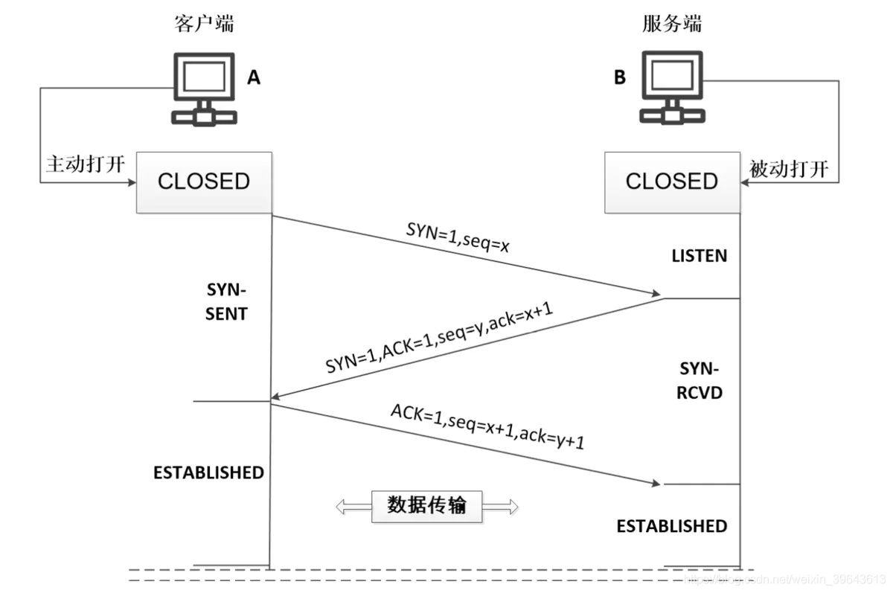
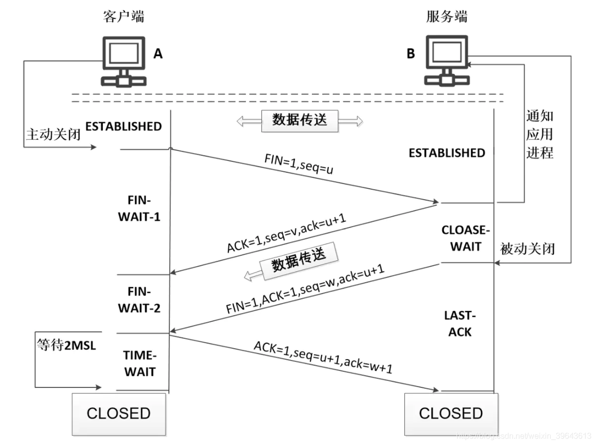

# TCP的3次握手和4次挥手过程

src:https://www.jianshu.com/p/6b2e35fdaf2c

# TCP三次握手
## 剖析三次握手机制
首先Client端发送连接请求报文，Server端接受连接后回复ACK报文，并为这次连接分配资源。Client端接收到ACK报文后也向Server端发生ACK报文，并分配资源，这样TCP连接就建立了。

最初两端的TCP进程都处于CLOSED关闭状态，A主动打开连接，而B被动打开连接。（A、B关闭状态CLOSED** —> **B收听状态LISTEN —> A同步已发送状态SYN-SENT —> B同步收到状态SYN-RCVD —> A、B连接已建立状态ESTABLISHED）

## 三次握手过程
B的TCP服务器进程先创建传输控制块TCB，准备接受客户进程的连接请求。然后服务器进程就处于LISTEN（收听）状态，等待客户的连接请求。若有，则作出响应。

1. **第一次握手**：A的TCP客户端进程也是首先创建传输控制块TCB，A将标志位SYN置为1，随机产生一个值seq=x，然后向B发出连接请求报文段（`首部的同步位SYN=1，初始序号seq=x`），SYN=1的报文段不能携带数据，但要消耗掉一个序号，此时TCP客户进程进入SYN-SENT（同步已发送）状态。
2. **第二次握手**：服务端B收到连接请求报文段后，由标志位SYN=1得知Client请求建立连接，Server将标志位SYN和ACK都置为1，确认号ack=x+1，随机产生一个值作为初始序号seq=y，如同意建立连接，则向A发送确认报文段（`SYN=1，ACK=1，ack=x+1，seq=y`）确认连接，操作系统为该TCP连接分配TCP缓存和变量，此时TCP服务器进程进入SYN-RCVD（同步收到）状态。
3. **第三次握手**：客户端A收到服务端B的确认后，检查ack是否为x+1，ACK是否为1，如果正确则将标志位ACK置为1，确认号ack置为y+1，序号seq置为x+1，并且此时操作系统为该TCP连接分配TCP缓存和变量，要向B给出确认报文段（`ACK=1，ack=y+1，seq=x+1`）。TCP连接已经建立，A进入ESTABLISHED（已建立连接）。当B收到A的确认后，也进入ESTABLISHED状态。

## 流程串
A和B都处于CLOSED状态 —> B创建TCB，处于LISTEN状态，等待A请求 —> A创建TCB，发送连接请求（SYN=1，seq=x），进入SYN-SENT状态 —> B收到连接请求，向A发送确认（SYN=ACK=1，确认号ack=x+1，初始序号seq=y），进入SYN-RCVD状态 —> A收到B的确认后，给B发出确认（ACK=1，ack=y+1，seq=x+1），A进入ESTABLISHED状态 —> B收到A的确认后，进入ESTABLISHED状态。

## TCB传输控制块
Transmission Control Block，存储每一个连接中的重要信息，如TCP连接表，到发送和接收缓存的指针，到重传队列的指针，当前的发送和接收序号。

# 四次挥手
## 剖析四次挥手机制
我们通过Client端和Server端的对白来了解一下TCP四次挥手机制是怎样的。

假设Client端发起中断连接请求，也就是发送FIN报文。Server端接到FIN报文后，了解Client的意思是说:"Server端，你好，我没有数据要发给你了，但是如果你Server端还有数据没有发送完成，则不必急着关闭Socket，可以继续发送数据。

所以Server端先发送ACK告诉Client端:"Client端，你好，你的请求我收到了，但是我还没准备好，请继续你等我的消息"。这个时候Client端就进入FIN_WAIT状态，继续等待Server端的FIN报文。

当Server端确定数据已发送完成，则向Client端发送FIN报文，告诉Client端:"Server端，你好，我这边数据发完了，准备好关闭连接了"。

Client端收到FIN报文后，知道无数据再传了，可以关闭连接了。但是他还是不相信网络，怕Server端不知道要关闭，所以发送ACK后进入TIME_WAIT状态，如果Server端没有收到ACK则可以重传。Server端收到ACK后，也知道Client确认断开连接了。Client端等待了2MSL后依然没有收到Server端回复，则证明Server端已正常关闭，心想，这次我Client端可以放心关闭连接了。Ok，至此TCP连接就这样关闭了！

数据传输结束后，通信的双方都可释放连接，A和B都处于ESTABLISHED状态。（A、B连接建立状态ESTABLISHED —> A终止等待1状态FIN-WAIT-1 —> B关闭等待状态CLOSE-WAIT —> A终止等待2状态FIN-WAIT-2——B最后确认状态LAST-ACK —> A时间等待状态TIME-WAIT —> B、A关闭状态CLOSED）

## 四次挥手流程
1. 第一次挥手：客户端A的应用进程先向服务端TCP发出连接释放报文段（FIN=1，序号seq=u），并停止再发送数据，主动关闭TCP连接，进入FIN-WAIT-1（终止等待1）状态，等待服务端B的确认。
2. 第二次挥手：服务端B收到连接释放报文段后即发出确认报文段（ACK=1，确认号ack=u+1，序号seq=v），服务端B进入CLOSE-WAIT（关闭等待）状态，此时的TCP处于半关闭状态。A收到B的确认后，进入FIN-WAIT-2（终止等待2）状态，等待B发出的连接释放报文段。
3. 第三次挥手：服务端B没有要向客户端A发出的数据，B发出连接释放报文段 （FIN=1，ACK=1，序号seq=w，确认号ack=u+1），B进入LAST-ACK（最后确认）状态，等待A的确认。
4. 第四次挥手：客户端A收到服务端B的连接释放报文段后，对此发出确认报文段（ACK=1，seq=u+1，ack=w+1），A进入TIME-WAIT（时间等待）状态。此时TCP未释放掉，需要经过时间等待计时器设置的时间2MSL后，A才进入CLOSED状态。

## 流程串
A和B处于ESTABLISHED状态 —> A发出连接释放报文段并处于FIN-WAIT-1状态 —> B发出确认报文段且进入CLOSE-WAIT状态 —> A收到确认后，进入FIN-WAIT-2状态，等待B的连接释放报文段 —> B没有要向A发出的数据，B发出连接释放报文段且进入LAST-ACK状态 —> A发出确认报文段且进入TIME-WAIT状态 —> B收到确认报文段后进入CLOSED状态 —> A经过等待计时器时间2MSL后，进入CLOSED状态。

# Q&A
## 为什么A还要发送一次确认呢？可以二次握手吗？
主要为了防止已失效的连接请求报文段突然又传送到了B，因而产生错误。如A发出连接请求，但因连接请求报文丢失而未收到确认，于是A再重传一次连接请求。后来收到了确认，建立了连接。数据传输完毕后，就释放了连接，A工发出了两个连接请求报文段，其中第一个丢失，第二个到达了B，但是第一个丢失的报文段只是在某些网络结点长时间滞留了，延误到连接释放以后的某个时间才到达B，此时B误认为A又发出一次新的连接请求，于是就向A发出确认报文段，同意建立连接。

不可以二次握手就建立连接，如果不采用三次握手，只要B发出确认，就建立新的连接了的话，如果此时A不理睬B的确认，且不发送数据，则B一致等待A发送数据，浪费资源。

## Server端易受到SYN攻击？
服务器端的资源分配是在二次握手时分配的，而客户端的资源是在完成三次握手时分配的，所以服务器容易受到SYN洪泛攻击，SYN攻击就是Client在短时间内伪造大量不存在的IP地址，并向Server不断地发送SYN包，Server则回复确认包，并等待Client确认，由于源地址不存在，因此Server需要不断重发直至超时，这些伪造的SYN包将长时间占用未连接队列，导致正常的SYN请求因为队列满而被丢弃，从而引起网络拥塞甚至系统瘫痪。

防范SYN攻击措施：降低主机的等待时间使主机尽快的释放半连接的占用，短时间受到某IP的重复SYN则丢弃后续请求。

## 为什么A在TIME-WAIT状态必须等待2MSL的时间？
MSL最长报文段寿命Maximum Segment Lifetime，MSL=2

两个理由：1）保证客户端A发送的最后一个ACK报文段能够到达服务端B。2）防止“已失效的连接请求报文段”出现在本连接中。

1. 这个ACK报文段有可能丢失，使得处于LAST-ACK状态的B收不到对已发送的FIN+ACK报文段的确认，B超时重传FIN+ACK报文段，而A能在2MSL时间内收到这个重传的FIN+ACK报文段，接着A重传一次确认，重新启动2MSL计时器，最后A和B都进入到CLOSED状态，若A在TIME-WAIT状态不等待一段时间，而是发送完ACK报文段后立即释放连接，则无法收到B重传的FIN+ACK报文段，所以不会再发送一次确认报文段，则B无法正常进入到CLOSED状态。
在发送完最后一个ACK报文段后，再经过2MSL，就可以使本连接持续的时间内所产生的所有报文段都从网络中消失，使下一个新的连接中不会出现这种旧的连接请求报文段。
为什么连接的时候是三次握手，关闭的时候却是四次握手？

2. 因为当Server端收到Client端的SYN连接请求报文后，可以直接发送SYN+ACK报文。其中ACK报文是用来应答的，SYN报文是用来同步的。但是关闭连接时，当Server端收到FIN报文时，很可能并不会立即关闭SOCKET，所以只能先回复一个ACK报文，告诉Client端，"你发的FIN报文我收到了"。只有等到我Server端所有的报文都发送完了，我才能发送FIN报文，因此不能一起发送。故需要四步握手。

## 为什么TIME_WAIT状态需要经过2MSL(最大报文段生存时间)才能返回到CLOSE状态？
虽然按道理，四个报文都发送完毕，我们可以直接进入CLOSE状态了，但是我们必须假象网络是不可靠的，有可以最后一个ACK丢失。所以TIME_WAIT状态就是用来重发可能丢失的ACK报文。