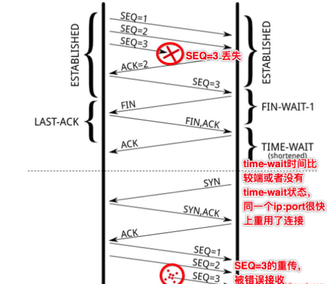
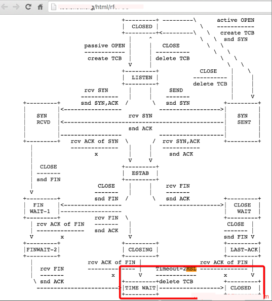
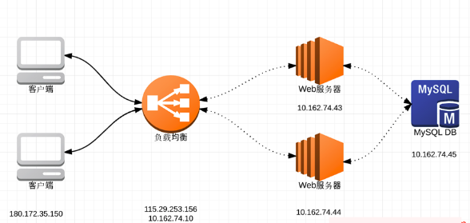

# TCP连接的TIME_WAIT和CLOSE_WAIT 状态解说

# 前言


相信很多运维工程师遇到过这样一个情形: 用户反馈网站访问巨慢, 网络延迟等问题, 然后就迫切地登录服务器,终端输入命令"netstat -anp | grep TIME_WAIT | wc -l " 查看一下, 接着发现有几百几千甚至几万个TIME_WAIT 连接数. 顿时慌了~


通过 "netstat  -anp | grep TIME_WAIT | wc -l"  命令查看数量,发现TIME_WAIT的连接数量很多! 可能是因为服务器主动关闭连接导致TIME_WAIT产生了很多.
发现系统存在大量TIME_WAIT状态的连接, 可以通过调整系统内核参数来解决:

打开 sysctl.conf 文件，修改以下几个参数：
```
[root@web01 ~]# vim  /etc/sysctl.conf
net.ipv4.tcp_tw_reuse = 1
net.ipv4.tcp_tw_recycle = 1
net.ipv4.tcp_timestamps = 1

net.ipv4.tcp_syncookies = 1
net.ipv4.tcp_fin_timeout = 30
  
[root@web01 ~]# sysctl -p
```

接着被告知: 开启tw_recylce和tw_reuse功能, 一定需要timestamps的支持，而且这些配置一般不建议开启，但是对解决TIME_WAIT很多的问题，有很好的用处。
果然, 经过如上配置后, 过了几分钟，再查看TIME_WAIT的数量快速下降了不少，并且后面也没发现哪个用户说有问题了. 做到这里, 相信大多数运维人员想当然地以
为问题已经解决了,但是，要彻底理解并解决这个问题，可能就没这么简单，或者说，要想彻底搞清楚并解决这个问题, 还是有很长的路要走滴!

相关查看命令:
```
[root@web01 ~]# netstat -n | awk '/^tcp/ {++state[$NF]} END {for(key in state) print key,"\t",state[key]}'
```
会得到类似下面的结果,具体数字会有所不同:
```
LAST_ACK 1
SYN_RECV 14
ESTABLISHED 79
FIN_WAIT1 28
FIN_WAIT2 3
CLOSING 5
TIME_WAIT 1669
```
```
[root@web01 ~]# sysctl -a | grep time | grep wait
net.netfilter.nf_conntrack_tcp_timeout_fin_wait = 120
net.netfilter.nf_conntrack_tcp_timeout_close_wait = 60
net.netfilter.nf_conntrack_tcp_timeout_time_wait = 120
```
执行命令"netstat -na"查看到的相关TCP状态解释:
LISTEN:       侦听来自远方的TCP端口的连接请求;
SYN-SENT:     在发送连接请求后等待匹配的连接请求;
SYN-RECEIVED: 在收到和发送一个连接请求后等待对方对连接请求的确认;
ESTABLISHED:  代表一个打开的连接;
FIN-WAIT-1:   等待远程TCP连接中断请求, 或先前的连接中断请求的确认;
FIN-WAIT-2:   从远程TCP等待连接中断请求;
CLOSE-WAIT:   等待从本地用户发来的连接中断请求;
CLOSING:      等待远程TCP对连接中断的确认;
LAST-ACK:     等待原来的发向远程TCP的连接中断请求的确认;
TIME-WAIT:    等待足够的时间以确保远程TCP接收到连接中断请求的确认;
CLOSE:        没有任何连接状态;


# 1. 简单解释下什么是TIME-WAIT和CLOSE-WAIT ?


通常来说要想解决问题，就要先理解问题。有时遇到问题,上网百度个解决方案,临时修复了问题,就以为问题已经不在了, 其实问题不是真的不存在了，而是可能隐藏在更深的地方，只是我们没有发现，或者以现有自己的的知识水平无法发现而已。总所周知，由于socket是全双工的工作模式，一个socket的关闭，是需要四次握手来完成的:

1)  主动关闭连接的一方，调用close()；协议层发送FIN包 ;
2)  被动关闭的一方收到FIN包后，协议层回复ACK；然后被动关闭的一方，进入CLOSE_WAIT状态，主动关闭的一方等待对方关闭，则进入FIN_WAIT_2状态；此时，主动关闭的一方等待被动关闭一方的应用程序，调用close操作 ;
3) 被动关闭的一方在完成所有数据发送后，调用close()操作；此时，协议层发送FIN包给主动关闭的一方，等待对方的ACK，被动关闭的一方进入LAST_ACK状态；
4) 主动关闭的一方收到FIN包，协议层回复ACK；此时，主动关闭连接的一方，进入TIME_WAIT状态；而被动关闭的一方，进入CLOSED状态 ;
5)  等待2MSL时间，主动关闭的一方，结束TIME_WAIT，进入CLOSED状态 ;

通过上面的一次socket关闭操作，可以得出以下几点：
1) 主动关闭连接的一方 – 也就是主动调用socket的close操作的一方，最终会进入TIME_WAIT状态 ;
2) 被动关闭连接的一方，有一个中间状态，即CLOSE_WAIT，因为协议层在等待上层的应用程序，主动调用close操作后才主动关闭这条连接 ;
3) TIME_WAIT会默认等待2MSL时间后，才最终进入CLOSED状态；
4) 在一个连接没有进入CLOSED状态之前，这个连接是不能被重用的！

所以说这里凭直觉看，TIME_WAIT并不可怕，CLOSE_WAIT才可怕，因为CLOSE_WAIT很多，表示说要么是你的应用程序写的有问题，没有合适的关闭socket；要么是说，你的服务器CPU处理不过来（CPU太忙）或者你的应用程序一直睡眠到其它地方(锁，或者文件I/O等等)，你的应用程序获得不到合适的调度时间，造成你的程序没法真正的执行close操作。

那么这里又出现两个问题：
1) 上面提到的连接重用，那连接到底是个什么概念？
2) 协议层为什么要设计一个TIME_WAIT状态？这个状态为什么默认等待2MSL时间才会进入CLOSED

先解释清楚这两个问题后, 接着再来看开头提到的/etc/sysctl.conf文件中那几个网络配置参数究竟有什么用，以及TIME_WAIT的后遗症问题。

# 2. Socket连接到底是个什么概念？**
socket 其实就是一个五元组，包括：源IP, 源端口, 目的IP, 目的端口, 类型(TCP or UDP) . 这个五元组，即标识了一条可用的连接。 需要注意是是，经常有很多人把一个socket定义成四元组，也就是源IP:源端口+目的IP:目的端口，这个定义是不正确的。

比如说，如果本地出口IP是110.122.144.166，那么你的浏览器在连接某一个Web服务器，例如百度的时候，这条socket连接的四元组可能就是：[110.122.144.166:45678, tcp, 110.88.92.104:80] , 源IP为你的出口IP地址 110.122.144.166，源端口为随机端口 45678，目的IP为百度的某一个负载均衡服务器IP 110.88.92.104，端口为HTTP标准的80端口。

如果这个时候，你再开一个浏览器，访问百度，将会产生一条新的连接：[110.122.144.166:43678, tcp, 110.88.92.104:80] , 这条新的连接的源端口为一个新的随机端口 43678。如此来看，如果你的本机需要压测百度，那么你最多可以创建多少个连接呢？


# 3. TIME_WAIT有什么用？

如果来做个类比的话，TIME_WAIT的出现，对应的是你的程序里的异常处理，它的出现，就是为了解决网络的丢包和网络不稳定所带来的其他问题：

**1)** 防止前一个连接【五元组，这里继续以 110.122.144.166:45678, tcp, 110.88.92.104:80 为例】上延迟的数据包或者丢失重传的数据包，被后面复用的连接【前一个连接关闭后，此时你再次访问百度，新的连接可能还是由110.122.144.166:45678, tcp, 110.88.92.104:80 这个五元组来表示，也就是源端口凑巧还是45678】错误的接收（异常：数据丢了，或者传输太慢了），参见下图：



\- SEQ=3的数据包丢失，重传第一次，没有得到ACK确认
\- 如果没有TIME_WAIT，或者TIME_WAIT时间非常端，那么关闭的连接【110.122.144.166:45678, tcp, 110.88.92.104:80 的状态变为了CLOSED，源端口可被再次利用】，马上被重用【对110.88.92.104:80新建的连接，复用了之前的随机端口45678】，并连续发送SEQ=1,2 的数据包; 
\- 此时，前面的连接上的SEQ=3的数据包再次重传，同时，seq的序号刚好也是3（这个很重要，不然，SEQ的序号对不上，就会RST掉），此时，前面一个连接上的数据被后面的一个连接错误的接收; 

**2)** 确保连接方能在时间范围内，关闭自己的连接。其实，也是因为丢包造成的，参见下图：


\- 主动关闭方关闭了连接，发送了FIN；
\- 被动关闭方回复ACK同时也执行关闭动作，发送FIN包；此时，被动关闭的一方进入LAST_ACK状态; 
\- 主动关闭的一方回去了ACK，主动关闭一方进入TIME_WAIT状态；
\- 但是最后的ACK丢失，被动关闭的一方还继续停留在LAST_ACK状态; 
\- 此时，如果没有TIME_WAIT的存在，或者说，停留在TIME_WAIT上的时间很短，则主动关闭的一方很快就进入了CLOSED状态，也即是说，如果此时新建一个连接，源随机端口如果被复用，在connect发送SYN包后，由于被动方仍认为这条连接【五元组】还在等待ACK，但是却收到了SYN，则被动方会回复RST; 
\- 造成主动创建连接的一方，由于收到了RST，则连接无法成功; 

所以，这里看到了，TIME_WAIT的存在是很重要的，如果强制忽略TIME_WAIT，还是有很高的机率，造成数据粗乱，或者短暂性的连接失败。那么，为什么说TIME_WAIT状态会是持续2MSL（2倍的max segment lifetime）呢？这个时间可以通过修改内核参数调整吗？第一，这个2MSL，是RFC 793里定义的，参见RFC的截图标红的部分：





这个定义，更多的是一种保障（IP数据包里的TTL，即数据最多存活的跳数，真正反应的才是数据在网络上的存活时间），确保最后丢失了ACK，被动关闭的一方再次重发FIN并等待回复的ACK，一来一去两个来回。内核里，写死了这个MSL的时间为：30秒（有读者提醒，RFC里建议的MSL其实是2分钟，但是很多实现都是30秒），所以TIME_WAIT的即为1分钟. 所以，再次回想一下前面的问题，如果一条连接，即使在四次握手关闭了，由于TIME_WAIT的存在，这个连接，在1分钟之内，也无法再次被复用，那么，如果你用一台机器做压测的客户端，你一分钟能发送多少并发连接请求？如果这台是一个负载均衡服务器，一台负载均衡服务器，一分钟可以有多少个连接同时访问后端的服务器呢？

# 4. TIME_WAIT很多，可怕吗？

如果你通过 "ss -tan state time-wait | wc -l" 发现，系统中有很多TIME_WAIT，看到时相信很多人都会紧张。多少算多呢？几百几千？如果是这个量级，其实真的没必要紧张。因为: 这个量级，因为TIME_WAIT所占用的内存很少很少；因为记录和寻找可用的local port所消耗的CPU也基本可以忽略。会占用内存吗？当然！任何你可以看到的数据，内核里都需要有相关的数据结构来保存这个数据啊。一条Socket处于TIME_WAIT状态，它也是一条“存在“的socket，内核里也需要有保持它的数据：

1) 内核里有保存所有连接的一个hash table，这个hash table里面既包含TIME_WAIT状态的连接，也包含其他状态的连接。主要用于有新的数据到来的时候，从这个hash table里快速找到这条连接。不同的内核对这个hash table的大小设置不同，你可以通过dmesg命令去找到你的内核设置的大小：

[root@web01 ~]# dmesg |grep --color "TCP established hash table"
TCP established hash table entries: 524288 (order: 11, 8388608 bytes)

2) 还有一个hash table用来保存所有的bound ports，主要用于可以快速的找到一个可用的端口或者随机端口：
[root@web01 ~]# dmesg |grep --color "TCP bind hash table"
TCP bind hash table entries: 65536 (order: 8, 1048576 bytes)

由于内核需要保存这些数据，必然，会占用一定的内存。

那么会消耗CPU吗？当然！每次找到一个随机端口，还是需要遍历一遍bound ports的吧，这必然需要一些CPU时间。TIME_WAIT很多，既占内存又消耗CPU，这也是为什么很多人，看到TIME_WAIT很多，就蠢蠢欲动的想去干掉他们。其实，如果你再进一步去研究，1万条TIME_WAIT的连接，也就多消耗1M左右的内存，对现代的很多服务器，已经不算什么了。至于CPU，能减少它当然更好，但是不至于因为1万多个hash item就担忧。如果要真的想去调优，还是需要搞清楚调优方案以及调优参数背后的意义！


# 5. TIME_WAIT调优

TIME_WAIT调优，则必须理解的几个调优参数:

**net.ipv4.tcp_timestamps**
RFC 1323 在 TCP Reliability一节里，引入了timestamp的TCP option，两个4字节的时间戳字段，其中第一个4字节字段用来保存发送该数据包的时间，第二个4字节字段用来保存最近一次接收对方发送到数据的时间。有了这两个时间字段，也就有了后续优化的余地。tcp_tw_reuse 和 tcp_tw_recycle就依赖这些时间字段。

**net.ipv4.tcp_tw_reuse**
从字面意思来看，这个参数是reuse TIME_WAIT状态的连接。时刻记住一条socket连接，就是那个五元组，出现TIME_WAIT状态的连接，一定出现在主动关闭连接的一方。所以，当主动关闭连接的一方，再次向对方发起连接请求的时候（例如，客户端关闭连接，客户端再次连接服务端，此时可以复用了；负载均衡服务器，主动关闭后端的连接，当有新的HTTP请求，负载均衡服务器再次连接后端服务器，此时也可以复用），可以复用TIME_WAIT状态的连接。

通过字面解释以及例子说明，可以看到，tcp_tw_reuse应用的场景：某一方，需要不断的通过“短连接“连接其他服务器，总是自己先关闭连接(TIME_WAIT在自己这方)，关闭后又不断的重新连接对方。

那么，当连接被复用了之后，延迟或者重发的数据包到达，新的连接怎么判断，到达的数据是属于复用后的连接，还是复用前的连接呢？那就需要依赖前面提到的两个时间字段了。复用连接后，这条连接的时间被更新为当前的时间，当延迟的数据达到，延迟数据的时间是小于新连接的时间，所以，内核可以通过时间判断出，延迟的数据可以安全的丢弃掉了。

这个配置，依赖于连接双方，同时对timestamps的支持。同时，这个配置，仅仅影响outbound连接，即做为客户端的角色，连接服务端[connect(dest_ip, dest_port)]时复用TIME_WAIT的socket。

**net.ipv4.tcp_tw_recycle**
从字面意思来看，这个参数是销毁掉 TIME_WAIT。当开启了这个配置后，内核会快速的回收处于TIME_WAIT状态的socket连接。多快？不再是2MSL，而是一个RTO（retransmission timeout，数据包重传的timeout时间）的时间，这个时间根据RTT动态计算出来，但是远小于2MSL。

有了这个配置，还是需要保障丢失重传或者延迟的数据包，不会被新的连接(注意，这里不再是复用了，而是之前处于TIME_WAIT状态的连接已经被destroy掉了，新的连接，刚好是和某一个被destroy掉的连接使用了相同的五元组而已)所错误的接收。在启用该配置，当一个socket连接进入TIME_WAIT状态后，内核里会记录包括该socket连接对应的五元组中的对方IP等在内的一些统计数据，当然也包括从该对方IP所接收到的最近的一次数据包时间。当有新的数据包到达，只要时间晚于内核记录的这个时间，数据包都会被统统的丢掉。

这个配置，依赖于连接双方对timestamps的支持。同时，这个配置，主要影响到了inbound的连接（对outbound的连接也有影响，但是不是复用），即做为服务端角色，客户端连进来，服务端主动关闭了连接，TIME_WAIT状态的socket处于服务端，服务端快速的回收该状态的连接。

由此，如果客户端处于NAT的网络(多个客户端，同一个IP出口的网络环境)，如果配置了tw_recycle，就可能在一个RTO的时间内，只能有一个客户端和自己连接成功(不同的客户端发包的时间不一致，造成服务端直接把数据包丢弃掉)。

下面通过案例和图示，来加深下理解:




\- 客户端IP地址为：180.172.35.150，我们可以认为是浏览器; 
\- 负载均衡有两个IP，外网IP地址为 115.29.253.156，内网地址为10.162.74.10；外网地址监听80端口; 
\- 负载均衡背后有两台Web服务器，一台IP地址为 10.162.74.43，监听80端口；另一台为 10.162.74.44，监听 80 端口; 
\- Web服务器会连接数据服务器，IP地址为 10.162.74.45，监听 3306 端口; 

这种简单的架构下，我们来看看，在不同的情况下，上面谈论的tw_reuse/tw_recycle对网络连接的影响。

先做个假定：
\- 客户端通过HTTP/1.1连接负载均衡，也就是说，HTTP协议投Connection为keep-alive，所以假定，客户端对负载均衡服务器的socket连接，客户端会断开连接，所以TIME_WAIT出现在客户端; 
\- Web服务器和MySQL服务器的连接，我们假定，Web服务器上的程序在连接结束的时候，调用close操作关闭socket资源连接，所以，TIME_WAIT出现在 Web 服务器端。

那么，在这种假定下：
\- Web服务器上，肯定可以配置开启的配置：tcp_tw_reuse；如果Web服务器有很多连向DB服务器的连接，可以保证socket连接的复用。
\- 那么，负载均衡服务器和Web服务器，谁先关闭连接，则决定了我们怎么配置tcp_tw_reuse/tcp_tw_recycle了。

**方案一：负载均衡服务器**
首先关闭连接, 在这种情况下，因为负载均衡服务器对Web服务器的连接，TIME_WAIT大都出现在负载均衡服务器上，所以:

在负载均衡服务器上的配置：
net.ipv4.tcp_tw_reuse = 1      //尽量复用连接
net.ipv4.tcp_tw_recycle = 0     //不能保证客户端不在NAT的网络啊

在Web服务器上的配置为：
net.ipv4.tcp_tw_reuse = 1     //这个配置主要影响的是Web服务器到DB服务器的连接复用
net.ipv4.tcp_tw_recycle： 设置成1和0都没有任何意义。想一想，在负载均衡和它的连接中，它是服务端，但是TIME_WAIT出现在负载均衡服务器上；它和DB的连接，它是客户端，recycle对它并没有什么影响，关键是reuse

**方案二：Web服务器首先关闭来自负载均衡服务器的连接**
在这种情况下，Web服务器变成TIME_WAIT的重灾区。负载均衡对Web服务器的连接，由Web服务器首先关闭连接，TIME_WAIT出现在Web服务器上；Web服务器对DB服务器的连接，由Web服务器关闭连接，TIME_WAIT也出现在它身上，此时:

负载均衡服务器上的配置：
net.ipv4.tcp_tw_reuse：0 或者 1 都行，都没有实际意义
net.ipv4.tcp_tw_recycle=0      //一定是关闭recycle

在Web服务器上的配置：
net.ipv4.tcp_tw_reuse = 1    //这个配置主要影响的是Web服务器到DB服务器的连接复用
net.ipv4.tcp_tw_recycle=1   //由于在负载均衡和Web服务器之间并没有NAT的网络，可以考虑开启recycle，加速由于负载均衡和Web服务器之间的连接造成的大量TIME_WAIT

**问题1: 通常说的连接池可以复用连接，是不是意味着，需要等到上个连接time wait结束后才能再次使用?**
所谓连接池复用，复用的一定是活跃的连接，所谓活跃，第一表明连接池里的连接都是ESTABLISHED的，第二，连接池做为上层应用，会有定时的心跳去保持连接的活跃性。既然连接都是活跃的，那就不存在有TIME_WAIT的概念了，在上篇里也有提到，TIME_WAIT是在主动关闭连接的一方，在关闭连接后才进入的状态。既然已经关闭了，那么这条连接肯定已经不在连接池里面了，即被连接池释放了。

**问题2: 作为负载均衡的机器随机端口使用完的情况下大量time_wait，不调整上面文中说的那三个参数，有其他的更好的方案吗？**
第一，随机端口使用完，你可以通过调整/etc/sysctl.conf下的net.ipv4.ip_local_port_range配置，至少修改成 net.ipv4.ip_local_port_range=1024 65535，保证你的负载均衡服务器至少可以使用6万个随机端口，也即可以有6万的反向代理到后端的连接，可以支持每秒1000的并发（想一想，因为TIME_WAIT状态会持续1分钟后消失，所以一分钟最多有6万，每秒1000）；如果这么多端口都使用完了，也证明你应该加服务器了，或者，你的负载均衡服务器需要配置多个IP地址，或者，你的后端服务器需要监听更多的端口和配置更多的IP（想一下socket的五元组）

第二，大量的TIME_WAIT，多大量？如果是几千个，其实不用担心，因为这个内存和CPU的消耗有一些，但是是可以忽略的。

第三，如果真的量很大，上万上万的那种，可以考虑，让后端的服务器主动关闭连接，如果后端服务器没有外网的连接只有负载均衡服务器的连接（主要是没有NAT网络的连接），可以在后端服务器上配置tw_recycle，然后同时，在负载均衡服务器上，配置tw_reuse。

# 6. TCP状态转移


**简单来说**
一端忘记close,将造成另一端大量的close_wait的状态。
主动执行close的一端,在量特别大的情况下,对so_linger没有做设置,将造成大量的time_wait状态的连接。

**TCP状态转移要点**
TCP协议规定,对于已经建立的连接,网络双方要进行四次握手才能成功断开连接,如果缺少了其中某个步骤,将会使连接处于假死状态,连接本身占用的资源不会被释放。网络服务器程序要同时管理大量连接,所以很有必要保证无用连接完全断开,否则大量僵死的连接会浪费许多服务器资源

客户端TCP状态迁移:
CLOSED -> SYN_SENT -> ESTABLISHED -> FIN_WAIT_1 -> FIN_WAIT_2 -> TIME_WAIT -> CLOSED
服务器TCP状态迁移:
CLOSED -> LISTEN -> SYN收到 -> ESTABLISHED -> CLOSE_WAIT -> LAST_ACK -> CLOSED
当客户端开始连接时,服务器还处于LISTENING,客户端发一个SYN包后,他就处于SYN_SENT状态,服务器就处于SYS收到状态,然后互相确认进入连接状态ESTABLISHED.

**相关状态解释**
1) LISTENING状态
服务启动后首先处于侦听(LISTENING)状态。

2) ESTABLISHED状态
ESTABLISHED的意思是建立连接。表示两台机器正在通信。

3) CLOSE_WAIT
对方主动关闭连接或者网络异常导致连接中断,这时我方的状态会变成CLOSE_WAIT 此时我方要调用close()来使得连接正确关闭

4) TIME_WAIT
我方主动调用close()断开连接,收到对方确认后状态变为TIME_WAIT,缺省为240秒。TCP协议规定TIME_WAIT状态会一直持续2MSL(即两倍的分段最大生存期),以此来确保旧的连接状态不会对新连接产生影响。处于TIME_WAIT状态的连接占用的资源不会被内核释放,所以作为服务器,在可能的情况下,尽量不要主动断开连接,以减少TIME_WAIT状态造成的资源浪费。

目前有一种避免TIME_WAIT资源浪费的方法,就是关闭socket的LINGER选项。但这种做法是TCP协议不推荐使用的,在某些情况下这个操作可能会带来错误.

断开连接的时候, 当发起主动关闭的左边这方发送一个FIN过去后,右边被动关闭的这方要回应一个ACK,这个ACK是TCP回应的,而不是应用程序发送的,此时,被动关闭的一方就处于CLOSE_WAIT状态了。如果此时被动关闭的这一方不再继续调用closesocket,那么他就不会发送接下来的FIN,导致自己老是处于CLOSE_WAIT。只有被动关闭的这一方调用了closesocket,才会发送一个FIN给主动关闭的这一 方,同时也使得自己的状态变迁为LAST_ACK。

出现大量CLOSE_WAIT的原因很简单,就是某一方在网络连接断开后,没有检测到这个错误,没有执行closesocket,导致了这个状态的实现,这在TCP/IP协议的状态变迁图上可以清楚看到。同时和这个相对应的还有一种叫TIME_WAIT的。一端的Socket调用close后,另一端的Socket没有调用close

另外,把SOCKET的SO_LINGER设置为0秒拖延(也就是立即关闭)在很多时候是有害处的。 还有,把端口设置为可复用是一种不安全的网络编程方法

当主动关闭的一方发送FIN到被动关闭这边后,被动关闭这边的TCP马上回应一个ACK过去,同时向上面应用程序提交一个ERROR,导 致上面的SOCKET的send或者recv返回SOCKET_ERROR,正常情况下,如果上面在返回SOCKET_ERROR后调用了closesocket,那么被动关闭的者一方的TCP就会发送一个FIN过去,自己的状态就变迁到LAST_ACK. 

使用netstat -na命令即可知道到当前的TCP连接状态。一般LISTEN、ESTABLISHED、TIME_WAIT是比较常见。

分析:
time_wait过多这个问题主要因为TCP的结束流程未走完,造成连接未释放。现设客户端主动断开连接,流程如下:

Client 消息 Server
close()
------ FIN ------->
FIN_WAIT1 CLOSE_WAIT
<----- ACK -------
FIN_WAIT2
close()
<------ FIN ------
TIME_WAIT LAST_ACK

------ ACK ------->
CLOSED
CLOSED

如上图所示,由于Server的Socket在客户端已经关闭时而没有调用关闭,造成服务器端的连接处在“挂起”状态,而客户端则处在等待应答的状态上。此问题的典型特征是:**一端处于FIN_WAIT2 ,而另一端处于CLOSE_WAIT .**

对于基于TCP的HTTP协议,关闭TCP连接的是Server端,这样,Server端会进入TIME_WAIT状态,可 想而知,对于访问量大的Web Server,会存在大量的TIME_WAIT状态,假如server一秒钟接收1000个请求,那么就会积压240*1000=240,000个TIME_WAIT的记录,维护这些状态给Server带来负担。当然现代操作系统都会用快速的查找算法来管理这些TIME_WAIT,所以对于新的TCP连接请求,判断是否hit中一个TIME_WAIT不会太费时间,但是有这么多状态要维护总是不好。


