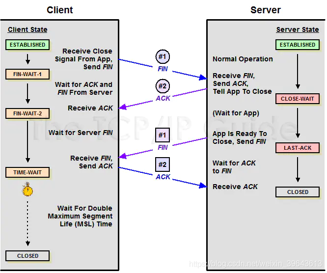

# 关于关闭 Socket 的一些坑

src:https://www.jianshu.com/p/b59778516984

# 背景
最近踩到一个 "Socket 连接持续处于 Fin_Wait2 和 Close_Wait 状态无法关闭" 的坑中。起因是在维护大量连接时调用 `socket.close()` 时，看到部分连接并没有正常关闭，而是从 `ESTABLISHED` 的状态变成 `FIN_WAIT2` 并且连接状态没有后续迁移，而对端的连接状态则是从 `ESTABLISHED` 变成了 `CLOSE_WAIT` 。

后来发现这和 TCP/IP 栈的4次挥手断开连接有关，列出一些踩坑时的收获。

Socket 连接关闭的流程
先看一张 Socket 关闭连接的状态迁移路径图:

在 Client 端调用 `socket.close()` 时，首先会往对端(即 Server 端)发送一个 FIN 包，接着将自身的状态置为 `FIN_WAIT1` ，此时主动关闭端(即 Client 端)处于持续等待接收对端的响应 FIN 包的 ACK 回应状态，此时对端的状态是处于 `ESTABLISHED` ，一旦收到了 Client 发来的 close 连接请求，就回应一个 FIN 包，表示收到该请求了，并将自身状态置为 `CLOSE_WAIT`，这时开始等待 Server 端的应用层向 Client 端发起 close 请求。

这时 Client 端一旦收到 Server 端对第一个 FIN 包的回应 ACK 就会将进入下一个状态 FIN_WAIT_2 来等待 Server 发起断开连接的 FIN 包。在FIN_WAIT_1 的 time_wait 中， Server 端会发起 close 请求，向 Client 端发送 FIN 包，并将自身状态从 `CLOSE_WAIT` 置为 `LAST_ACK` ，表示 Server 端的连接资源开始释放了。同时 Client 端正处于 `FIN_WAIT2` 状态，一旦接收到 Server 端的 FIN 包，则说明 Server 端连接已释放，接着就可以释放自身的连接了，于是进入 `TIME_WAIT` 状态，开始释放资源，在经过设置的 2个 MSL 时间后，状态最终迁移到 `CLOSE` 说明连接成功关闭，一次 TCP 4次挥手 关闭连接的过程结束。

通常会出现状态滞留的情况有下面几种:

* Client 处于 FIN_WAIT1 , Server 处于 ESTABLISHED => 这种情况通常是连接异常，socket.close() 发送的 FIN 包对端无法收到。由于 TCP FIN_WAIT 自身有 Timeout, 在 Timeout 后如果还没有收到响应，则会停止等待。这种情况在 DDoS 攻击中比较常见，Server 端在某一时刻需要处理大量 FIN_WAIT1 时就会卡死。解决方法是修改 `/etc/sysctl.conf` 的 `net.ipv4.tcp_fin_timeout` 来提高 Timeout 值，保证大量连接能正常在超时时间内收到响应，当然这对服务器负载有要求。而如果是异常 ip 在某时间段内发送大量流量的 DDoS 攻击，则可以在 iptable 上手动封 ip 或者开启防火墙。
* Client 处于 FIN_WAIT2, Server 处于 CLOSE_WAIT => 这种情况通常是 Server 端还在使用连接进行读写或资源还未释放完，所以还没主动往对端发送 FIN 包进入 LAST_ACK 状态，连接一直处于挂起的状态。这种情况需要去检查是否有资源未释放或者代码阻塞的问题。通常来说 CLOSE_WAIT 的持续时间应该较短，如果出现长时间的挂起，那么应该是代码出了问题。
* Client 出于 TIME_WAIT, Server 处于 LAST_ACK => 首先 TIME_WAIT 需要等待 2个 MSL (Max Segment Lifetime) 时间，这个时间是确保 TCP 段能够被接收到的最大寿命。默认是 60 s 。解决方案是: 1. 调整内核参数 `/etc/sysctl.conf` 中的 `net.ipv4.tcp_tw_recycle = 1` 确保 TIME_WAIT 状态的连接能够快速回收，或者缩短 MSL 时间。 2. 检查是否有些连接可以使用 keepalive 状态来减少连接数。
此外，如果在单台服务器上并且不做负载均衡而处理大量连接的话，可以在 /proc/sys/net/ipv4/ip_local_port_range 中减少端口的极限值，限制每个时间段的最大端口使用数，从而保证服务器的稳定性，一旦出现大量的 TIME_WAIT 阻塞后续连接，是比较致命的。

# Socket.terminate() 和 Socket.close()

此外还遇到了另一个小问题，在关闭连接时，一开始用的是 `socket.terminate() `，然而 netstat 时却发现大量连接没有释放，后来发现 Python Socket 的 `terminate()` 只是发送 `socket.SHUT_WR` 和 `socket.SHUT_RD` 来关闭通道的读写权限而并没有释放连接句柄。导致了连接已经无法使用，但仍然处于 ESTABLISHED 状态。

解决方法就是使用 `socket.close()` 来替换 `socket.terminate()`

后来又看到如果是 DDoS 攻击的话，可能会阻塞住 `socket.close()` ，导致后续连接未关闭，大量流量进入服务器。

所以比较好的方式是在 `socket.close() `之前先调用 `socket.terminate()` 关闭通道的读写权限，再调用 `socket.close()`