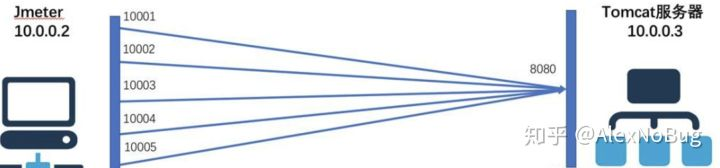

# 单台服务器支持的最大连接数-困扰多年的问题

src:https://zhuanlan.zhihu.com/p/133243639

在性能测试过程中，经常会接触到链接数相关的问题，有一个问题曾经困扰我好长时间，那就是一台服务器最多能支持多少链接数呢？

有的朋友可能会说是65535，因为操作系统有65535个端口，那么这个答案准确吗？

首先先了解下如何标识一个链接（记住下面的概念，文章后面要用到），操作系统是通过一个四元组来标识一个TCP链接：

{本地ip，本地port，远程ip，远程port}

这四个要素唯一确定一个TCP链接，任意一个要素不相同，就认为是一个不同的链接。

在Linux系统中，一切皆文件，每一个TCP链接都要占用一个文件句柄，系统允许创建的链接数取决于句柄数的上限。超过这个值再创建链接就会报这样的错误：

“Can't open so many files"

通过命令ulimit -n可以查看当前系统允许打开文件数量的上限，在Linux中这个值默认是1024，也就是说默认情况下，只能创建1024个链接。同时这个值也是可以修改的，通过修改/etc/security/limits.conf文件，可以把这个值改大，一般服务器都会改的很大，比如我们的服务器上一般设置为1000000。

那这么说是不是就意味着只要我改的很大，链接数可以无限大了？

其实也并不是这样，创建链接的时候，一般分为两个端，即链接的发起端和链接接收端。比如我们现在使用Jmeter进行压测，被测系统部署在Tomcat服务器10.0.0.3上，使用的是8080端口。如果我们用5个并发来进行压测的话，创建的链接如下图所示

对于Jmeter来说，它是链接发起端，Jmeter创建了5个链接去连接服务端的8080端口，每个新建链接会占用了一个端口号，如图中的10001-10005。在操作系统中，端口号的范围是0-65535，其中0-1024是预留端口号，不可使用，其他的端口都是可以使用的。也就是说，**在链接发起端，受端口号的限制理论上最多可以创建64000左右链接。**

那么有没有办法超过这个限制呢，答案是肯定的！

通过TCP标识的四元组可以看到，对于链接发起端，影响链接数的是本地ip和port，端口号受限于65535，已经没办法增加了。那我们可以增加本地ip来达到这个目的。一般情况下，服务器的一个网卡上只绑定了一个ip，对外通信都使用这个ip进行。其实网卡是支持一个绑定多个IP的（必须确保ip是有效的且未使用的）

ifconfig eth0:1 10.0.0.5

以上命令可以在eth0网卡上增加一个ip 10.0.0.5，服务器网卡每增加一个ip，就可以允许在这个ip上再创建65535左右的链接数。

我曾经做过一个邮件网关的链接数测试，目的是为了测试网关服务器可以接收并且保持多少TCP长连接。正常情况下，受限于单台机器65535端口号的影响，客户端想创建25万TCP长连接，至少需要4台机器。通过对客户端网卡绑定多IP的方法，成功在一台机器上创建了25万个链接。

当然，这种手段只是一种非常规的操作，只是为了进行某种特殊场景的测试。正常情况下不推荐网卡绑定多个IP。

链接接收端

对于Tomcat服务器来讲，它是链接接收端，它是不是也受限于65535呢？并不是，从上面图中可以看到，Jmeter发起的所有链接都创建在Tomcat服务器的8080端口，也就是说对于链接接收端，所有的链接占用的是同一个端口。根据TCP标识四元组可以分析出，**一个链接接收端，
最大的TCP链接数=所有有效ip排列组合的数量*端口数量64000
因此链接接收端支持的链接数理论上可以认为是无限大的。**

上面介绍的一些数据都是理论上单台机器可以支持的TCP链接数，**实际情况下，每创建一个链接需要消耗一定的内存，大概是4-10kb，所以链接数也受限于机器的总内存。(链接发起端,活力全开才64000左右链接，内存最多才占用640M，一般客户端都能 满足；内存限制主要还是考虑服务器端)**