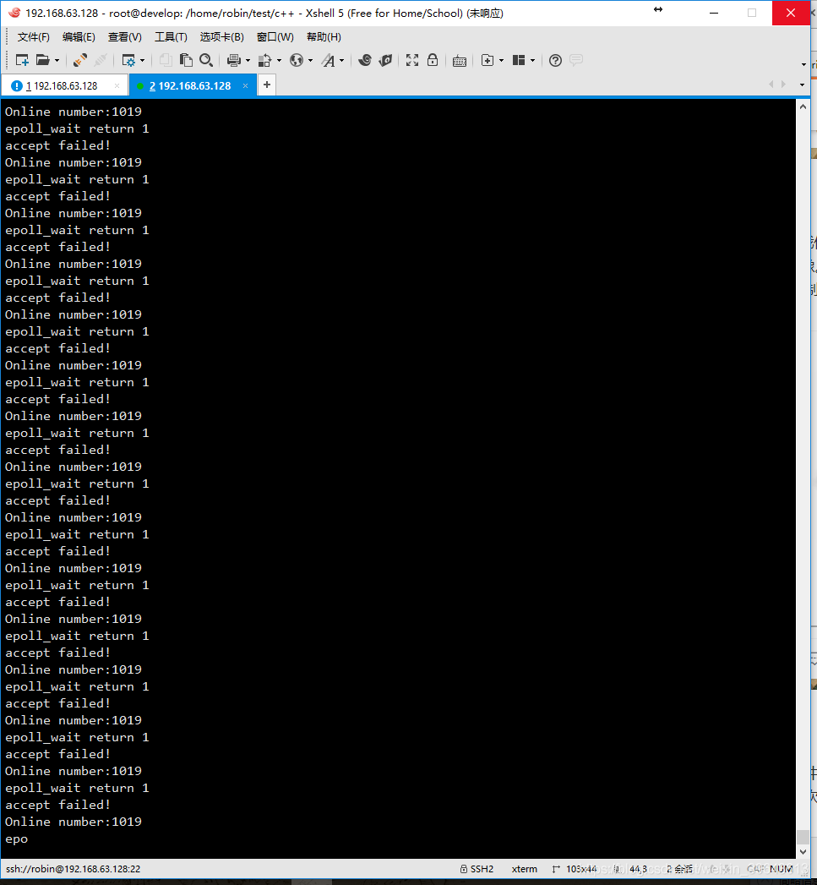
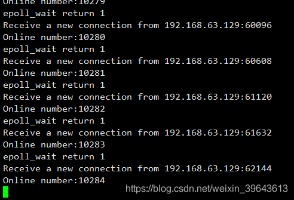
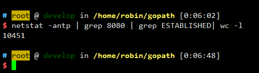
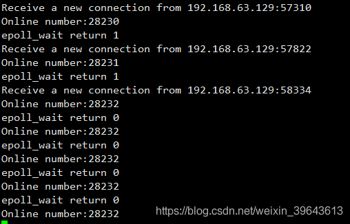
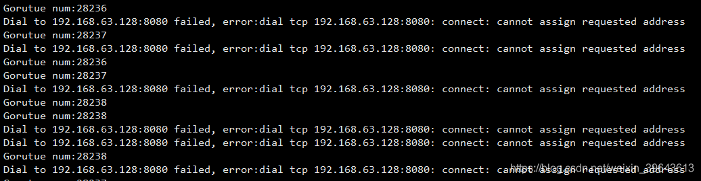
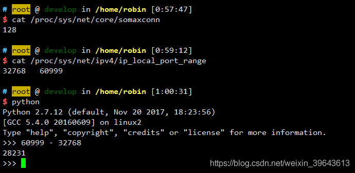

# 测试Linux下tcp最大连接数限制

src:https://blog.csdn.net/qq_34420188/article/details/60867755


现在做服务器开发不加上高并发根本没脸出门，所以为了以后吹水被别人怼“天天提高并发，你自己实现的最高并发是多少”的时候能义正言辞的怼回去，趁着元旦在家没事决定自己写个demo搞一搞。

这个测试主要是想搞明白Linux下哪些参数配置限制了连接数的最大值，上限是多少。

# 一、先说下demo的思路：
服务端用epoll实现，就是简简单单的接收连接，然后客户端用go的goroutine，每个goroutine就是简单的建立连接，然后什么也不做。

上代码：

server：

```go
/*
 * g++ -o test_epoll ./test_epoll.c
 */
#include <unistd.h>
#include <sys/types.h>
#include <sys/socket.h>
#include <sys/epoll.h>
#include <netinet/in.h>
#include <arpa/inet.h>

#include <stdio.h>
#include <stdlib.h>
#include <string.h>
#include <errno.h>

int SetReuseAddr(int fd)
{
    int optval = 1;
    socklen_t optlen = sizeof(optval);
    return setsockopt(fd, SOL_SOCKET, SO_REUSEADDR, &optval, optlen);
}

int main()
{
    int fd = socket(AF_INET, SOCK_STREAM, 0);
    int iRet = SetReuseAddr(fd);
    if (iRet != 0)
    {
        printf("setsockopt for SO_REUSEADDR failed, error:%s\n", strerror(iRet));
        return iRet;
    }

    struct sockaddr_in addr;
    memset(&addr, 0, sizeof(addr));
    addr.sin_family = AF_INET;
    addr.sin_port = htons(8080);
    addr.sin_addr.s_addr = INADDR_ANY;
    if (bind(fd, (struct sockaddr*)&addr, sizeof(addr))  == -1)
    {
        printf("bind failed, error:%s\n", strerror(errno));
        return errno;
    }

    if (listen(fd, 5) == -1)
    {
        printf("listen failed, error:%s\n", strerror(errno));
        return errno;
    }
    printf("Listening on 8080...\n");

    int epfd = epoll_create(102400);
    struct epoll_event event;
    event.events = EPOLLIN;
    event.data.fd = fd;
    epoll_ctl(epfd, EPOLL_CTL_ADD, fd, &event);

    struct epoll_event revents[102400];
    int iOnline = 0;
    while (1)
    {
        int num = epoll_wait(epfd, revents, 102400, 60 * 1000);
        printf("epoll_wait return %d\n", num);
        if (num > 0)
        {
            for (int i = 0; i < num; i++)
            {
                if (revents[i].data.fd == fd)
                {
                    int client;
                    struct sockaddr_in cli_addr;
                    socklen_t cli_addr_len = sizeof(cli_addr);
                    client = accept(fd, (struct sockaddr*)&cli_addr, &cli_addr_len);
                    if (client == -1)
                    {
                        printf("accept failed, error:%s\n", strerror(errno));
                        if (errno == EMFILE)
                        {
                            printf("per-process limit reached\n");
                            exit(errno);
                        }
                        if (errno == ENFILE)
                        {
                            printf("system-wide limit reached\n");
                            exit(errno);
                        }
                        continue;
                    }

                    iOnline++;
                    printf("Receive a new connection from %s:%d\n", inet_ntoa(cli_addr.sin_addr), cli_addr.sin_port);
                    event.events = EPOLLIN;
                    event.data.fd = client;
                    epoll_ctl(epfd, EPOLL_CTL_ADD, fd, &event);
                }
            }
        }
        printf("Online number:%d\n", iOnline);
    }

    return 0;
}
```


client：

```go
package main

import (
    "net"
    "fmt"
    "time"
    "strconv"
    "runtime"
)

func Connect(host string, port int) {
    _, err := net.Dial("tcp", host+":"+strconv.Itoa(port))
    if err != nil {
        fmt.Printf("Dial to %s:%d failed\n", host, port)
        return
    }

    for {
        time.Sleep(30 * 1000 * time.Millisecond)
    }
}

func main() {
    count := 0
    for {
        go Connect("192.168.63.128", 8080)
        count++;
        fmt.Printf("Gorutue num:%d\n", runtime.NumGoroutine())
        time.Sleep(100 * time.Millisecond)
    }
}
```

# 二、开始测试
**第一次：**
先说结果，连接数达到1031时accept失败了，当时还没有对errno做判断，所以只打印输出了accept失败。


然后首先想到的是ulimit -n的限制，查看了一下，默认值1024，然后就是修改这个值，在/etc/security/limits.conf中添加一下内容：

```
1 *    soft    nofile 102400
2 *    hard    nofile 102400
```

然后关闭当前xshell连接，重新连接即生效，现在看ulimit -n就是102400了。

这两行的意思就是将每个进程能打开的文件描述符个数的soft、hard限制调整为102400，

注：ulimit -n 102400也可以生效，但是这个修改是临时的。

然后进行第二次测试。

**第二次：**
逗比了，其实连接数只有2000+，我之前还在奇怪为啥Windows的默认连接数能有这么高呢，原来有些连接已经断了，但是因为我没有做处理，所以以为还在呢，看来我得再安装一个虚拟机了[二哈]

待继续。。。

安装虚拟机去，

时间：2017-12-31 00:09:00

虚拟机安装好了，接着搞，

这次是真的超过10K了。





连接数还在增加，不知道能不能最终达到10万呢，小小的期待ing

时间：2017-12-31 00:41:00，最终上限卡在28232，golang一直报dial失败，由于忘了打印出具体错误信息了，所以无从知道为什么dial失败，所以只能再跑一次T_T


 时间：2017-12-31 01:01:00，添加打印dial失败的错误信息的，又跑了一遍，还是在28232时出现dial失败，错误信息：
golang的标准库文档中么有对错误信息的解释，从错误信息来看，是分配地址失败，于是想是不是端口地址范围限制了。


 查看了一下端口地址范围，确认就是这个限制，由于端口地址是16位，所以，就算把这个端口地址范围修改为1024--65535，也最多能开启64521个连接，而我现在只有一台虚拟机作为客户端，所以想要实现10万连接是不可能了，但是通过这次测试，也让我搞明白了，到底哪些参数会限制连接的上限，这就是我想要的。

最后，感谢Linux内核团队的大神们推出了epoll这么牛逼的机制，才使得我们现在想实现高并发是如此的容易，希望自己有一天也能这么牛逼，哈哈。

元旦假期就这么过了，挺happy的，解决问题之后的这种快感可能就是我们做技术的之所以对技术这么入迷的原因吧。

明天要出去happy了，希望新的一年，自己和家人都好好的。

