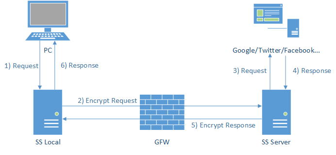
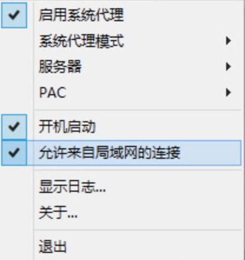

# 科学上网1：shadowsocks 全系列配置总结

src:https://huhao.ai/ke-xue-shang-wang-shadowsocks-quan-xi-lie-pei-zhi-zong-jie/


# 引言

翻墙了很多年，最早的免费透明代理，到goagent，再到shadowsocks，经常都是快速实用，从没有做过仔细研究整理。最近又遇到了翻墙的问题，决定一次性搞透彻，遂整理了此文档。

# 1. Shadowsocks

Shadowsocks是一个以开源SOCKS5为基础的代理项目，作为专为克服GFW审查制度而设计。2012年首度由中国的程序员clowwindy发布；2015年，clowwindy宣布由于警方的介入，他们准备退出该计划。此后，Shadowsocks已经由众多合作者开发和维护。

Shadowsocks在技术上可以简单总结为：
一套基于Socks5代理方式的网络加密传输数据包的技术 = 用socks5技术加密的技术

Shadowsocks 原理



# 2. shadowsocks版本

各版本详情及链接 https://shadowsocks.org/en/download/clients.html

## Server版本

- shadowsocks-python: python版本 [GitHub](https://github.com/shadowsocks)
- shadowsocks-go: go版本 [GitHub](https://github.com/shadowsocks/shadowsocks-go)
- go-shadowsocks2: 重构的Go版本，核心功能增强。 [GitHub](https://github.com/shadowsocks/go-shadowsocks2)
- shadowsocks-libev: C with libev，用的最广的一个版本，有Docker版本。同时包含server和client。 [GitHub](https://github.com/shadowsocks/shadowsocks-libev.git)
- libQtShadowsocks: C++ with Qt。 [GitHub](https://github.com/shadowsocks/libQtShadowsocks.git)
- shadowsocks-perl: Perl版本。 [GitHub](https://github.com/zhou0/shadowsocks-perl)

## Client版本

- shadowsocks-windows: windows客户端 [GitHub](https://github.com/shadowsocks/shadowsocks-windows/releases)
- shadowsocksX-NG: macos客户端 [GitHub](https://github.com/shadowsocks/ShadowsocksX-NG/releases)
- Shadowsocks-Qt5: linux客户端，基于Qt [GitHub](https://github.com/shadowsocks/shadowsocks-qt5/releases)
- shadowsocks-android: android客户端 [Google Play](https://play.google.com/store/apps/details?id=com.github.shadowsocks)
- outline-app: outline项目客户端，支持iOS [GitHub](https://github.com/Jigsaw-Code/outline-client/)
- shadowsocks-libev: 可以用于路由器OpenWRT的客户端

## Outline项目

Outline是一个开源的VPN项目，包含：

- outline-ss-server：由go-shadowsocks2驱动Shadowsocks服务端程序。 [github](https://github.com/Jigsaw-Code/outline-ss-server)
- outline-server: VPN服务端GUI管理工具，用于创建和管理Outline servers。基于Electron，支持Windows, macOS and Linux的
- outline-client: 兼容Shadowsocks的VPN客户端，基于Cordova和Electron，支持Windows、Android / ChromeOS、Linux、iOS、macOS。 [github](https://github.com/Jigsaw-Code/outline-client/)

## Shadowsocks-R相关项目

- ShadowsocksX-NG-R: ssr macos客户端 [github release](https://github.com/qinyuhang/ShadowsocksX-NG-R/releases)
- shadowsocksr-android: ssr android客户端 [shadowsocksr-android](https://github.com/shadowsocksrr/shadowsocksr-android/releases/)
- shadowsocksr-csharp: ssr windows客户端 [shadowsocksr windows客户端](https://github.com/shadowsocksrr/shadowsocksr-csharp/releases/)

shadowsocks-R相关版本支持SSR混淆功能

## 其他iOS客户端

均需要需要美国地区的apple id

- Potatso Lite: Shadowsocks及Shadowsocksr混淆
- outline: [App Store](https://itunes.apple.com/app/outline-app/id1356177741)

# 3. 一键部署SS服务器

## 部署

采用秋水逸冰的Shadowsocks一键安装脚本(四合一)

```
wget --no-check-certificate -O shadowsocks-all.sh https://raw.githubusercontent.com/teddysun/shadowsocks_install/master/shadowsocks-all.sh
chmod +x shadowsocks-all.sh
./shadowsocks-all.sh 2>&1 | tee shadowsocks-all.log
```

## 卸载

```
./shadowsocks-all.sh uninstall
```

# 4. 手动部署SS服务器

## shadowsocks-libev (建议使用，且使用docker部署）

```
$ docker pull shadowsocks/shadowsocks-libev
$ docker run -e PASSWORD=<password> -p<server-port>:8388 -p<server-port>:8388/udp -d --restart always shadowsocks/shadowsocks-libev
```

默认配置信息

- SERVER_ADDR: the IP/domain to bind to, defaults to 0.0.0.0
- SERVER_ADDR_IPV6: the IPv6 address to bind to, defaults to ::0
- METHOD: encryption method to use, defaults to aes-256-gcm
- TIMEOUT: defaults to 300
- DNS_ADDRS: DNS servers to redirect NS lookup requests to, defaults to 8.8.8.8,8.8.4.4

[shadowsocks-libev docker详细配置](https://github.com/shadowsocks/shadowsocks-libev/blob/master/docker/alpine/README.md)

## shadowsocks-python

```
$ pip install git+https://github.com/shadowsocks/shadowsocks.git@master 
$ cat /etc/shadowsocks.json
{
    "server":"my_server_ip",
    "server_port":8388,
    "local_port":1080,
    "password":"barfoo!",
    "timeout":600,
    "method":"aes-256-gcm"
}
$ ssserver -c /etc/shadowsocks.json                #通过配置文件启动shadowsocks server
$ ssserver -p 443 -k password -m aes-256-cfb       #在shell中运行
$ ssserver -p 443 -k password -m aes-256-cfb --user nobody -d start   #在后台运行
$ ssserver -d stop                                 #停止
$ less /var/log/shadowsocks.log                    #查看log
```

[shadowsocks-python详细配置](https://github.com/shadowsocks/shadowsocks/tree/master）

# 5. 启动SS客户端：PC、android、iOS全启动

SS客户端看起来没有难度，不过由于手机端的各种限制，在android和ios上都需要折腾一下。因为手机端的app的使用需要先具备「翻墙」能力才能配置，这就是蛋生鸡鸡生蛋问题了。步骤:
先配置PC的SS-->PC在同一局域网下代理给移动端翻墙能力-->移动端在翻墙情况下进行SS配置-->移动端撤掉局域网代理，独立使用SS客户端翻墙。

详细步骤：
1.先在PC上启动shadowsocks客户端并连接成功，启动「局域网代理」功能
2.手机端跟PC在同一局域网内，连接PC上的SS代理（不需要任何软件）
3.Android端下载并更新google play商店，登录google账号，并启动shadowsocks android
4.iOS端申请apple id，并成功激活，使用apple id登录，下载outline或者Potatso Lite客户端，并配置启动

## windows启动SS客户端并共享给局域网其他设备

下载并安装shadowsocks-windows，启动SS客户端，并开启「允许来自局域网的连接功能」，如下图：



## macos启动SS客户端并共享给局域网其他设备

macOS可以给其他设备共享网络，包括给局域网设备共享wifi，但是无法共享ss代理，因为内核不支持。
解决方案:需要借助 Privoxy 代理本机的 SOCKS5 连接来实现 ShadowSocks 的共享

```
$ brew install privoxy 
$ ./privoxy –no-daemon /usr/local/etc/privoxy/config &
$ vi /usr/local/etc/privoxy/config          
forward-socks5t /  127.0.0.1:1080 .
listen-address 0.0.0.1:8118         #监听局域网的8118端口
```

如果需要开机启动

```
$ ln -sfv /usr/local/opt/privoxy/*.plist ~/Library/LaunchAgents       #添加开机启动
$ launchctl load ~/Library/LaunchAgents/homebrew.mxcl.privoxy.plist   #启动 Privoxy
```

## android/iOS设备设置局域网代理

代理就是前两步的PC上的shadowsocks

- proxy ip：局域网内的PC机器的ip
- port：端口1080

设置方法
【设置】-【无线局域网】-【xxx wifi】- 【HTTP代理】-【手动】

## Android安装ss

先安装google play服务框架，以miui为例，

- 小米应用商店，搜索“谷歌安装器”，最下方，“去豌豆荚搜索”
- 安装「谷歌安装器3.0」
- 登录google play并更新到最新
- 在google play中搜索shadowsocks并下载安装
- 去除局域网代理，直接使用android的ss客户端并配置连接

## ios安装SS

第一步：申请美国apple id。需要SS服务器位于美国。

- PC在开启SS美国代理下，在apple官网申请新的apple id
- 在iOS设备连接PC ss代理下，切换商店，使用新id登录，激活id

[美国Apple id申请详细步骤](https://ssr.tools/104)

第二步：应用商店下载 outline 或者 Potatso Lite，并配置上网

# 6. 相关项目

## shadowsocks & VPN

从技术上讲，shadowsocks与VPN无关，它不是VPN，而是代理。VPN是一个虚拟网络接口，可以通过它发送所有内容；而代理是用于将数据转发到另一个的服务器。它们之间主要有两个区别：

- 要使用代理，必须让程序知道有代理。但是使用vpn不需要对应用程序进行配置。例如。当使用shadowsocks时，应该配置您的浏览器（如firefox）以使用代理。之后，代理仅适用于此程序。代理将永远不会自动与系统中的所有程序一起使用。但是使用VPN，可以在系统内部运行VPN，所有程序都可以使用它。
- 可以通过VPN传输任何类型的数据，而使用代理，只能传递TCP数据（在某些版本的shadowsocks中，UDP也有效）。例如，NTP是基于UDP的用于在服务器之间同步时间的著名协议，因此NTP无法通过shadowsocks。DNS也是如此，使用VPN，它会没问题。
- Shadowsocks不是为了隐私和匿名而设计的，Shadowsocks中的数据没有经过加密。其背后的主要理念是让您的数据看起来更像HTTPS流量，以便其可以不受限制地移动。而VPN只要在启动状态就会加密所有流量，从而提供一个在线的匿名身份，能够完全清除个人的数据纪录。VPN的运作方式及其广泛的普及性使政府和平台更容易阻止技术或迫使大公司从其商店中移除VPN产品（如苹果便从其中国应用程序商店中移除VPN应用程序），Shadowsocks非常难以被侦测和封锁，其主要原因是掩饰流量使其看起来与HTTPS无异。
- 与传统的ssh SOCKS5代理相反，Shadowsocks可以使用多个TCP连接。而这使得其速度与其替代品相比要快上许多。

VPN的问题在于，所有流量都不区分的经过vpn网络传输。开启vpn时，访问翻墙网站方便，但是访问国内的网站相当于绕了一圈，速度很慢，且很多访问不了；关闭vpn，则无法翻墙。

## Shadowsocks & Shadowsocks-R

Shadowsocks俗称「酸酸」，Shadowsocks-R俗称「酸酸乳」。

ShadowsocksR（简称SSR）是网名为breakwa11的用户法器的Shadowsocks分支，在Shadowsocks的基础上增加了一些資料混淆方式，称修复了部分安全问题并可以提高QoS优先级。这个安全问题本质上并不是数据传输的安全问题（数据传输都是工业级加密，不存在被破解的情况），而是第三方比如监管部门，可以比较高的概率检测服务器是否在运行shadowsocks，探测方式代价比较大。后续clowwindy已经在原版给出了auto ban的解决办法，自动把这些恶意IP屏蔽掉。

SSR最开始声明的安全问题和混淆并未受到shadowsocks核心开发者的认同，且最初代码并未开源，让社区出现分裂。不过，由于SSR作者比较及时响应社区其他用户的反馈，及时把SS上线的功能迁移到SSR，同时SSR增加的功能并未很好的整合到SS，导致SSR得到了大部分「使用者」而非「贡献者」的支持。SSR作者breakwa11的这种行为有违开源精神，但是后面及时做了改正。

从当前情况来看，SSR的用户稍多与纯SS的用户。不过从本质上来说，两者在使用上并未有核心差异，SSR的混淆并没有真正提高安全性，而SS已经增强了反探测功能。

# 7. 常见问题

## ss配置信息加密并生成二维码

ss的配置信息可以用字符串表示，格式为：
ss://method:password@hostname:port

通常该字符串不会明文传输，通过base64加密

```
console.log( "ss://" + btoa("bf-cfb:test/!@#:@192.168.100.1:8888"))
```

ss://YmYtY2ZiOnRlc3RAMTkyLjE2OC4xMDAuMTo4ODg4Cg

也可以直接通过官网小工具生成配置字符串和二维码：[生成ss配置信息](https://shadowsocks.org/en/config/quick-guide.html)

## 如何防止服务器被墙

1.建议不要安装国产杀毒软件。可以用国外杀毒软件代替，免费的有AVAST、小红伞等。本人自从实用mac以来就没用过杀毒软件。
2.不要使用国产浏览器科学上网。比如360浏览器、QQ浏览器、百度浏览器、UC浏览器、Opera浏览器。建议Firefox、Chrome。
3.输入法一定要禁用联网权限，尤其是有「云联想」之类功能。
4.尽量避免使用SS客户端的全局代理模式上网。推荐使用PAC模式，或者手动模式+Chrome浏览器SwitchyOmega插件。
5.尽量避免在安卓手机上长时间、大流量科学上网，毕竟国内各大手机厂商的系统基本都会收集个人数据

## 服务器开启BBR

```
wget --no-check-certificate https://github.com/teddysun/across/raw/master/bbr.sh && chmod +x bbr.sh && ./bbr.sh
```

[一键开启bbr](https://teddysun.com/489.html)

## windows发射wifi热点

这是一个之前走过的弯路，想把windows热点分享给手机，让手机跟着windows翻墙。其实正确的方法是在同一局域网下设置代理。通过SS自带的「共享网络给局域网」功能实现手机代理。
如果还是需要在windows上发射wifi热点，可以参考 [windows发射wifi热点](https://blog.csdn.net/qq_35038153/article/details/79984321)

## macOS共享网络给其他设备

跟上面一样，在使用SS中不需要怎么做。但是macOS提供了很强大的网络共享功能，除了大家最常用的「手机开热点」功能，macos还可以通过蓝牙、usb等实现共享网络给手机。这些功能大多应用在没有局域网的情况下。
[macOS共享网络](https://support.apple.com/kb/PH25327?viewlocale=zh_CN&locale=zh_CN)

# 8. 参考

- [shadowsocks 官网：所有信息汇总](https://shadowsocks.org/en/download/clients.html)
- [shadowsocks一键安装脚本By teddysun](https://teddysun.com/486.html)
- [shadowsocks 源码解析](https://bingtaoli.github.io/2016/11/23/shadowsocks实现原理/)
- [vpn & shadowsocks](https://zh.vpnmentor.com/blog/shadowsocks-對決-vpn-你需要知道的每一件事/)
- [vpn & shadowsocks @ quora](https://www.quora.com/What-is-the-difference-between-shadowsocks-and-VPN)
- [shadowsocks & shadowsocks-R 争议的安全问题是什么](https://www.librehat.com/about-shadowsocks-r-and-the-security-of-shadowsocks/#more-1118)
- [shadowsocks-R 争议评论](https://t.du9l.com/2015/08/qi-wen-gong-shang/)
- [ss跟ssr争论相关issue](http://www.chinagfw.org/2016/08/shadowsocks_31.html)
- [shadowsocks 网络通信原理](https://segmentfault.com/a/1190000011862912)
- [shadowsocks wikipedia](https://zh.wikipedia.org/wiki/Shadowsocks)
- [科学上网pdf总结](https://crifan.github.io/scientific_network_summary/website/)
- [小米手机一键安装google play服务框架](https://www.jianshu.com/p/3ef94c719de7)
- [美国apple id申请](https://ssr.tools/104)
- [macos privoxy代理局域网](https://sebastianblade.com/share-macos-shadowsocks-proxy-to-other-device/)