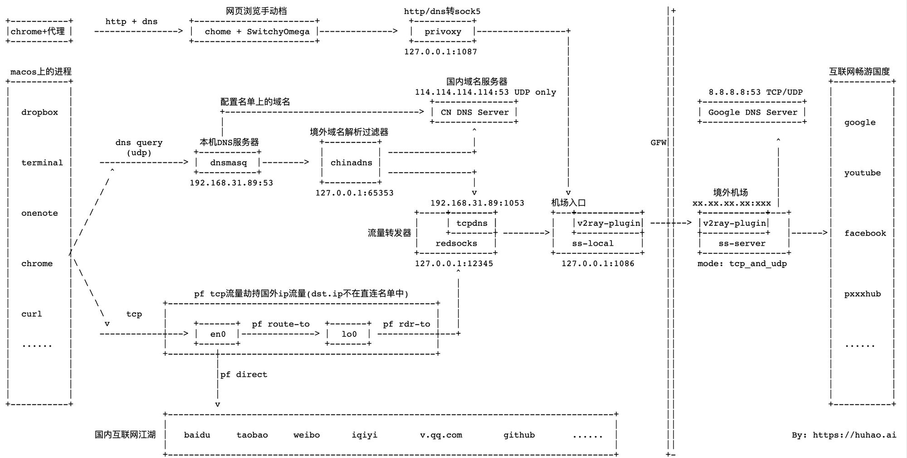

# 科学上网3：macos使用shadowsocks做透明代理

src:https://huhao.ai/macos-shadowsocks-transparent-proxy/




# 背景

- 一台vultr tokyo的主机，chrome + SwitchyOmega
- 一些本地的软件总是不能联网，比如dropbox，又不想挨个手动设置代理

因此，准备在自己的macos上搭一个「透明代理」，让本机的流量更方便上网。

本来想着在自己的macos上搭建透明代理，懒得去折腾家里的路由器了，结果踩到坑里了，好不容易爬出来，遂有了此文。

**更新历史**

- 2020.5.1 初次发表

# 最终翻墙架构

```
网页浏览手动档                           http/dns转sock5
+-----------+      http + dns      +-----------------------+                 +-----------+                                    ||
|chrome+代理 |    ----------------> |  chome + SwitchyOmega |-------------->  |  privoxy  |-----------------+                  ||
+-----------+                      +-----------------------+                 +-----------+                 |                  ||
                                                                            127.0.0.1:1087                 |                  ||
                                                                                                           |                  ||
macos上的进程                                                                                               |                  ||                             互联网畅游国度
+-----------+                                                                       国内域名服务器           |                  ||                             +-----------+
|           |                                                                 114.114.114.114:53 UDP only  |                  ||      8.8.8.8:53 TCP/UDP     |           |
|           |                            配置名单上的域名                           +---------------+         |                  ||    +-------------------+    |           |
|  dropbox  |                            +-------------------------------------> | CN DNS Server |         |                  ||    | Google DNS Server |    |           |
|           |                            |                                       +---------------+         |                  ||    +-------------------+    |  google   |
|           |                            |                境外域名解析过滤器                ^                 |                  ||                             |           |
|           |        dns query       本机DNS服务器           +----------+                  |                 |               GFW||                   ^         |           |
|           |          (udp)        +-----------+           |          | ----------------+                 |                  ||                   |         |           |
|  terminal |     ----------------> |  dnsmasq  |-------->  | chinadns |                                   |                  ||                   |         |           |
|           |       ^               +-----------+           |          | ----------------+                 |                  ||                   |         |  youtube  |
|           |      /               127.0.0.1:53             +----------+                 |                 |                  ||                   |         |           |
|           |     /                                        127.0.0.1:65353               v                 v                  ||       境外机场     |         |           |
|           |    /                                                               127.0.0.1:1053         机场入口               ||   xx.xx.xx.xx:xxx |         |           |
|  onenote  |   /                                                             +-----+--------+          +---+------------+    ||    +------------+---+       |           |
|           |  /                                                              |     | tcpdns |          |   |v2ray-plugin| ---||--> |v2ray-plugin|   |       |           |
|           | /                                                   流量转发器    |     +--------+ -------->|   +------------+    ||    +------------+   |------>|  facebook |
|           |/                                                                |   redsocks   |          |   ss-local     |    ||    |   ss-server    |       |           |
|           /                                                                 +--------------+          +----------------+    ||    +----------------+       |           |
|  chrome   |\                                                                127.0.0.1:12345             127.0.0.1:1086      ||    mode: tcp_and_udp        |           |
|           | \                                                                       ^                                       ||                             |           |
|           |  \                                                                      |                                       ||                             |           |
|           |   \                   pf tcp流量劫持国外ip流量(dst.ip不在直连名单中)         |                                       ||                             |  pxxxhub  |
|           |    \            +---------------------------------------------------+   |                                       ||                             |           |
|  curl     |     \    tcp    |                                                   |   |                                       ||                             |           |
|           |      v          |     +-------+  pf route-to   +-------+  pf rdr-to |   |                                       ||                             |           |
|           |     ------------|---> |  en0  |--------------> |  lo0  | -----------|---+                                       ||                             |           |
|  ......   |                 |     +-------+                +-------+            |                                           ||                             |  ......   |
|           |                 +---------|-----------------------------------------+                                           ||                             |           |
|           |                           |                                                                                     ||                             |           |
|           |                           |pf direct                                                                            ||                             |           |
|           |                           |                                                                                     ||                             |           |
|           |                           |                                                                                     ||                             |           |
+-----------+                           v                                                                                     ||                             +-----------+
                  +-------------------------------------------------------------------------------------+                     ||
                  |                                                                                     |                     ||
国内互联网江湖      |   baidu     taobao     weibo      iqiyi        v.qq.com        github       ......  |                      ||                      By: https://huhao.ai
                  |                                                                                     |                     ||
                  +-------------------------------------------------------------------------------------+                     +-
```

## 几个组件的作用

- **DNSMasq**: 这是一款轻量级的DNS服务器，也支持DHCP。本文主要用来作为本地DNS服务器，能够转发域名请求给到upstream recursive DNS服务器，也能缓存查询结果
- **ChinaDNS**: 作为dnsmasq的上游DNS服务器，将国内域名通过UDP转发到114.114.114.114进行解析（速度快）、将国外域名转发到redsocks的tcpdns接口，最终以tcp连接翻墙请求Google DNS服务器8.8.8.8
- **Redsocks**: 本机流量转发工具，将pf工具转发过来的所有tcp流量，以及chinadns转发到tcpdns插件的dns查询流量，都转发到shadowsocks。
- **PF**: OpenBSD系统的流量过滤器（防火墙），相当于macos上的iptables，可以对本机流量进行任意转发、拦截等操作。
- **privoxy**: 一款有过滤能力的代理工具，主要用于将http流量转发到ss-local的sock5接口上。
- **ss-local**: shadowsocks的客户端程序，基于sock5跟墙外机场通信。
- **ss-server**: shadowsocks的服务端程序，代理墙内的请求，并将结果返回。
- **v2ray-plugin**: 根据v2ray的思想移植到shadowsocks的流量加密插件，替代simple-obfs对ss-local和ss-server之间通信的流量进行加解密，防止被GFW识别并阻断。
- **SwitchyOmega**: Chrome上的一款插件，能够方便的手动转换每一个要打开的网页是否翻墙。

## 安装软件列表

上面列出的是最底层的sense，真正操作起来，相对简单些，主要配置一下几项：

- **[Shadowsocks-NG 1.9.4](https://github.com/shadowsocks/ShadowsocksX-NG)**: macos上的shadowsocks客户端，自带privoxy配置，同时支持v2ray-plugin插件，相当于ss-local + privoxy + v2ray_plugin。持续在更新，直接可用。
- **[DNSMasq 2.81](http://www.thekelleys.org.uk/dnsmasq/doc.html)**: dns server，一直在更新，也是openwrt默认的dns组件，直接可用。
- **[ChinaDNS 1.3.2](https://github.com/shadowsocks/ChinaDNS)**: shadowsocks的作者写的，功能简单、实用，监管原因，15年之后一直没在更新。macos上有bug，修复后可用。
- **[Redsocks2 0.67](https://github.com/semigodking/redsocks)**: 自带tcpdns功能，将所有tcp流量转发到ss-local。功能实用，但是年久失修，且当前的版本在macos有bug，经过修复后可用。

## 本机环境

- MacOS 10.15.4
- XCode 11.4.1
- openssl 1.1.1
- libevent 2.1.11
- 局域网内本机地址：192.168.31.89

## 本文参考前提

- 有一台翻墙服务器，架设了shadowsocks-libev+流量混淆插件
- macos上已经安装了Shadowsocks-NG，并配置好了流量混淆，能够进行翻墙（流量混淆使用哪一款插件无所谓）

# 详细流程

## A) Redsocks编译及配置

### Step1: 安装Redsocks

```
$ wget https://github.com/HaoH/redsocks/archive/release-0.68.tar.gz
$ tar -zxvf release-0.68.tar.gz
$ cd redsocks-release-0.68
$ make OSX_VERSION=master DISABLE_SHADOWSOCKS=true
$ cp redsocks2 /usr/local/bin
```

### Step2: 配置Redsocks

```
$ mkdir /usr/local/etc/redsocks
$ cp redsocks-release-0.68/redsocks.conf.example /etc/redsocks/redsocks.conf
$ cat /usr/local/etc/redsocks/redsocks.conf
base {
	log_debug = off;
  log_info = on;
  log = stderr;
	daemon = off;
	redirector = pf;             // macos没有iptables，用的是pf
	reuseport = off;
}

redsocks {
	bind = "127.0.0.1:12345";    // 监听的tcp端口
	relay = "127.0.0.1:1086";    // 转发的地址
  type = socks5;               // 转发消息类型，ss-local为socks5接口
	autoproxy = 0;
	timeout = 10;
}

tcpdns {
	bind = "127.0.0.1:1053";       // dns udp查询转tcp查询监听地址
	tcpdns1 = "8.8.8.8";           // dns tcp查询的服务器（google dns解析服务器）
	tcpdns2 = "8.8.4.4";
	timeout = 4;
}
```

**Redsocks配置文件说明**

- Redsocks有好几个版本，历史版本使用的配置文件格式有local_ip之类的，新版本的统一使用bind、relay来配置监听地址、转发地址
- 其中最核心的配置都做了注释，结合本文最开始的架构图进行理解

### Step3: 启动Redsocks

**手动启动（仅用于调试）**

```
$ sudo redsocks2 -c /usr/local/etc/redsocks/redsocks.conf
```

### Step4: 测试Redsocks

此时的Redsocks什么功能都没有，因为tcp的流量还没有转发进来，同时，配置的dns udp转tcp服务，需要等下面几部分配置完成之后才能看到效果。

### Step5: 部署到launchctl开机自启

**加入launchctl开机启动（用于部署）**

```
#设置日志文件目录
$ sudo mkdir /var/log/redsocks
#配置launchctl开机启动脚本并放入/Library/LaunchDaemons
$ cat /Library/LaunchDaemons/ai.huhao.redsocks.plist
<?xml version="1.0" encoding="UTF-8"?>
<!DOCTYPE plist PUBLIC "-//Apple Computer//DTD PLIST 1.0//EN" "http://www.apple.com/DTDs/PropertyList-1.0.dtd">
<plist version="1.0">
  <dict>
    <key>Label</key>
    <string>ai.huhao.redsocks</string>
    <key>ProgramArguments</key>
    <array>
      <string>/usr/local/bin/redsocks2</string>
      <string>-c</string>
      <string>/usr/local/etc/redsocks/redsocks.conf</string>
    </array>
    <key>StandardOutPath</key>
    <string>/var/log/redsocks/output.log</string>
    <key>StandardErrorPath</key>
    <string>/var/log/redsocks/error.log</string>
    <key>RunAtLoad</key>
    <true/>
    <key>KeepAlive</key>
    <true/>
  </dict>
</plist>
$ sudo launchctl load /Library/LaunchDaemons/ai.huhao.redsocks.plist
```

### Redsocks理论基础 & 配置总结

[Redsocks](http://darkk.net.ru/redsocks/)是darkk开发的一款将TCP流量转发到SOCK5的透明代理工具。

[Redsocks2](https://github.com/semigodking/redsocks) 是semigodking在darkk的基础上的改进版，该版本优化了配置文件格式、集成了TCPDNS功能，将DNS请求转成TCP请求。

本文的内容基于Redsocks2配置，相关的bug（见附录A）已经提交了PR。

## B) ChinaDNS编译及配置

### Step1: 安装ChinaDNS

```
$ https://github.com/HaoH/ChinaDNS/archive/ChinaDNS-1.3.3.tar.gz
$ tar -zxvf ChinaDNS-1.3.3.tar.gz
$ cd ChinaDNS-1.3.3
$ make & make install
```

备注：

- 默认会将 src/chinadns 复制到 /usr/local/bin 目录
- iplist.txt、chnroute.txt 复制到/usr/local/share 目录

### Step2: 更新中国地区ip列表文件

```
$ curl 'http://ftp.apnic.net/apnic/stats/apnic/delegated-apnic-latest' | grep ipv4 | grep CN |  awk -F\| '{ printf("%s/%d\n", $4, 32-log($5)/log(2)) }' > /usr/local/share/chnroute.txt
```

### Step3: 启动

**手动启动（仅用于调试)**

```
$ chinadns -b 127.0.0.1 -p 65353 -m \
          -s 114.114.114.114,127.0.0.1:1053 \
          -c /usr/local/share/chnroute.txt \
          -l /usr/local/share/iplist.txt \
          -v
```

参数说明

- 绑定并监听本机127.0.0.1:65353端口的dns查询请求
- 指定域名服务器，一个为电信114，一个为墙外的8.8.8.8（通过127.0.0.1:1053转换成tcp查询，在翻墙出去)
- 指定中国地区的ip地址列表为/usr/local/share/chnroute.txt。国外域名服务器返回国内的ip地址、国内dns服务器返回国外ip地址的解析结果会被过滤
- 指定ip地址黑名单列表为/usr/local/share/iplist.txt，所有返回在这个列表的地址都是已知的被投毒地址
- v参数用来输出日志，在测试联网阶段非常重要。可以清晰的看到哪个dns请求从哪个服务器获取，是被filter or pass

### Step4: 测试

**测试方案**

向本机的chinadns监听端口分别发送国内域名www.baidu.com以及国外域名www.youtube.com的dns query请求，从返回的结果与chinadns的console输出结果确认chinadns是否按照预期在运行：

- baidu.com: 从114返回的结果被pass并最终被采用
- youtube.com: 从翻墙服务器返回的结果被pass、114服务器返回的域名被filter

**测试www.baidu.com**

```
$ dig www.baidu.com  @127.0.0.1 -p 65353
; <<>> DiG 9.10.6 <<>> www.baidu.com @127.0.0.1 -p 65353
;; global options: +cmd
;; Got answer:
;; ->>HEADER<<- opcode: QUERY, status: NOERROR, id: 25350
;; flags: qr rd ra; QUERY: 1, ANSWER: 3, AUTHORITY: 5, ADDITIONAL: 5

;; QUESTION SECTION:
;www.baidu.com.			IN	A

;; ANSWER SECTION:
www.baidu.com.		600	IN	CNAME	www.a.shifen.com.
www.a.shifen.com.	600	IN	A	182.61.200.7
www.a.shifen.com.	600	IN	A	182.61.200.6

;; AUTHORITY SECTION:
a.shifen.com.		633	IN	NS	ns3.a.shifen.com.
a.shifen.com.		633	IN	NS	ns2.a.shifen.com.
a.shifen.com.		633	IN	NS	ns1.a.shifen.com.
a.shifen.com.		633	IN	NS	ns4.a.shifen.com.
a.shifen.com.		633	IN	NS	ns5.a.shifen.com.

;; ADDITIONAL SECTION:
ns1.a.shifen.com.	443	IN	A	61.135.165.224
ns2.a.shifen.com.	264	IN	A	220.181.33.32
ns3.a.shifen.com.	294	IN	A	112.80.255.253
ns4.a.shifen.com.	272	IN	A	14.215.177.229
ns5.a.shifen.com.	189	IN	A	180.76.76.95

;; Query time: 6 msec
;; SERVER: 127.0.0.1#65353(127.0.0.1)
;; WHEN: Sun May 03 19:49:56 CST 2020
;; MSG SIZE  rcvd: 260
Sun May  3 19:56:02 2020 [remote response] len(global_buf): 260
Sun May  3 19:56:02 2020 [remote response] answer for: www.baidu.com, answer from 114.114.114.114:53
182.61.200.7, 182.61.200.6, pass
Sun May  3 19:56:03 2020 [remote response] len(global_buf): 127
Sun May  3 19:56:03 2020 [remote response] answer for: www.baidu.com, answer from 192.168.31.89:1053
119.63.197.139, 119.63.197.151, pass
```

**测试www.youtube.com**

```
; <<>> DiG 9.10.6 <<>> www.youtube.com @127.0.0.1 -p 65353
;; global options: +cmd
;; Got answer:
;; ->>HEADER<<- opcode: QUERY, status: NOERROR, id: 44402
;; flags: qr rd ra; QUERY: 1, ANSWER: 16, AUTHORITY: 0, ADDITIONAL: 1

;; OPT PSEUDOSECTION:
; EDNS: version: 0, flags:; udp: 512
;; QUESTION SECTION:
;www.youtube.com.		IN	A

;; ANSWER SECTION:
www.youtube.com.	21599	IN	CNAME	youtube-ui.l.google.com.
youtube-ui.l.google.com. 299	IN	A	172.217.175.78
youtube-ui.l.google.com. 299	IN	A	172.217.174.110
youtube-ui.l.google.com. 299	IN	A	172.217.175.110
youtube-ui.l.google.com. 299	IN	A	172.217.161.46
youtube-ui.l.google.com. 299	IN	A	216.58.197.206
youtube-ui.l.google.com. 299	IN	A	216.58.197.142
youtube-ui.l.google.com. 299	IN	A	216.58.197.174
youtube-ui.l.google.com. 299	IN	A	172.217.25.78
youtube-ui.l.google.com. 299	IN	A	172.217.25.110
youtube-ui.l.google.com. 299	IN	A	172.217.24.142
youtube-ui.l.google.com. 299	IN	A	172.217.26.14
youtube-ui.l.google.com. 299	IN	A	172.217.31.142
youtube-ui.l.google.com. 299	IN	A	172.217.161.78
youtube-ui.l.google.com. 299	IN	A	216.58.220.142
youtube-ui.l.google.com. 299	IN	A	172.217.31.174

;; Query time: 361 msec
;; SERVER: 127.0.0.1#65353(127.0.0.1)
;; WHEN: Sun May 03 19:58:40 CST 2020
;; MSG SIZE  rcvd: 318
Sun May  3 19:58:40 2020 [local request] len(global_buf): 44
Sun May  3 19:58:40 2020 [local request] query for: www.youtube.com, query from: 127.0.0.1:61542
Sun May  3 19:58:40 2020 [remote response] len(global_buf): 267
Sun May  3 19:58:40 2020 [remote response] answer for: www.youtube.com, answer from 114.114.114.114:53
172.217.160.78, filter
Sun May  3 19:58:40 2020 [remote response] len(global_buf): 318
Sun May  3 19:58:40 2020 [remote response] answer for: www.youtube.com, answer from 192.168.31.89:1053
172.217.175.78, 172.217.174.110, 172.217.175.110, 172.217.161.46, 216.58.197.206, 216.58.197.142, 216.58.197.174, 172.217.25.78, 172.217.25.110, 172.217.24.142, 172.217.26.14, 172.217.31.142, 172.217.161.78, 216.58.220.142, 172.217.31.174, pass
```

### Step5: 加入launchctl开机自启

**用于部署**

创建日志文件

```
$ sudo mkdir /var/log/chinadns
$ chown -R huhao:staff /var/log/chinadns   #这个目录需要当前用户有写权限
```

设置launchctl开启自启配置文件

```
$ cat ~/Library/LaunchAgents/ai.huhao.chinadns.plist
<?xml version="1.0" encoding="UTF-8"?>
<!DOCTYPE plist PUBLIC "-//Apple Computer//DTD PLIST 1.0//EN" "http://www.apple.com/DTDs/PropertyList-1.0.dtd">
<plist version="1.0">
  <dict>
    <key>Label</key>
    <string>ai.huhao.chinadns</string>
    <key>ProgramArguments</key>
    <array>
      <string>/usr/local/bin/chinadns</string>
      <string>-b</string>
      <string>127.0.0.1</string>
      <string>-p</string>
      <string>65353</string>
      <string>-m</string>
      <string>-c</string>
      <string>/usr/local/share/chnroute.txt</string>
      <string>-s</string>
      <string>114.114.114.114,127.0.0.1:1053</string>
      <string>-l</string>
      <string>/usr/local/share/iplist.txt</string>
      <string>-v</string>
    </array>
    <key>StandardOutPath</key>
    <string>/var/log/chinadns/output.log</string>
    <key>StandardErrorPath</key>
    <string>/var/log/chinadns/error.log</string>
    <key>RunAtLoad</key>
    <true/>
    <key>KeepAlive</key>
    <true/>
  </dict>
</plist>
```

启动服务

```
$ launchctl load ~/Library/LaunchAgents/ai.huhao.chinadns.plist
```

### ChinaDNS理论基础 & 配置总结

**ChinaDNS简介**

[ChinaDNS](https://github.com/shadowsocks/ChinaDNS) 是 Shadowsocks作者 clowwindy 开发的一个中国特色防污染DNS解析工具。原版在15年8月之后未再更新。
aa65535针对[openwrt](https://github.com/aa65535/ChinaDNS)维护了一版。本文作者HaoH实战中fix了「local_ns_initparse: Message too long」的bug，地址在[这里](https://github.com/HaoH/ChinaDNS/releases)。

ChinaDNS本质上是一个DNS过滤器。通过通过维护一个国内的ip地址列表chnroute.txt、已知的GFW经常返回的做了投毒的国外域名的ip地址列表iplist.txt，对于每一个dns解析请求，同时发给所有的域名解析服务器，在此基础上筛选出有效的DNS解析记录：

- 如果国外域名服务器返回一个国内的ip地址：这个结果理论上不如国内域名服务器返回的结果，优先使用国内域名服务器结果
- 如果国内域名服务器返回一个国外的ip地址：大概率这个结果是被GFW投毒过的，尤其是那些结果在iplist黑名单，需要过滤

**ChinaDNS的不足及解决方案**

当「国内域名服务器返回国内ip地址、国外域名服务器返回国外地址」时，两个结果都会被pass，ChinaDNS无法判断哪一个是对的。

解决方案是结合DNSMasq作为域名过滤，对于已知的国内域名直接请求114解析，不在国内域名名单的才请求ChinaDNS，大大降低了ChinaDNS出现无法识别的情况概率。

**ChinaDNS配置说明**

- 域名服务器如果直接指定为「-s 114.114.114.114,8.8.8.8」，google服务器大概率是会被GFW block的；
- 即使把请求8.8.8.8的基于udp的dns请求转发到ss-local并穿墙，也是很可能得不到结果，因为udp流量被drop严重
- 此处将chinadns的国外的上游服务器指定为本机的redsocks的tcpdns服务127.0.0.1:1053，先转成tcp流量，再通过ss-local穿墙

## B）DNSMasq编译及配置

### Step1: 安装DNSMasq

```
$ brew install dnsmasq
```

手动安装（不推荐）

```
$ wget http://www.thekelleys.org.uk/dnsmasq/dnsmasq-2.81.tar.gz
$ tar -zxvf dnsmasq-2.81.tar.gz
$ cd dnsmasq-2.81
$ make
$ sudo make install
```

### Step2: 配置DNSMasq

可以将DNSMasq主配置文件放置在/etc/dnsmasq/中，上游服务器的配置文件放在/etc/dnsmasq/conf.d中。
上游服务器可以有很多个，既可以根据要查询的域名匹配，指定相应的上游dns服务器，也可以指定默认的dns服务器。

```
$ cat /usr/local/etc/dnsmasq.conf
port=53
no-resolv
no-poll
listen-address=127.0.0.1,192.168.31.89
conf-dir=/usr/local/etc/dnsmasq.d/,*.conf

#以下两行主要用来在launchctl运行中查看日志，正常运行的时候不需要打开
#log-queries=extra
#log-facility=/var/log/dnsmasq.log
#指定默认在所有规则不匹配情况下的上游DNS查询服务器
$ cat /usr/local/etc/dnsmasq.d/chinadns.conf
server=127.0.0.1#65353
#如果想要使用cloudflare的cdn，需要把cloudflare以及tls连接的ss服务器通过国内代理DNS查询
$ cat /usr/local/etc/dnsmasq.d/cloudflare.conf
server=/cloudflare.com/114.114.114.114
server=/huhao.ai/114.114.114.114
```

**配置文件说明**

- port设置监听端口53，默认的dns端口（不能改成其他端口，因为macos本机dns设置不支持修改端口，下一步骤相关)
- server设置DNSMasq的上游服务器为ChinaDNS，DNSMasq负责提供本机最终对外的DNS服务(包括各类查询、反查询、结果缓存)
- listen-address同时设置了本机的lo0地址以及本机在局域网lan的地址，表示可以接受局域网其他主机的dns查询服务
- conf-dir设置了很多被包含的其他配置，一般都是用来包含具体的「域名-->dns上游查询服务器」映射规则

### Step3: 设置DNSMasq的其他上游服务器配置

felixonmars持续维护更新的中国地区的ip列表，并采用dnsmasq上游服务器配置的规则进行了组织，放在dnsmasq-china-list中。需要将这些配置文件放入/usr/local/etc/dnsmasq.d中

```
$ git clone https://github.com/felixonmars/dnsmasq-china-list.git
$ cd dnsmasq-china-list
$ cp accelerated-domains.china.conf google.china.conf apple.china.conf bogus-nxdomain.china.conf /usr/local/etc/dnsmasq.d/
```

**dnsmasq-china-list的使用说明**

- 该项目主要包含了「域名->域名解析服务器」的映射规则，并且一直在更新（很重要）
- 该项目自带install.sh, 不过由于脚本兼容性（sed命令在macos下语法不对、安装的目录跟本文组织目录不同），我倾向于手动复制文件

### Step3: 启动DNSMasq

**手动启动（仅用于调试）**

```
$ sudo dnsmasq -C /usr/local/etc/dnsmasq.conf -d --log-queries
```

*默认情况下，dnsmasq会启动到后台，-d参数（debug模式前台运行）、--log-queries输出请求转发信息。

**使用brew services启动（推荐）**

- 该方法适合用来部署，使用手动启动方式调试完成后，可以加入到launchctl开机自启动
- brew services替代了原始的使用launchctl进行控制的命令，更加便捷

```
#启动dnsmasq，并在开机时启动
$ sudo brew services start dnsmasq

#停止dnsmasq，并取消在开机时启动
$ sudo brew services stop dnsmasq
```

如果需要修改brew services启动dnsmasq的参数，务必要修改dnsmasq在brew的安装路径下的源配置文件，而不是launchctl控制范围的配置文件，因为brew services在启动/关闭时会自动管理launchctl需要的软连接。

```
$ cat $(brew --prefix dnsmasq)/homebrew.mxcl.dnsmasq.plist
<?xml version="1.0" encoding="UTF-8"?>
<!DOCTYPE plist PUBLIC "-//Apple Computer//DTD PLIST 1.0//EN" "http://www.apple.com/DTDs/PropertyList-1.0.dtd">
<plist version="1.0">
  <dict>
    <key>Label</key>
    <string>homebrew.mxcl.dnsmasq</string>
    <key>ProgramArguments</key>
    <array>
      <string>/usr/local/opt/dnsmasq/sbin/dnsmasq</string>
      <string>--keep-in-foreground</string>
      <string>-C</string>
      <string>/usr/local/etc/dnsmasq.conf</string>
      <string>-7</string>
      <string>/usr/local/etc/dnsmasq.d,*.conf</string>
    </array>
    <key>RunAtLoad</key>
    <true/>
    <key>KeepAlive</key>
    <true/>
  </dict>
</plist>
```

### Step4: 修改macos wifi网路的dns解析

在wifi连接中，默认dns服务器是局域网的网关，也就是家里的路由器（地址是192.168.31.1)。
修改本机的默认dns服务器：

```
「系统偏好设置-->网络-->wifi-->高级-->dns」，填入本机的ip地址，127.0.0.1
```

正是由于此处无法设置端口号（默认是53），因此，DNSMasq如果想要作为默认DNS服务器，必须要使用53端口。

### Step4: 测试DNSMasq

**预期最终实现效果**

- 要查询的域名如果命中/etc/dnsmasq/conf.d/中来自dnsmasq-china-list的配置文件的域名，则向对应的上游域名服务器请求dns解析；
- 要查询的域名如果没有命中来自dnsmasq-china-list的配置文件的任何规则，则向server=127.0.0.1#65353的上游服务器请求解析；

**测试方案**

- 测试conf.d目录配置文件的规则「server=/001tech.com/114.114.114.114」
- 测试不在conf.d目录中的域名，比如www.youtube.com
- 多次请求同一个域名，看是否命中缓存

```
#该查询直接请求114，不会请求ChinaDNS，后者的后台日志没有相关记录
$ dig 001tech.com  @127.0.0.1 -p 53

#该查询会直接请求ChinaDNS，后者后台日志有记录
$ dig www.youtube.com  @127.0.0.1 -p 53

#该查询应该命中DNSMasq缓存，ChinaDNS不应该有任何新的关于www.youtube.com的记录
$ dig www.youtube.com  @127.0.0.1 -p 53
```

### DNSMasq配置总结

DNSMasq项目整体维护非常完整，在brew的库里有完整的Formula，使用brew services替代launchctl进行部署也非常方便，开机自启的配置文件都是现成的，直接使用即可。

相比较而言，Redsocks、ChinaDNS项目由于原始的Brew Formula没有更新，无法使用brew services, 整体部署稍微麻烦点。后面可以考虑做一个自己的brew tap，维护自己使用的一些github上非master分支发布的代码（一些是因为原作者不怎么维护，一些是因为自己有特殊配置)

参考这个：[DNSMasq在Homebrew的Formula](https://github.com/Homebrew/homebrew-core/blob/master/Formula/dnsmasq.rb)

## D) PF流量转发

PF是OpenBSD下的netfilter，相当于linux的iptables，用于包过滤、转发，是OS底层的支持。

### Step1: 设置PF直连名单

这份名单是相当于是不走翻墙服务器的白名单地址，包括3个部分：

- 已知的国内ip地址: 跟ChinaDNS使用的是同一份名单
- 内网ip: 127网段、192.168网段、10网段、172.16网段等
- 翻墙服务器地址: shadowsocks服务器地址

```
#将apnic维护的中国地区的ip地址名单作为直连ip列表的基础
$ curl 'http://ftp.apnic.net/apnic/stats/apnic/delegated-apnic-latest' | grep ipv4 | grep CN |  awk -F\| '{ printf("%s/%d\n", $4, 32-log($5)/log(2)) }' > /usr/local/etc/redsocks/direct_cidr_full.txt

#将本地、局域网内地址加入到直连名单
$ echo '''
192.31.196.0/24
192.52.193.0/24
127.0.0.0/8
192.175.48.0/24
192.0.0.0/24
198.18.0.0/15
203.0.113.0/24
100.64.0.0/10
240.0.0.0/4
0.0.0.0/8
192.88.99.0/24
172.16.0.0/12
192.168.0.0/16
198.51.100.0/24
255.255.255.255
192.0.2.0/24
169.254.0.0/16
224.0.0.0/4
10.0.0.0/8
''' >> /usr/local/etc/redsocks/direct_cidr_full.txt

#将shadowsocks服务器地址加入到直连名单
$ echo '''
xxx.xxx.xxx.xxx
''' >> /usr/local/etc/redsocks/direct_cidr_full.txt
```

### Step2: 设置PF流量转发规则

```
$ cat /etc/pf.config
scrub-anchor "com.apple/*"

#加载直连ip地址列表
table <direct_cidr> persist file "/usr/local/etc/redsocks/direct_cidr_full.txt"

nat-anchor "com.apple/*"
rdr-anchor "com.apple/*"

#将lo0上所有目的地不在直连地址列表的流量（需要翻墙流量）转发到 redsocks监听地址 127.0.0.1:12345
rdr pass on lo0 proto tcp from any to !<direct_cidr> -> 127.0.0.1 port 12345

#将eth0所有目的地不在直连地址列表的流量（需要翻墙的流量）路由到lo0上
pass out route-to (lo0 127.0.0.1) proto tcp from any to !<direct_cidr>

dummynet-anchor "com.apple/*"
anchor "com.apple/*"
load anchor "com.apple" from "/etc/pf.anchors/com.apple"
```

### Step3: 开启PF转发

```
#允许ip转发
$ sudo sysctl -w net.inet.ip.forwarding=1

#开启pf服务（默认关闭）
$ sudo pfctl -e

#清空pf所有配置
$ sudo pfctl -F all

#加载配置文件
$ sudo pfctl -f /etc/pf.conf
```

**停止PF转发过滤**

要么关闭pf，要么清空pf过滤规则。

```
#关闭pf服务
$ sudo pfctl -d

#清空pf所有配置
$ sudo pfctl -F all
```

### Step4: 测试PF & Redsocks

**期待的效果**

- 本机的dropbox在不手动设置代理情况下可以自动同步
- 终端上在不手动设置http_proxy情况下可以自动分流
- safari浏览器可以直接访问www.youtube.com并且播放视频顺畅
- 使用Wireshark查看eth0和lo0的数据包情况符合期待

```
#访问国外地址，本机当前ip在TOKYO
$ curl https://api.ip.sb/geoip 2> /dev/null | jq .
{
  "organization": "xxxx",
  "longitude": xxxx,
  "city": "Shinagawa",
  "timezone": "Asia/Tokyo",
  "isp": "xxxx",
  "offset": xxxx,
  "region": "xxxx",
  "asn": xxxx,
  "asn_organization": "xxxx",
  "country": "xxxx",
  "ip": "xxx.xxxx.xxx.xxx",
  "latitude": xxx,
  "postal_code": "xxxx",
  "continent_code": "AS",
  "country_code": "JP",
  "region_code": "xx"
}

#访问国内地址，本机当前ip在北京
$ curl myip.ipip.net
当前 IP：218.2xx.xxx.x  来自于：中国 北京 北京  鹏博士/电信/联通
```

### Step5: 开机启动pfctl

通过配置文件打开

```
$ sudo vi /System/Library/LaunchDaemons/com.apple.pfctl.plist
...
  <key>ProgramArguments</key>
  <array>
    <string>/sbin/pfctl</string>
    <string>-e</string>       #增加-e选项，表示enable
    <string>-f</string>
    <string>/etc/pf.conf</string>
  </array>
...
```

通过防火墙打开

> 在设置->安全性&隐私->防火墙->打开

# 其他相关性项目说明

- [dnsforwarder](https://github.com/holmium/dnsforwarder): 一个简单的 DNS 转发代理，作用跟DNSMasq类似，但是后者更强大、且持续更新中
- [chinadns-ng](https://github.com/zfl9/chinadns-ng)：对chinadns重构了一些，不过由于epoll和ipset原因，不支持macos

# 总结

透明代理的价值主要还是提供给局域网内的主机提供便捷的访问体验。相信很少有人用mac设备做透明代理，不如直接在路由器上基于openwrt设置。对于个人用户而言，基于chrome+SwitchyOmega的方式足够了。

本文纯属个人折腾，不过搞完之后发现本机上网便捷度还是提高了不少，访问速度也快了（估计跟DNS解析有关)，还没有测试，有空专门测试一下不同配置的效率。

# 参考

## macos透明代理配置

- [ybyte-macOS 透明代理配置-20190217](https://penglei.github.io/post/transparent_proxy_on_macosx/)
- [semigodking-REDSOCKS2使用说明-20170817](https://github.com/semigodking/redsocks/wiki/REDSOCKS2使用说明)
- [brite's blog-在Mac OS下,利用redsocks2+pf，把ss转化为全局代理-20190617](https://briteming.blogspot.com/2019/06/mac-osredsocks2ss.html)
- [Olivia-利用shadowsocks打造局域网翻墙透明网关-20171224](https://medium.com/@oliviaqrs/利用shadowsocks打造局域网翻墙透明网关-fb82ccb2f729)

## DNS相关

- [Google Public DNS using](https://developers.google.com/speed/public-dns/docs/using)
- [GFW DNS解析问题分析 & ChinaDNS源码分析](https://cyberloginit.com/2019/04/08/chinadns-code-analysis.html)
- [Cyberloginit-DNSMasq log analysis](https://cyberloginit.com/2018/04/10/dnsmasq-log-analysis-of-home-network.html)

## macos相关配置

- [brew install dnsmasq](https://medium.com/@narakuw/brew-install-dnsmasq-in-macos-sierra-26021c824be8)
- [launchd info](https://www.launchd.info/)
- [apple developer - macos launchd jobs](https://developer.apple.com/library/archive/documentation/MacOSX/Conceptual/BPSystemStartup/Chapters/CreatingLaunchdJobs.html)

## PF相关参考资料

- [A Beginner's Guide To Firewalling with pf-20180503](http://srobb.net/pf.html)
- [Murus-OSX PF Manual](https://murusfirewall.com/Documentation/OS X PF Manual.pdf)
- [Peter-Firewalling with OpenBSD's PF packet filter-2005](http://rlworkman.net/howtos/OpenBSD_pf_guide.html)
- [openbsd pf manual](http://www.openbsd.org/faq/pf/index.html)
- [apple pf conf manual](https://developer.apple.com/library/mac/documentation/Darwin/Reference/ManPages/man5/pf.conf.5.html)

## 其他编程相关

- [zfl9 Otokaze-c语言socket编程(一)-201708](https://www.zfl9.com/c-socket.html)
- [GNU C Lib](https://www.gnu.org/software/libc/manual/html_node/)
- [Network Programming socket](https://www.tenouk.com/Module41.html)
- [GNU socket sample](https://www.gnu.org/software/libc/manual/html_node/Server-Example.html)
- [shichao-Chapter 3. Sockets Introduction](https://notes.shichao.io/unp/ch3/)
- [Apple Networking Overview](https://developer.apple.com/library/archive/documentation/NetworkingInternetWeb/Conceptual/NetworkingOverview/UnderstandingandPreparingfortheIPv6Transition/UnderstandingandPreparingfortheIPv6Transition.html)
- [geeksforgeeks tcp server](https://www.geeksforgeeks.org/tcp-server-client-implementation-in-c/)
- [XCode LLDB调试命令](http://lldb.llvm.org/use/variable.html)
- [cmu socket lecture ppt](https://www.cs.cmu.edu/~srini/15-441/S10/lectures/)
- [rpi socket sample](https://www.cs.rpi.edu/~moorthy/Courses/os98/Pgms/socket.html)
- [LLDB VS GDB](https://developer.apple.com/library/archive/documentation/IDEs/Conceptual/gdb_to_lldb_transition_guide/document/lldb-command-examples.html)
- [openssl EVP库](https://openssl-programing.readthedocs.io/en/latest/21.html)

------

原创文章，转载请注明出处

> Author: HaoH

> Last Updated: 2020-05-05

> License: [CC BY-NC-ND 4.0](https://creativecommons.org/licenses/by-nc-nd/4.0/)

------

# 附录A: 一些现象背后的事实

## 现象1：本地浏览器可以直接打开youtube网站，但是视频就是死活播放不了，就像透明代理开了一半

这个现象本质是DNS解析被投毒，获取的DNS记录有些能正确拿到，有些又不行。需要正确配置DNSMasq、ChinaDNS、Redsocks。

让ChinaDNS直接访问8.8.8.8进行dns解析，会出现这种情况。

## 现象2：访问墙外网站，出现 NET::ERR_CERT_COMMON_NAME_INVALID

原因同上，也是由于获取的DNS解析被投毒。浏览器识别到网页的信息跟证书不匹配。

## 现象3: Redsocks提示打开的文件太多：red_connect_relay failed!!!: Too many open files

理论上macos默认一个进程打开的文件数>2000，作为一个流量转发工具，本机运行的流量同一时间打开的文件量不应该太多。出现此问题的原因很可能是出现了循环转发，一个流量循环转发死循环了。

本文实战中也遇到了这个问题，通过检查pf的配置文件，将局域网地址加入直连列表解决问题；同时，也需要检查redsocks的配置文件，是否配置正确。

# 附录B: Bug修复记录

本次搭建透明代理，莫名其妙踩了几个坑，别人的攻略里配置好好地，我的机器跑起来就不能正常运行，最后采用了最笨的办法：将代码导入到XCode工程，并且调试运行找到bug点并修复。好久没有用c的socket编程，这次算是复习了一下，这里记录一下相关的几个bug的修复情况。

## 1) Redsocks

以下两处bug已经提交了修复代码和[PR](https://github.com/semigodking/redsocks/pull/146)

### bind: Invalid argument

启动即报错，报错信息如下：

```
1588564617.082446 err redsocks.c:1007 redsocks_init_instance(...) bind: Invalid argument
```

仔细检查了配置文件，跟semigodking的Readme一样的参数，怎么会Invalid呢？原版的Redsocks使用的参数格式是local_host+local_ip, semigodking改版后使用的是bind。

```
bind = "127.0.0.1:12345";
```

导入到XCode中，查看代码+调试了后发现问题：
Redsocks使用 struct sockaddr_storage 作为ip地址的存储，这个结构可以兼容各种类型的协议，本来是一个优点。

macos上，bind相关的几个数据结构定义如下：

```
/*
 * [XSI] Structure used by kernel to store most addresses.
 */
struct sockaddr {
	__uint8_t       sa_len;         /* total length */
	sa_family_t     sa_family;      /* [XSI] address family */
	char            sa_data[14];    /* [XSI] addr value (actually larger) */
};

/*
 * [XSI] sockaddr_storage
 */
struct sockaddr_storage {
	__uint8_t       ss_len;         /* address length */
	sa_family_t     ss_family;      /* [XSI] address family */
	char            __ss_pad1[_SS_PAD1SIZE];
	__int64_t       __ss_align;     /* force structure storage alignment */
	char            __ss_pad2[_SS_PAD2SIZE];
};

int bind(int, const struct sockaddr *, socklen_t);
```

redsocks2上相关bind的调用如下：

```
#将sockaddr_storage数据结构转换为(struct sockaddr*)指针
error = bind(fd, (struct sockaddr*)&instance->config.bindaddr, sizeof(instance->config.bindaddr));
```

**发现问题**

macos上bind调用 sizeof(sockaddr_storage) 得到的长度是128字节，而sizeof(sockaddr)有效字节是16字节。如果我们bind参数传递的是ipv4的地址+端口，则有效字节只有16字节，按照128字节的长度去bind，肯定是要失败的。

而redsocks在初始化时，会在redsocks_onexit函数中使用event2模块的evutil_parse_sockaddr_port解析bind字符串。该函数会初始化struct sockaddr_storage结构中的ss_len字段，也就是无论该地址是ipv4还是ipv6，均会设置正确的ss_len长度字段。这个ss_len字段在linux系统上经常被忽略，大部分都是0，而在macos系统上，则严格得被设置成了有效地址的长度。

**解决方案**
将所有bind函数调用中，给bind传递的socklen_t参数，综合考虑struct sockaddr_storage中的ss_len的值，如果有非0值，则使用该值作为bind的地址长度。

```
bindaddr_len = instance->config.bindaddr.ss_len > 0 ? instance->config.bindaddr.ss_len : sizeof(instance->config.bindaddr);
error = bind(fd, (struct sockaddr*)&instance->config.bindaddr, bindaddr_len);
```

### error: field 'ctx' has incomplete type EVP_CIPHER_CTX

这是一个来自openssl的问题。openssl从1.0.2升级到1.0+改动非常大，原有的EVP_CIPHER_CTX结构体本来是可以直接创建实例的，升级之后这类结构体被放置在了openssl的黑盒中，只能通过指针引用。

openssl 1.0.2及之前的EVP_CIPHER_CTX使用方法：

```
EVP_CIPHER_CTX ctx;
EVP_CIPHER_CTX_init(&ctx);
... //do something
EVP_CIPHER_CTX_cleanup(&ctx);
```

openssl 1.0+之后EVP_CIPHER_CTX使用方法

```
EVP_CIPHER_CTX *ctx = EVP_CIPHER_CTX_new();
EVP_CIPHER_CTX_init(ctx);
... //do something
EVP_CIPHER_CTX_free(ctx);
```

[参考这里](https://stackoverflow.com/questions/47518843/error-field-ctx-has-incomplete-type-evp-cipher-ctx)

**类似的问题**

Field has incomplete type 'cipher_evp_t' (aka 'struct evp_cipher_ctx_st')

## 2) ChinaDNS

### local_ns_initparse: Message too long

socket通信中经常需要一个数组传递信息，ChinaDNS为了降低频繁申请这个内容的开销，使用了一个全局的global_buf数组作为socket通信消息传递缓冲。默认这个数组长度为512。

大部分情况512的数组长度作为DNS请求数据应该够用，但是本人第一次运行就hang住了，一直报Message too long的信息，而且还不是错误，只是notice，搞得我莫名其妙，但是就是网络连不上，可能跟我翻墙的网址有关。经过实测，我个人访问的网址中，这个dns解析记录最长超过了1024，很多超过了512。

**解决方案**

将Chinadns.c的第71行改为2048并重新编译

```
#define BUF_SIZE 2048
```

该代码已经提交了[PR](https://github.com/shadowsocks/ChinaDNS/pull/155)

## 3) 将开源Makefile项目导入XCode调试

### XCode项目设置

- 项目创建的时候不要选择Makefile项目，要选择Command Line Tools项目
- 正确设置头文件路径: 在项目target配置中
- Header Search Paths: 添加#include <>的路径，比如

> /usr/local/opt/openssl/include /usr/local/include

- User Header Search Paths: 添加#include “”路径，比如

> /Users/wukong/Workspace/VPN/redsocks2/xnu/master

- 正确设置链接库: 在项目target配置中
- Library Search Paths: 添加要链接的库所在目录，比如

> /usr/local/opt/openssl/lib /usr/local/lib

- Other Linker Flags: 比如

> -levent -levent_openssl -lssl -lcrypto -ldl -lz

### XCode编译错误undefined reference to `__gcov_flush'

为了使用XCode调试ChinaDNS，建了一个XCode工程，编译时出现 __gcov_flush 的错误。

解决方案在Xcode工程配置中

> Test Project --> Build Settings
> Instrument Program Flow = Yes

[参考链接](https://stackoverflow.com/questions/19655479/undefined-reference-to-gcov-flush)