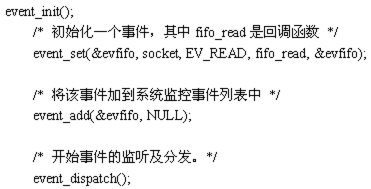

# 聊聊C10K问题及解决方案

# 1. C10K问题

大家都知道`互联网的基础就是网络通信`，早期的互联网可以说是一个小群体的集合。互联网还不够普及，用户也不多。一台服务器同时在线100个用户估计在当时已经算是大型应用了。所以并不存在什么C10K的难题。互联网的爆发期应该是在www网站，浏览器，雅虎出现后。最早的互联网称之为Web1.0，互联网大部分的使用场景是下载一个Html页面，用户在浏览器中查看网页上的信息。这个时期也不存在C10K问题。

Web2.0时代到来后就不同了，一方面是普及率大大提高了，用户群体几何倍增长。另一方面是互联网不再是单纯的浏览万维网网页，逐渐开始进行交互，而且应用程序的逻辑也变的更复杂，从简单的表单提交，到即时通信和在线实时互动。C10K的问题才体现出来了。`每一个用户都必须与服务器保持TCP连接才能进行实时的数据交互`。Facebook这样的网站同一时间的并发TCP连接可能会过亿。

> 腾讯QQ也是有C10K问题的，只不过他们是用了UDP这种原始的包交换协议来实现的，绕开了这个难题。当然过程肯定是痛苦的。如果当时有epoll技术，他们肯定会用TCP。后来的手机QQ，微信都采用TCP协议。

这时候问题就来了，`最初的服务器都是基于进程/线程模型的`，新到来一个TCP连接，就需要分配1个进程（或者线程）。`而进程又是操作系统最昂贵的资源`，一台机器无法创建很多进程。`如果是C10K就要创建1万个进程，那么操作系统是无法承受的`。如果是采用分布式系统，维持1亿用户在线需要10万台服务器，成本巨大，也只有Facebook，Google，雅虎才有财力购买如此多的服务器。`这就是C10K问题的本质`。

> 
> 实际上当时也有异步模式，如：select/poll模型，这些技术都有一定的缺点，如selelct最大不能超过1024，poll没有限制，但每次收到数据需要遍历每一个连接查看哪个连接有数据请求。

# 2. 解决方案

解决这一问题，主要思路有两个：`一个是对于每个连接处理分配一个独立的进程/线程；另一个思路是用同一进程/线程来同时处理若干连接`。


## 2.1. 每个进程/线程处理一个连接

这一思路最为直接。但是由于申请进程/线程会占用相当可观的系统资源，同时对于多进程/线程的管理会对系统造成压力，因此这种方案不具备良好的可扩展性。

因此，这一思路在服务器资源还没有富裕到足够程度的时候，是不可行的；即便资源足够富裕，效率也不够高。

**`问题：资源占用过多，可扩展性差。`** 

## 2.2. 每个进程/线程同时处理多个连接（IO多路复用）

### 2.2.1. 传统思路

`最简单的方法是循环挨个处理各个连接，每个连接对应一个 socket`，当所有 socket 都有数据的时候，这种方法是可行的。

但是当应用读取某个 socket 的文件数据不 ready 的时候，`整个应用会阻塞在这里等待该文件句柄`，即使别的文件句柄 ready，也无法往下处理。

> 思路：直接循环处理多个连接。
>
> 问题：任一文件句柄的不成功会阻塞住整个应用。

### 2.2.2. select

要解决上面阻塞的问题，思路很简单，如果我在读取文件句柄之前，`先查下它的状态，ready 了就进行处理，不 ready 就不进行处理`，这不就解决了这个问题了嘛？

于是有了 select 方案。`用一个 fd_set 结构体来告诉内核同时监控多个文件句柄，当其中有文件句柄的状态发生指定变化（例如某句柄由不可用变为可用）或超时，则调用返回`。之后应用可以`使用 FD_ISSET 来逐个查看是哪个文件句柄的状态发生了变化`。

这样做，`小规模的连接问题不大，但当连接数很多（文件句柄个数很多）的时候，逐个检查状态就很慢了`。因此，`select 往往存在管理的句柄上限（FD_SETSIZE）`。同时，`在使用上，因为只有一个字段记录关注和发生事件，每次调用之前要重新初始化 fd_set 结构体`。

```
int select(int nfds, fd_set *readfds, fd_set *writefds, fd_set *exceptfds, struct timeval *timeout);
```

> 思路：有连接请求抵达了再检查处理。
>
> 问题：句柄上限+重复初始化+逐个排查所有文件句柄状态效率不高。

### 2.2.3 poll

poll 主要解决 select 的前两个问题：`通过一个 pollfd 数组向内核传递需要关注的事件消除文件句柄上限`，同时`使用不同字段分别标注关注事件和发生事件，来避免重复初始化`。

```
int poll(struct pollfd *fds, nfds_t nfds, int timeout);
```

> 思路：设计新的数据结构提供使用效率。
>
> 问题：逐个排查所有文件句柄状态效率不高。

### 2.2.4 epoll

既然逐个排查所有文件句柄状态效率不高，很自然的，`如果调用返回的时候只给应用提供发生了状态变化（很可能是数据 ready）的文件句柄`，进行排查的效率不就高多了么。

epoll 采用了这种设计，适用于大规模的应用场景。

实验表明，`当文件句柄数目超过 10 之后，epoll 性能将优于 select 和 poll；当文件句柄数目达到 10K 的时候，epoll 已经超过 select 和 poll 两个数量级`。

```
int epoll_wait(int epfd, struct epoll_event *events, int maxevents, int timeout);
```

> 思路：只返回状态变化的文件句柄。
>
> 问题：依赖特定平台（Linux）。

因为Linux是互联网企业中使用率最高的操作系统，`Epoll就成为C10K killer、高并发、高性能、异步非阻塞这些技术的代名词了`。FreeBSD推出了kqueue，Linux推出了epoll，Windows推出了IOCP，Solaris推出了/dev/poll。`这些操作系统提供的功能就是为了解决C10K问题`。`epoll技术的编程模型就是异步非阻塞回调`，也可以叫做Reactor，事件驱动，事件轮循（EventLoop）。Nginx，libevent，node.js这些就是Epoll时代的产物。

select、poll、epoll具体原理详解，请参见：[《聊聊IO多路复用之select、poll、epoll详解》](http://my.oschina.net/xianggao/blog/663655)。

### 2.2.5 libevent

由于epoll, kqueue, IOCP每个接口都有自己的特点，程序移植非常困难，于是需要对这些接口进行封装，以让它们易于使用和移植，其中libevent库就是其中之一。跨平台，封装底层平台的调用，提供统一的 API，但底层在不同平台上自动选择合适的调用。

按照libevent的官方网站，libevent库提供了以下功能：`当一个文件描述符的特定事件（如可读，可写或出错）发生了，或一个定时事件发生了，libevent就会自动执行用户指定的回调函数，来处理事件`。目前，libevent已支持以下接口/dev/poll, kqueue, event ports, select, poll 和 epoll。`Libevent的内部事件机制完全是基于所使用的接口的`。因此libevent非常容易移植，也使它的扩展性非常容易。目前，libevent已在以下操作系统中编译通过：Linux，BSD，Mac OS X，Solaris和Windows。

使用libevent库进行开发非常简单，也很容易在各种unix平台上移植。一个简单的使用libevent库的程序如下：




# 3. 协程（coroutine）

随着技术的演进，epoll 已经可以较好的处理 C10K 问题，但是如果要进一步的扩展，例如支持 10M 规模的并发连接，原有的技术就无能为力了。

那么，新的瓶颈在哪里呢？

从前面的演化过程中，我们可以看到，`根本的思路是要高效的去阻塞，让 CPU 可以干核心的任务`。**`所以，千万级并发实现的秘密：内核不是解决方案，而是问题所在！`**

**这意味着：**

> 不要让内核执行所有繁重的任务。将数据包处理，内存管理，处理器调度等任务从内核转移到应用程序高效地完成。让Linux只处理控制层，数据层完全交给应用程序来处理。

`当连接很多时，首先需要大量的进程/线程来做事`。同时系统中的应用进程/线程们可能大量的都处于 ready 状态，`需要系统去不断的进行快速切换`，而我们知道`系统上下文的切换是有代价的`。虽然现在 Linux 系统的调度算法已经设计的很高效了，但对于 10M 这样大规模的场景仍然力有不足。

所以我们面临的瓶颈有两个，`一个是进程/线程作为处理单元还是太厚重了；另一个是系统调度的代价太高了`。

很自然地，我们会想到，**`如果有一种更轻量级的进程/线程作为处理单元，而且它们的调度可以做到很快（最好不需要锁）`**，那就完美了。

这样的技术现在在某些语言中已经有了一些实现，`它们就是 coroutine（协程），或协作式例程`。具体的，`Python、Lua 语言中的 coroutine（协程）模型，Go 语言中的 goroutine（Go 程）模型，都是类似的一个概念`。实际上，多种语言（甚至 C 语言）都可以实现类似的模型。

它们在实现上都是`试图用一组少量的线程来实现多个任务，一旦某个任务阻塞，则可能用同一线程继续运行其他任务，避免大量上下文的切换`。`每个协程所独占的系统资源往往只有栈部分`。而且，`各个协程之间的切换，往往是用户通过代码来显式指定的（跟各种 callback 类似）`，不需要内核参与，可以很方便的实现异步。

这个技术本质上也是`异步非阻塞技术，它是将事件回调进行了包装，让程序员看不到里面的事件循环`。程序员就像写阻塞代码一样简单。比如调用 client->recv() 等待接收数据时，就像阻塞代码一样写。`实际上是底层库在执行recv时悄悄保存了一个状态，比如代码行数，局部变量的值。然后就跳回到EventLoop中了。什么时候真的数据到来时，它再把刚才保存的代码行数，局部变量值取出来，又开始继续执行。`

这就是协程的本质。`协程是异步非阻塞的另外一种展现形式`。Golang，Erlang，Lua协程都是这个模型。


## 3.1 同步阻塞
不知道大家看完协程是否感觉得到，`实际上协程和同步阻塞是一样的`。答案是的。`所以协程也叫做用户态进/用户态线程`。区别就在于`进程/线程是操作系统充当了EventLoop调度，而协程是自己用Epoll进行调度`。

协程的优点是它比系统线程开销小，缺点是如果其中一个协程中有密集计算，其他的协程就不运行了。操作系统进程的缺点是开销大，优点是无论代码怎么写，所有进程都可以并发运行。

> `Erlang解决了协程密集计算的问题，它基于自行开发VM，并不执行机器码`。即使存在密集计算的场景，`VM发现某个协程执行时间过长，也可以进行中止切换`。Golang由于是直接执行机器码的，所以无法解决此问题。`所以Golang要求用户必须在密集计算的代码中，自行Yield`。

实际上同步阻塞程序的性能并不差，它的效率很高，不会浪费资源。当进程发生阻塞后，操作系统会将它挂起，不会分配CPU。直到数据到达才会分配CPU。多进程只是开多了之后副作用太大，`因为进程多了互相切换有开销`。所以`如果一个服务器程序只有1000左右的并发连接，同步阻塞模式是最好的`。

## 3.2 异步回调和协程哪个性能好
`协程虽然是用户态调度，实际上还是需要调度的，既然调度就会存在上下文切换`。所以协程虽然比操作系统进程性能要好，但总还是有额外消耗的。`而异步回调是没有切换开销的，它等同于顺序执行代码`。所以异步回调程序的性能是要优于协程模型的。


