# GetShell的姿势总结

url：https://www.freebuf.com/articles/web/258229.html

# 原文来自[SecIN社区](https://www.sec-in.com/article/743)—作者：WiHat

# 0x00 什么是WebShell

渗透测试工作的一个阶段性目标就是获取目标服务器的操作控制权限，于是WebShell便应运而生。Webshell中的WEB就是web服务，shell就是管理攻击者与操作系统之间的交互。Webshell被称为攻击者通过Web服务器端口对Web服务器有一定的操作权限，而webshell常以网页脚本的形式出现。常见的WebShell使用asp、jsp和php来编写，提供了如执行系统命令、文件上传下载、数据库管理等功能。

# 0x01 获取WebShell的方式

获取WebShell的动作又叫做GetShell，是渗透测试各项能力的综合体现，也是渗透测试一个重要的阶段性目标。
GetShell方式众多，常见如文件上传、SQL注入、命令执行、文件包含、解析漏洞等等。有时候一个漏洞即可GetShell，有时候则需要各种漏洞打一套组合拳方可。So，多交流，才能掌握更多GetShell骚姿势。

## 1.文件上传漏洞GetShell

通过利用任意文件上传漏洞可以最快获取WebShell，一般常见有三种情况：（1）直接上传木马文件到目标服务器；（2）绕过防护（以下不包括绕过WAF防护，以后有时间再介绍绕过WAF的姿势）限制上传木马文件；（3）CMS等的通用任意文件上传漏洞。在对目标进行渗透测试时，可从前后台头像修改、文件导入、图片上传等处寻找文件上传接口。此外，还需要根据识别的站点指纹寻找是否存在文件上传漏洞。以下是针对不同情况下上传WebShell的方式。

### （1） 站点没有任何防护，且上传点未做安全校验，则可直接上传WebShell文件。

### （2） 站点存在简单防护：

a) 前端校验文件后缀时，可先传允许的文件类型，然后抓包修改文件后缀。
b) MIME校验时，抓包修改Conten-Type为允许MIME类型。

### （3） 绕过黑名单的方式：

a) 利用特殊文件后缀。如.php3、.php5、.php7、.phtml；asa、cer、cdx、aspx；jspx、 jsw、jsv、jspf等，但不一定都能被解析。
b) 配合Windows/Linux特性使用特殊字符，如上传.php::$DATA、“.php空格”等后缀的文件到Windows服务器，由于Windows的文件后缀中不能包含一些特殊符号，使得这些文件在保存在Windows服务器上时后缀只剩下.php。
c) Apache 1.x、2.2.x版本文件解析漏洞，.php.xx。
d) 后缀大小写，如pHp。
e) 在数据包中使用双filename，如filename=“1.jsp”; filename=“1.php”。

### （4） 绕过白名单：

a) 00截断，要求PHP<5.3.4且magic_quotes_gpc为OFF状态。
b) 配合解析漏洞（见解析漏洞getshell）。
c) 文件包含图片马（见文件包含getshell）。

### （5） 绕过文件内容检测：

a) 使用文件头绕过，如图片中使用GIF89a。
b) 使用图片马，接着配合解析漏洞或者文件包含漏洞getshell。
c) 使用元数据编辑器在图片的EXIF信息中插入一句话木马。

### （6） CMS、框架等的文件上传漏洞。

如禅道<=12.4.2后台任意文件上传漏洞；编辑器漏洞、中间件的也不容忽视，如CVE-2017-12615可直接使用put写入木马文件。当然，“老洞”IIS 6 开启WebDAV可直接put写入文件。
以下两张图是禅道<=12.4.2后台任意文件上传漏洞的利用截图：

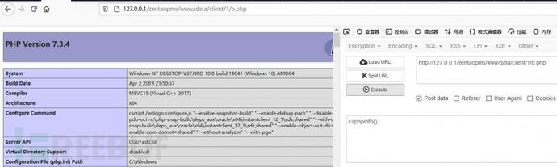

## 2.命令（代码）执行漏洞GetShell

利用命令（代码）执行漏洞写入WebShell文件从而GetShell。在此列举了以下四种常见情况作为说明。
（1） 利用CMS、框架通用漏洞，如thinkPHP命令执行漏洞，影响范围较广，如鲶鱼CMS、ThinkCMF、yunCMS等。Struts2远程命令（代码）执行漏洞，如S2-059、S2-057……
（2） 中间件、架构通用漏洞，如：Jboss远程命令执行、weblogic未授权命令执行CVE-2020-14882……
（3） 应用程序命令执行漏洞，如Redis 4.x/5.x命令执行漏洞、Zabbix远程命令执行CVE-2020-11800……
（4） 命令注入漏洞写入WebShell，根据Linux和Windows的不同采用不同的注入方式。如：

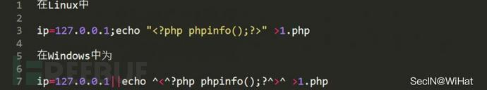

## 3.解析漏洞GetShell

利用解析漏洞将图片马等文件解析为恶意脚本文件从而GetShell，本文主要介绍在IIS、Nginx、Apache的解析漏洞。一般，该漏洞会配合文件上传漏洞等来获取WebShell。

### （1） IIS解析漏洞。

a) IIS 5.x/6.0解析漏洞，其中文件名解析漏洞利用形式为*.asp;.jpg；目录解析漏洞利用形式为/asp/1.jpg。
b) IIS 7.0/7.5解析漏洞。其实该漏洞为cgi.fix_pathinfo的配置不当引起的解析漏洞，利用形式为x.jpg%20\0.php。

### （2） Nginx解析漏洞

a) Nginx漏洞版本0.8.41 ~ 1.4.3 / 1.5.0 ~ 1.5.7默认配置导致解析漏洞，利用形式为x.jpg/.php。
b) Nginx漏洞版本0.5.、0.6.、0.7 <= 0.7.65、0.8 <= 0.8.37，利用形式为x.jpg%00.php。
c) CVE-2013-4547，利用形式为x.jpg[非空编码]\0.php
d) PHPStudy v8.1.0.7默认Nginx配置解析漏洞，利用形式为x.jpg/.php。

### （3） Apache解析漏洞

a) 文件后缀x.php.ss.ss2会被解析为php文件
b) 利用配置文件。上传.htaccess配置文件，就会将.jpg解析为PHP文件，内容如下：

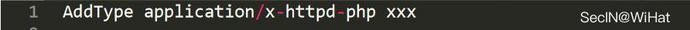

或者

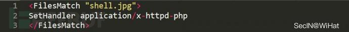

## 4.SQL注入漏洞GetShell

在MySQL注入中，可以利用SQL注入获取WebShell，要写入WebShell文件到服务器中，需要满足以下条件：

1. 网站物理路径；
2. 文件写入的权限；
3. secure_file_priv条件没有设置为NULL；
   要求mysql数据库的配置中，没有将secure_file_priv条件没有设置为NULL，即secure_file_priv=NULL时，无法导入导出文件；而当设置为空时，即secure_file_priv=时，则导入导出文件不受限制；如果设置为某个文件路径，如secure_file_priv=/mysql/时，则导入导出必须要在跟文件目录下完成。利用形式如下。
   （1） 直接使用into outfile

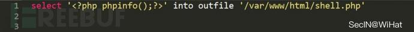

（2） 直接使用into downfile

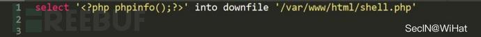

（3） 意为将数据导出到文件shell.php时，每个数据以一句话木马作为分割符

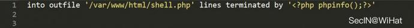

而在写入时，也可以将分隔符，即一句话木马做hex编码如：

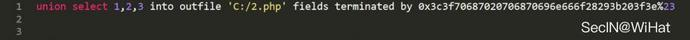

（4） 设置每行数据开头为一句话木马

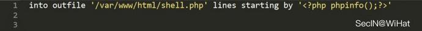

（5） 在字段之间的以一句话木马作为分隔符。

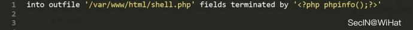

举例如下图所示：

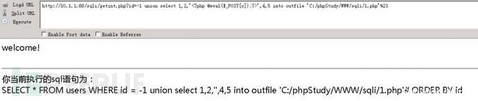

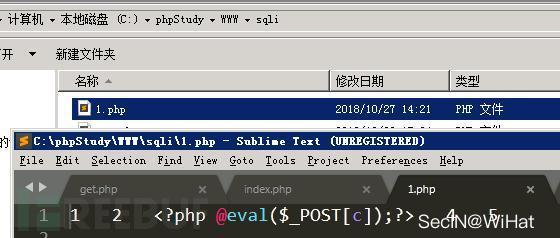

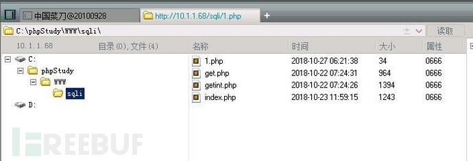

## 5.文件包含漏洞GetShell

利用文件包含漏洞GetShell，由于面比较大，主要介绍PHP文件包含，其分为本地文件包含和远程文件包含。本地文件包含中，需要PHP的配置文件项allow_url_include和allow_url_fopen均设置为On。一般配合文件上传等漏洞GetShell，最常见的如先传图片马，再包含之。远程文件包含中，需要PHP的配置文件项allow_url_fopen设置为On，利用方式是在远程服务器上存在shell.txt，内容为webshell，然后远程包含这个文件即可。笔者在文章https://sec-in.com/article/80中已经对文件包含漏洞做了详细的介绍，读者可前往阅读。

## 6.其他方式GetShell

将其命名为“其他方式”是因为不便将其再分类，笔者便都将其归纳至此。

### （1） 0day、nday GetShell

0day自己挖，如一些cms黑白盒渗透、代码审计等；Nday靠收集。

### （2） 后台创建模板写入WebShell

创建、修改模板时写入webshell文件。

### （3） 修改网站配置插入WebShell

在网站设置如“网站名称”中插入一句话，但需要注意闭合，稍有不慎会将网站插坏的。

### （4） 后台数据库备份GetShell

数据库备份时修改备份文件后缀，在数据中插入一句话。

### （5） PHPMyadmin GetShell

a) 开启日志文件，将日志文件的路径设置为网站的物理路径，如：

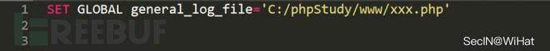

最后在执行的SQL语句中带有一句话木马，这样，日志文件内容中就包含了webshell。
b) 导出数据时，将webshell导出到文件中，详见前文SQL注入GetShell。

### （6） 组合漏洞GetShell

如DedeCMS CSRF + 任意文件写入。

### （7） 后台修改文件上传类型

添加上传文件类型，如白名单中添加PHP。

### （8） ……

以上。本次就先总结到这里，扛不住这眼睛乏涩，望大佬们不吝赐教。

# 0x02 写在最后

很早前就想着将GetShell的方式总结一下，但无奈拖延症晚期的我，愣是拖了半年多。半年的时间内，也不知道自己做了啥。对了，很希望能和各位大佬多交流。最后，漏洞永远都会存在，就像蝗虫从未被我们消灭。