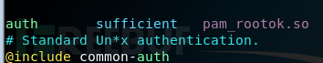

# Webshell入侵检测初探

url：https://www.freebuf.com/articles/web/183520.html

## 0x01:Webshell简介

**攻击者在入侵企业网站时，通常要通过各种方式获取webshell从而获得企业网站的控制权，然后方便进行之后的入侵行为。常见攻击方式有：直接上传获取webshell、SQL注入、远程文件包含(RFI)、FTP，甚至使用跨站点脚本(XSS)作为攻击的一部分，甚至一些比较老旧的方法利用后台数据库备份及恢复获取webshell、数据库压缩等。通用功能包括但不限于shell命令执行、代码执行、数据库枚举和文件管理。**

### 1.Webshell分类

webshell从协议上来看,最开始基于 TCP、UDP 的 Shell,到后来基于ICMP 的 Shell和基于DNS 的shell 。从依托工具上看,有 nc 反弹、telnet 反弹、SSH 端口转发等手段,极度猥琐的甚至还有利用 awk 的反弹 Shell。从语言上看,各种流行的语言都能用来写后门,从bash 到 3P(Perl Python PHP)再到 Ruby 和 Java。

### 2.Webshell功能

**（1）站长工具**

Webshell被站长常常用于网站管理、服务器管理等，根据FSO权限的不同，作用有在线编辑网页脚本、上传下载文件、查看数据库、执行任意程序命令等。

**（2）持续远程访问**

入侵者可以利用从而达到长期控制网站服务器的目的，若攻击者自行修复了漏洞，以确保没有其他人会利用该漏洞，攻击者可以低调的随时控制服务器。一些流行的webshell使用密码验证和其他技术来确保只有上传webshell的攻击者才能访问它。（webshell密码爆破工具表示不服）

**（3）权限提升**

在服务器没有配置错误的情况下，webshell将在web服务器的用户权限下运行，该用户权限是有限的。通过使用webshell，攻击者可以尝试通过利用系统上的本地漏洞来执行权限提升，常见的有查找敏感配置文件、通过内核漏洞提权、利用低权限用户目录下可被Root权限用户调用的脚本提权、任务计划等（从入门到放弃）

**（4）极强的隐蔽性**

有些恶意网页脚本可以嵌套在正常网页中运行，且不容易被查杀。webshell还可以穿越服务器防火墙，由于与被控制的服务器或远程主机交互的数据都是通过80端口传递，因此不会被防火墙拦截，在没有记录流量的情况下，webshell使用post包发送，也不会被记录在系统日志中，只会在web日志中记录一些数据提交的记录。

## 0x02:WebShell检测

### 1.基于webshell特征检测

**常见webshell函数**

（1）存在系统调用的命令执行函数，如eval、system、cmd_shell、assert等；

（2）存在系统调用的文件操作函数，如fopen、fwrite、readdir等；

（3）存在数据库操作函数，调用系统自身的存储过程来连接数据库操作；

（4）具备很深的自身隐藏性、可伪装性，可长期潜伏到web源码中；

（5）衍生变种多，可通过自定义加解密函数、利用xor、字符串反转、压缩、截断重组等方法来绕过检测；

```
//利用base64编码
<?php
$b = base64_encode(‘whoami‘);
echo $b.‘<br />‘;
echo base64_decode($b).'<br />';?>//利用gzcompress压缩
<?php
$c = gzcompress('whoami');
echo $c.'<br>';
echo gzuncompress($c)."<br />";?>
//进制运算     <?php@$_++; $__=("#"^"|").("."^"~").("/"^"`").("|"^"/").("{"^"/"); ?>
//利用注释符
<?php@${$__}[!$_](${$__}[$_]);@$_="s"."s"./*-/*-*/"e"./*-/*-*/"r";@$_=/*-/*-*/"a"./*-/*-*/$_./*-/*-*/"t";@$_/*-/*-*/($/*-/*-*/{"_P"./*-/*-*/"OS"./*-/*-*/"T"}[/*-/*-*/0/*-/*-*/-/*-/*-*/2/*-/*-*/-/*-/*-*/5/*-/*-*/]);    ?>
```

以上对于webshell本身的行为分析 ，它带有对于系统调用、系统配置、数据库、文件的操作动作，可以通过关键词匹配脚本文件找出webshell，再如一些压缩后的数据， 有可能一些WAF并不会检测到内容存在危险。变性后的数据，WAF也检测不出存在的危险，首先脚本文件带有这些特殊的函数，本身就是可疑文件，当然也还有其他方式可以去进行检测。


这类检测可以通过grep去查找webshell，D盾之类的webshell查杀工具也是利用这种原理，对源码进行查杀。但经常会存在黑客在上传完webshell后门，获取到自己想要的信息后，就会删除掉webshell，又或者遇到了一些变形过的webshell后门，我们的关键字没有搜索到，这时候通过文件去找到webshell的方法就不适用了。

```
find  /site/* -type f -name "*.php"  |xargs grep "eval"
```

如果木马做了免杀处理，可以查看是否使用加密函数：

```
find /site/* -type f -name “*.php” |xargs grep "base64_decode"
```

查看是否做了拼接处理：

```
find /site/* -type f -name “*.php” |xargs grep "@$"
```

对搜索到的内容，手动查看是否是木马，可以在本地打开脚本文件，查看网页生成时间或者上传至一些检测的网站进行检测（http://www.virscan.org/；https://x.threatbook.cn/），当然去分析代码也是完全没问题的。


### 2.基于流量特征的webshell检测

**（1）基于流量行为特征的webshell检测**

基于流量的检测，是无法通过检测构成webshell危险函数的关键词来做检测的，但webshell带有常见写的系统调用、系统配置、数据库、文件的操作动作等，它的行为方式决定了它的数据流量中多带参数具有一些明显的特征，通过匹配行为的流量特征做检测，这也是基于webshell入侵后行为特征进行检测，当然也可以从系统层面webshell入侵行为进行检测。

```
ipconfig/ifconfigsystemwhoaminetstatevaldatabasesysteminfo......
```

常见的可以从data数据中去检索攻击者常用的命令和payload等，当然大部分的webshell不会这么直接，可能会经过编码，如最经典的webshell中国菜刀采用的是先url编码再base64编码，对应的采取解码的方式去发现敏感的行为特征。这也是抓取流量的好处，因为在web访问日志中，是无法抓取POST方式的包，也就没法分析webshell入侵后的行为，而流量很好的做到了这一点。

**（2）基于webshell工具特征的检测**

中国菜刀webshell流量特征检测：

使用最常见的一句话木马搭建的环境，直接抓包查看，可以看到菜刀发送的数据包。


经过解码后可以看到当前执行的命令是netstat -an，那么以上那些关闭错误回显、“z1”等字符串操作就是中国菜刀这款webshell的特征。


webacoo webshell流量特征检测：

使用webacoo工具生成webshell并进行连接抓包测试 。


通过wireshark等抓包工具进行分析，可以发现编码通信内容通过cookie头传输，其中有三个cm、cn和cp变量，这是webacoo webshell管理工具的特征。


### 3.基于webshell系统行为特征的检测

这个思路和基于webshell的流量行为特征进行检测的想法大概一直，攻击者上传webshell总会做些什么，那么可以去监测系统的变化以及敏感的操作，尽可能的去收集服务器的信息，通过和之前的配置以及文件的变化对比监测系统达到尽可能发现webshell的成果。

**（1）文件分析**

查看/tmp、/init.d、/usr/bin、/usr/sbin等敏感目录有无可疑的文件，针对可以的文件可使用stat进行创建修改时间、访问时间的详细查看，若修改时间距离事件日期接近，有线性关联，说明可能被篡改或者其他。


对于文件还可使用查找新增文件的方式来查找接近安全事件时间的文件。

例如：

要查找24小时内被修改的PHP文件： 

```
find ./ -mtime 0 -name "*.php" 
```

不只是php文件，很多后门都会创建出很多文件。


根据确定时间去反推变更的文件：

```
ls -al /tmp | grep "Feb 27"
```

查找777的权限以及隐藏的文件 （以“.”开头的文件具有隐藏属性）：

```
find / *.jsp -perm 4777
```


**（2）进程分析**

使用netstat 网络连接命令，分析可疑端口、可疑IP、可疑PID及程序进程（top可以实时动态的查看系统的整体运行情况，主要分析cpu和内存多的进程，是一个不错的综合了多方面信息监测系统性能和运行信息的实用工具），最好可以去区分对外的监听端口和对内的监听端口，一般可以有效的查找出后门。

```
netstat –antlp | more
```

如上图DNS后门利用python进行dns查询，dns作为信道进行隐蔽通信的核心就是把要传递的数据作为DNS请求的HOSTNAME部分。通过抓包可以看到流量是经过加密的，通过流量检测不一定能检测出来，当然还可以通过rootkit等方法将进程进行隐藏，linux /proc会为每个进行创建一个目录，按他的pid来命令，也可根据这个来分析。可通过以下命令查看隐藏进程：

```
ps -ef | awk '{print}' | sort -n | uniq >1

ls /proc | sort -n |uniq >2 

diff 1 2
```

（3）系统信息分析

```
history (cat /root/.bash_history)//查看分析history (cat /root/.bash_history)，曾经的命令操作痕迹，以便进一步排查溯源/etc/passwd//查看有无新增的恶意用户或者除root之外uid为0的用户crontab  /etc/cron*//查看当前的任务计划有哪些，是否有后门木马程序启动相关信息$PATH//分析有无敏感可疑信息 ......
```

以上也是应急经常去分析的系统信息，但是放在webshell检测上也同样适合，也适用于webshell入侵检测，如发现可疑项，可通过逆向思维去分析。这块我也和很多大佬沟通过，包括在入侵检测中，简单的都可以很好去发现，比如通过最原始的爆破进行分析溯源，IDS很好的解决了很多人为的重复性工作，对于变形或者绕过的攻击，可能需要尽可能的提取多的信息，串线综合去分析，APT等高级攻击，检测会相当的麻烦，愿听大佬讲解。

**（4）配置文件**

如最普通的将pam.d下的ssh的验证模块改成su的验证模块，那么再次登录，验证uid为0，那么root就免密登录，而一般情况下，不仔细也是无法观察出的，还有更多的后门，再入php.ini后门，所以需要去监控一些培训文件，与之前的配置文件比较，以便于发现问题所在。



**（5）chkrootkit/rkhunter**

chkrootkit是用来监测 rootkit 是否被安装到当前系统中的工具。rootkit ，是一类入侵者经常使用的工具。这类工具通常非常的隐秘、令用户不易察觉，通过这类工具，入侵者建立了一条能够常时入侵系统，或者说对系统进行实时控制的途径。所以，我们要用 chkrootkit 来定时监测系统，以保证系统的安全。

chkrootkit主要功能：


> 检测是否被植入后门、木马、rootkit
>
> 检测系统命令是否正常（避免在入侵检测分析时使用已被替换的命令）
>
> 检测登录日志


使用chkrootkit –n；如果发现有异常，会报出“INFECTED”字样。 

rkhunter是Linux系统平台下的一款开源入侵检测工具，具有非常全面的扫描范围，除了能够检测各种已知的rootkit特征码以外，还支持端口扫描、常用程序文件的变动情况检查。

rkhunter主要功能：

> 系统命令（Binary）检测，包括Md5 校验
>
> Rootkit检测
>
> 本机敏感目录、系统配置、服务及套间异常检测
>
> 三方应用版本检测


假如系统的命令（例如netstat ls 等）被替换，为了进一步排查，需要下载一新的或者从其他未感染的主机拷贝新的命令。当然类似像Login后门这种的检测，同样可以使用命令md5sum对现有/bin/login文件作校验，与以前的值作比较。

### 4.基于web日志webshell行为特征的检测

在准备分析webshell和攻击事件之前，先了解系统架构，如服务器类型、业务架构、网络拓扑等。

Ø 服务器类型：windows、linux etc..

Ø cms：dedecms、phpcms、trs cms etc..

Ø 中间件、容器、框架、数据库：tomcat、iis、apache、weblogic、struts、mysqletc..

Ø 脚本语言：asp、php、jsp etc..

Ø 业务架构：如前端网页内容是否是后端通过ftp上传的（新闻网偏多） etc..

......

接着来看下常见黑客的攻击步骤：

正常情况下攻击者会先去寻找web漏洞，就像我下图一样，通过一些高危的漏洞，比如Struts2、反序列、SQL注入等等，然后直接获取webshell。

最常见的就是通过寻找一个sql注入点，获取网站后台的管理员账号密码，然后在后台上传一个webshell。上传了webshell，留下了一个脚本文件在服务器上，那么通过查找webshell也是在应急的时候的一个切入口，通过webshell来确定时间和攻击者，进而从时间维度和攻击维度进一步分析。

如上文利用grep命令搜索常见webshell木马里面可能会用的危险函数，找到webshell，然后再从日志里翻出关于这个webshell的记录，找到访问wenshell的攻击者ip，从而继续搜索攻击者的访问记录，就可以还原整个攻击者做过的动作了。

webshell的访问特征（如果你非要告诉我攻击者把webshell插入了其他的动态页面中2333）：

1）少量的IP对其发起访问

2）总的访问次数少

3）该页面属于孤立页面

那么接下来就可以使用awk、uniq、sort或者脚本对url每天的总访问数量、url独立访问的页面等进行统计分析。

```
awk -F " " '{print $1}' log |sort| uniq -c |sort -nr |morecat access.log | cut-f1 -d " " | sort | uniq -c | sort -k 1 -r | head -10             //查看页面访问排名前十的IPcat access.log | cut-f4 -d " " | sort | uniq -c | sort -k 1 -r | head -10             //查看页面访问排名前十的URL
```

在日志提权的时候尽可能的去除掉一些静态的页面和错误请求信息，常见的可以通过grep -v去排除，排除项有：

1）去除静态path（例如jpeg,jpg,gif,png,bmp,css,js,xls,xlsx,doc,xml,wav,tar.gz,zip,swf,mp3,ico,pidf,torrent） ；

2）去除白名单path （例如主页index.php,index.asp,index.aspx,index.ashx,index.html)；

3）去除非webshell后缀的path （例如asp,aspx,php,jsp,py,cgi,pl,java,sh,war,cfm,phtml)；

4）去除扫描器造成的path（按扫描器IP信誉库（云扫描器IP信誉库与时效性扫描器IP信誉库）与扫描器行为（可以简单的按ip host聚类，将单位时间内请求数超过M，独立路径数超过N的请求视为扫描器）来去除）；

5）去除响应码非200的path。

### 5.webshell其他检测方法

从这开始以下内容全为道听途说，但很多企业是正在做的，本人技术有限，未能亲自实践，只是为了文章的完整性！

**（1）动态检测（沙箱）**

上面介绍了静态检测，通过对指定脚本的关键词、高危函数、问价修改时间、权限等以及和其他文件的关联性等多个纬度的特征进行检测。速度快，且能快速定位；动态特征检测通过Webshell运行时使用的系统命令或者网络流量及状态的异常来判断动作的威胁程度，Webshell通常会被加密从而避免静态 特征的检测，当Webshell运行时就必须向系统发送系统命令来达到控制系统或者操作数据库的目的，通过检测系统调用来监测甚至拦截系统命令被执行，从行为模式上深度检测脚本文件的安全性。这种我能想到的就是类似于python爬虫的使用Selenium模拟浏览器行为。

**（2）统计学**

在日志分析中，基于webshell特征去发现webshell也范属于统计学。NeoPiS 国外流行的一个基于统计学的webshell后门检测工具，它使用五种计学方法在脚本文件中搜索潜在的被混淆或被编码的恶意代码。

NeoPi使用以下五种检测方法：

1）信息熵(Entropy):通过使用ASCII码表来衡量文件的不确定性；

2）最长单词(LongestWord):最长的字符串也许潜在的被编码或被混淆；

3）重合指数(Indexof Coincidence):低重合指数预示文件代码潜在的被加密或被混效过；

4）特征(Signature):在文件中搜索已知的恶意代码字符串片段；

5）压缩(Compression):对比文件的压缩比。

机器学习：

引用下兜哥的分享[基于机器学习的 Webshell 发现技术探索](https://mp.weixin.qq.com/s?__biz=MzIwNjEwNTQ4Mw%3D%3D&mid=2651577090&idx=1&sn=924b14ba842f57c34f06995416a98360&chksm=8cd9c5e6bbae4cf0e3eed6192133c6c87de47cfcc911fca90d86f1383d5ec2f6f1cf661aaeb6)和github上的项目 [机器学习检测Webshell](https://github.com/hi-WenR0/MLCheckWebshell)

## 0x03:webshell防御

从根本上解决动态网页脚本的安全问题，要做到防注入、防暴库、防COOKIES欺骗、防跨站攻击等等，务必配置好服务器FSO权限。 

1.建议用户通过ftp来上传、维护网页，尽量不安装asp的上传程序。

2.对asp上传程序的调用一定要进行身份认证，并只允许信任的人使用上传程序。

3.asp程序管理员的用户名和密码要有一定复杂性，不能过于简单，还要注意定期更换。

4.到正规网站下载程序，下载后要对数据库名称和存放路径进行修改，数据库名称要有一定复杂性。

5.要尽量保持程序是最新版本。

6.不要在网页上加注后台管理程序登陆页面的链接。

7.为防止程序有未知漏洞，可以在维护后删除后台管理程序的登陆页面，下次维护时再通过上传即可。

8.要时常备份数据库等重要文件。

9.日常要多维护，并注意空间中是否有来历不明的asp文件。

10.尽量关闭网站搜索功能，利用外部搜索工具，以防爆出数据。

11.利用白名单上传文件，不在白名单内的一律禁止上传，上传目录权限遵循最小权限原则。

## 后记：

本着共享的精神，水平有限，还望见谅！

一个人的信安之路好难~~~

## 参考文献：

https://www.imperva.com/blog/2018/07/the-trickster-hackers-backdoor-obfuscation-and-evasion-techniques/

http://www.360doc.com/content/16/0612/17/30594932_567188526.shtml

https://github.com/tennc/webshell

《UNIX Linux网络日志分析与流量监控》